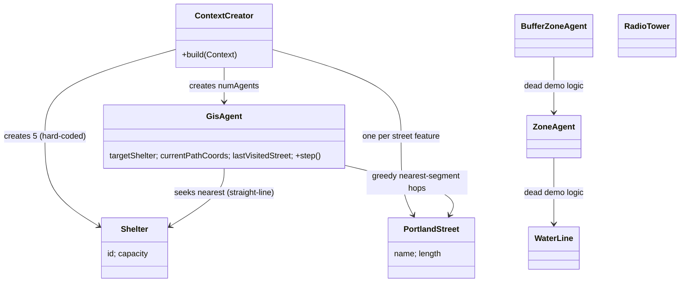

# Wildfire Smoke Shelter ABM — Project Assessment & Development Roadmap

**Project:** Placing Clean-Air Shelters for Wildfire Smoke (NSF REU, Portland State University)
**Researcher:** Fatima Asghar · Mentor: Dr. Christopher Teuscher
**Assessed:** 2026-07-23 · **Assessor role:** senior software engineer / ABM researcher / reproducibility reviewer
**Specification source:** `Copy of Wildfires smoke.pdf` (midpoint presentation slides)
**Code analyzed:** `Geography/` (Repast Simphony 2.8.0 project) — no code was modified during this assessment.

---

## PHASE 1 — PROJECT FORENSICS

### 1.1 Framework confirmation

This **is a Repast Simphony 2.8.0 GIS project**, built by modifying Repast's stock *Geography* demo (author tags `@author Eric Tatara` remain in most files). Evidence:

- `Geography/Geography.rs/scenario.xml:2` — `<Scenario simphonyVersion="2.8.0">`
- `Geography/.classpath:6` — `REPAST_SIMPHONY_SUPPORT` Eclipse classpath container
- `Geography/launchers/Geography Model.launch` — Repast Eclipse launch configuration
- Slide 7 confirms it: *"Started from Repast's stock GIS Geography demo, stripped most of it, kept and repurposed three components."*
- Runtime: Temurin OpenJDK 17 (`hs_err_pid5412.log` JRE header).

### 1.2 How Repast is structured in this project

Repast Simphony wires a model together through the `.rs` scenario directory rather than a `main()`:

| Repast concept | File | What it does here |
|---|---|---|
| Scenario | `Geography.rs/scenario.xml` | Registers 1 data loader + 3 display actions. **No data-collection actions are registered.** |
| Context/projections | `Geography.rs/context.xml` | Declares master context `Geography` with projections: `Geography` (GIS), `Network`, and three coverage layers (`My coverage`, `My indexed coverage`, `My indexed coverage 2`) |
| Data loader | `Geography.rs/repast.simphony.dataLoader.engine.ClassNameDataLoaderAction_0.xml` | Points to the single entry point: `geography.agents.ContextCreator` |
| Parameters | `Geography.rs/parameters.xml` | `numAgents` (int, default 100), `zoneDistance` (double, 1000.0), `randomSeed` (default `__NULL__`) |
| Agent classpath | `Geography.rs/user_path.xml` | Loads agents from `../bin` filtered to `geography.agents.*` |
| Batch runs | `batch/batch_params.xml` | Empty stock sweep (`<sweep runs="1">`) — batch experimentation not set up |

### 1.3 Simulation entry point

`geography.agents.ContextCreator implements ContextBuilder` (`ContextCreator.java:62`). Its `build()` method (lines 67–209):

1. Reads `numAgents` and `zoneDistance` parameters (lines 70–71).
2. Creates the GIS `Geography` projection (74–75) and a `Network` projection (79–80).
3. Loads `./data/Streets.shp` features (91–92) and places `numAgents` `GisAgent`s at the **first coordinate of each street polyline**, cycling `i % features.size()` (96–99).
4. Creates **5 hard-coded `Shelter`s** (capacity 100) at street coordinates chosen by the arbitrary formula `(i * 7) % features.size()` (102–115).
5. Adds a random network edge from each new agent to a random existing agent (125–129) — a demo leftover with no model meaning.
6. Calls `loadFeatures("data/Streets.shp", …)` (187), which creates one `PortlandStreet` agent per street feature (334–344).
7. Creates an end-of-run schedule slot but every action in it is commented out (190–206).

### 1.4 Agents

| Class | Geometry | Scheduled behavior | Status |
|---|---|---|---|
| `GisAgent` (= unsheltered resident) | Point | `step()` `@ScheduledMethod(start=30, interval=1)` (`GisAgent.java:47`): pick nearest shelter (straight-line, 57–67), greedily hop to nearest street segment (69–113), walk its vertices at 0.00015°/tick (142–150), remove self on arrival (130–131) | Active — core model agent |
| `Shelter` | Point | None (pure data: `id`, `capacity`) | Active but inert — `capacity` is never read or decremented anywhere |
| `PortlandStreet` | LineString | None (`name`, `length` holders) | Active; created with placeholder values `"Portland Street"`, `length=1.0` (`ContextCreator.java:339-340`) |
| `ZoneAgent` | Polygon | `step()` every tick → `checkWaterSupply()` | **Dead** — `Zones2.shp` load commented out (184), so none are created |
| `BufferZoneAgent` | Polygon | `step()` every tick | **Dead** — only created from ZoneAgents |
| `WaterLine` | LineString | None | **Dead** — load commented out (186) |
| `RadioTower` | Point | None | **Dead** — never instantiated |

### 1.5 Environment

- One GIS `Geography` projection in WGS84; `loadFeaturesFromShapefile()` reprojects any source CRS to WGS84 (`ContextCreator.java:228-234`) — a real, working improvement over the stock demo.
- The street network exists only as **independent LineString agents**; no graph/topology is built. The `Network` projection contains only random demo edges between resident agents.
- Three coverage (raster) layers are declared in `context.xml` but all coverage-creation code is commented out (`ContextCreator.java:135-180`) — currently **declared-but-empty projections** (natural future home for a PM2.5 field).

### 1.6 Schedules

- `GisAgent.step()` — start=30, interval=1 (movement).
- `ZoneAgent.step()` / `BufferZoneAgent.step()` — every tick, but no instances exist (dead schedule).
- Display refresh every tick (`display_1.xml` schedParams).
- End-of-run action slot exists but is empty (`ContextCreator.java:190-206`).
- **No tick↔wall-clock mapping is defined anywhere** — "1 tick" has no defined duration, so exposure-hours cannot yet be computed.

### 1.7 Data collection

**None.** `scenario.xml` registers no data sets, outputters, or text sinks; the only file-output code (shapefile writer) is commented out. The only run outputs are `System.out.println` lines (e.g., `GisAgent.java:130`, `ContextCreator.java:188`).

### 1.8 Visualization

- Three GIS display actions: `GIS (legacy)` (`display_1.xml`), `GIS (3D)` (`display_2.xml`), `GIS (edited style)` (`display_3.xml`).
- `display_1.xml:32-45` layer order: Shelter (1), GisAgent (2), PortlandStreet (3); SLD styles render residents as dots, streets as lines.
- `TowerAgentStyle.java:22` was retargeted from `RadioTower` to `Shelter` (`extends DefaultMarkStyle<Shelter>`) — matches slide 7's "RadioTower → Shelters" repurposing.
- Matches slide 8's screenshots ("every buttercream dot is a simulated resident").

### 1.9 Folder overview

```
reu/
├── Copy of Wildfires smoke.pdf   ← project specification (midpoint slides)
├── Streets.zip                   ← Portland streets shapefile (52 MB unzipped) — NOT yet in Geography/data/
└── Geography/                    ← Repast Simphony 2.8 project (modified stock GIS demo)
    ├── src/geography/agents/     ← ContextCreator + 7 agent classes (3 live, 4 dead)
    ├── src/geography/styles/     ← display styles (mostly stock; TowerAgentStyle retargeted to Shelter)
    ├── data/                     ← stock demo shapefiles (CookCounty, Zones2, WaterLines, Agents2…); Streets.shp MISSING
    ├── Geography.rs/             ← scenario: context, parameters, data loader, 3 displays; no data collection
    ├── launchers/                ← Eclipse launch configs (GUI, batch, installer)
    ├── batch/                    ← empty parameter sweep
    ├── bin/                      ← compiled classes (in sync with src)
    ├── freezedried_data/, integration/, lib/, misc/, installer/, docs/, icons/, repast-licenses/  ← stock scaffolding
    ├── debug.log                 ← NPE from an earlier loadFeatures version (missing shapefile attribute)
    └── hs_err_pid5412.log        ← JVM out-of-memory crash (G1 mmap failure, Temurin 17)
```

### 1.10 Class relationships



### 1.11 Simulation workflow

1. Repast runtime reads `scenario.xml` → runs `ContextCreator.build()`.
2. Streets load (reprojected to WGS84); residents placed at street start-vertices; 5 shelters placed at formula-picked street vertices.
3. Tick 30 onward, each resident: nearest shelter by straight-line degrees → nearest street segment (excluding only the immediately previous one) → orient along segment toward shelter → walk vertex-to-vertex at 0.00015°/tick (~12–17 m at Portland's latitude).
4. On finishing a segment: if within 0.002° (~200 m) of shelter → print + **remove self from context**; else drop path and re-select from current position.
5. If no path can be built while a shelter is targeted, the agent is **silently removed** (`GisAgent.java:151-152`).
6. Run ends with no persisted output.

### 1.12 Current state — what works, what doesn't

**Works (verified in code):**
- Repast scenario boots through `ContextCreator`; shapefile loading with CRS reprojection (`ContextCreator.java:211-269`); agent/shelter placement on street geometry; greedy street-following movement; GIS visualization of all three live layers. Slide 8's screenshots corroborate that it has run end-to-end.

**Incomplete:**
- Movement is greedy segment-hopping, not routing over a connected street graph — no guarantee of reachability or shortest path; `lastVisitedStreet` (`GisAgent.java:78-80`) only prevents immediate backtracking, so two-street oscillation loops remain possible.
- Batch sweep infrastructure empty; end-of-run schedule slot empty.

**Placeholder:**
- Street attributes: `"Portland Street"`, `length = 1.0` for every street (`ContextCreator.java:339-340`, self-described "safe defaults").
- Shelters: count (5), capacity (100), and placement formula `(i*7) % features.size()` are all invented placeholders — not the real Portland shelter map the slides' "Status quo" strategy requires.
- `Shelter.capacity` is never enforced.

**Incorrect / risky:**
- **Silent agent deletion** on both success and path-failure (`GisAgent.java:130-131, 151-152`) — indistinguishable outcomes; destroys the ability to measure exposure ("total up each person's smoke dose" is impossible for removed agents).
- All movement math is in **raw degrees** (thresholds 0.0002/0.002; speed 0.00015). Degrees are anisotropic (lat ≠ lon distance at 45.5°N); meanwhile `zoneDistance` uses proper metric buffers via `GeographyWithin`. Mixed unit systems.
- Per-tick O(residents × streets) nearest-segment scans over tens of thousands of street features; `hs_err_pid5412.log` records a real JVM OOM crash. Performance/memory is a live defect.
- Dead demo schedules (`ZoneAgent`/`BufferZoneAgent` every-tick steps) and unused coverage/Network declarations add noise and confusion.

**Missing entirely:**
- `Geography/data/Streets.shp` — the code's required input exists only in `Streets.zip` at the repo root; **a fresh checkout cannot run**.
- Smoke: no PM2.5 field, no AirNow data, no exposure accumulation of any kind (no smoke-related identifier appears anywhere in `src/`).
- Vulnerability: no age, COPD/asthma, RR multipliers, or VWE metric.
- Real population data (Point-in-Time counts, encampment locations), real shelter locations.
- The five placement strategies; scoring (exposure-hours, Gini); sensitivity sweeps.
- All data collection, outcome logging, decision logging.
- Version control: **the repo is not a git repository** — a direct blocker for the slides' reproducibility commitment and for Phase 4's staged commits.
- Time model (tick ↔ hours), event calendar for Sept 7–19, 2020.

---

## PHASE 2 — RESEARCH REQUIREMENTS vs CURRENT IMPLEMENTATION

Spec source: slides. Central metric (slide 4): **VWE = PM2.5 × RR_age × RR_comorbidity**, per person per hour. Strategies (slide 5): Status quo · Density · Gap-index · PM2.5 oracle · VWE oracle. Scoring: exposure-hours above the "unhealthy" line, Gini coefficient, swept across mobility & comorbidity assumptions.

| # | Requirement (slide) | Current status | Responsible file/class | Missing | Recommended solution |
|---|---|---|---|---|---|
| R1 | Real Portland street network (slide 7) | ⚠️ Partial | `ContextCreator.loadFeatures`, `PortlandStreet` | `Streets.shp` not unpacked into `data/`; no graph topology; placeholder attributes | Unzip `Streets.zip` → `Geography/data/`; build a routable graph (JTS/GeoTools or JGraphT) from street geometry at init; read real name/length attributes from the `.dbf` |
| R2 | Unsheltered residents of Multnomah County (slide 7) | ❌ Synthetic count only | `ContextCreator.build` 91–100 | Real population size, demographics, encampment start locations | Initialize agents from PIT-count-derived counts and encampment/campsite-report locations (see Phase 3, V1/V15) |
| R3 | Shelters snapped to street nodes = today's shelter map (slides 5, 7) | ❌ Placeholder | `ContextCreator.build` 102–115, `Shelter` | Real clean-air shelter locations & capacities; snapping is to arbitrary formula-picked vertices | Load shelters from a curated CSV/shapefile of real Multnomah County cleaner-air spaces; snap to nearest street-graph node |
| R4 | Hourly PM2.5 from EPA AirNow, Sept 7–19 2020 (slides 3, 4) | ❌ Absent | none (coverage layers declared empty in `context.xml`) | Entire smoke layer | Ingest AirNow/AQS hourly monitor data; interpolate (e.g., IDW) onto a `WritableGridCoverage2D` coverage — the declared-but-unused coverage machinery (`ContextCreator.java:135-180`) is the intended slot |
| R5 | VWE metric per person-hour (slide 4) | ❌ Absent | none | RR_age, RR_comorbidity fields; hourly accumulation | Add vulnerability attributes to `GisAgent`; accumulate `VWE += PM2.5(loc,t) × RR_age × RR_com × Δt_hours` each tick |
| R6 | Agents walk streets to nearest *reachable* shelter (slide 7) | ⚠️ Approximation | `GisAgent.step()` | Reachability & shortest-path guarantees; capacity constraint; agents vanish on arrival/failure | Replace greedy segment-hopping with shortest-path routing on the street graph; keep agents in-context with a `sheltered` state; enforce `Shelter.capacity` |
| R7 | Five placement strategies (slide 5) | ❌ Absent | none | All five strategy generators | Strategy = a shelter-location list; implement as a `ShelterPlacementStrategy` parameterized by a run parameter so batch sweeps can select it |
| R8 | Scoring: exposure-hours above "unhealthy" + Gini (slide 5) | ❌ Absent | none | All metrics & aggregation | Per-agent exposure ledger + end-of-run aggregator (Phase 5 design) |
| R9 | Sensitivity sweep: mobility × comorbidity × RR CIs (slides 5, 9) | ❌ Absent | `batch/batch_params.xml` (empty) | Sweepable parameters, batch config | Promote RRs, prevalence, walking speed to `parameters.xml`; populate `batch_params.xml` |
| R10 | Reproducible, MIT-licensed, Zenodo release (slides 3, 9) | ❌ Not started | — | git repo, license, seed discipline, README, DOI | `git init`; add MIT `LICENSE`; log `randomSeed` per run; staged commits (Phase 4) |
| R11 | Pre-registered parameters (slide 6, W1) | ❓ Unverifiable in repo | — | Pre-registration document not in repo | Add the pre-registration (or link) to the repo; parameter defaults must match it |
| R12 | BenMAP cost-effectiveness (optional, slide 9) | ❌ Absent | none | Export of concentration/population inputs | Defer; design outcome CSVs so BenMAP-compatible aggregates can be derived |

**Spec-vs-claim discrepancy worth flagging:** slide 6 says *"I can total up each person's smoke dose over the whole event."* No dose code exists anywhere in `src/`, and arriving agents are deleted. The midpoint claim overstates the code; the roadmap below closes that gap honestly.

---

## PHASE 3 — SCIENTIFIC VARIABLE DOCUMENTATION

Rule followed: **no invented values.** Values present in the slides are cited to the slides' own citations (verify full references against the pre-registration before publication). Everything else is flagged `VALUE MISSING` with a recommended source to obtain it from.

---

**V1 — age**
- **Purpose:** Resident agent attribute; determines RR_age in VWE.
- **Why it affects outcomes:** PM2.5 mortality/morbidity risk rises with age; slide 2's "65+ with COPD ≈ ×2.6 harm" example is driven half by age.
- **Research source:** Di et al. 2017 (as cited on slide 4) — *Air Pollution and Mortality in the Medicare Population*, NEJM.
- **Citation status:** Slide-provided. Verify exact RR extraction against the paper in the pre-registration.
- **Implementation location:** New field on `GisAgent` (does not exist yet). Distribution to sample from: **VALUE MISSING** — use age brackets from the HUD/Multnomah County Point-in-Time count report.

**V2 — RR_age (age risk multiplier)**
- **Purpose:** Multiplier in VWE.
- **Why:** Same measured PM2.5 produces larger health damage in 65+ adults.
- **Source/value:** ×1.45 for adults 65+ — slide 4, attributed to Di et al. 2017.
- **Status:** Value present (slide-sourced). CI bounds for the sensitivity sweep: **VALUE MISSING** — take from the paper's published confidence interval.
- **Implementation:** New `GisAgent` field + `parameters.xml` entry (sweepable).

**V3 — copdStatus (comorbidity)**
- **Purpose:** Boolean/flag on residents; selects RR_comorbidity.
- **Why:** Chronic lung disease multiplies PM2.5 harm (slide 2).
- **Source/value:** RR ×1.80 — slide 4, attributed to Anderson et al. 2013. **Flag:** the full Anderson et al. 2013 reference is not resolvable from the slides alone; confirm the exact paper in the pre-registration.
- **Prevalence among unhoused Portlanders:** **VALUE MISSING** — obtain from homeless-health literature (e.g., Fazel et al. 2014, *The health of homeless people in high-income countries*, The Lancet) or county health data; this is also a declared sweep axis (slide 9).
- **Implementation:** New `GisAgent` field; prevalence as a parameter.

**V4 — asthmaStatus**
- **Purpose:** Second comorbidity channel (required by project brief).
- **Why:** Wildfire smoke is consistently associated with asthma exacerbations/ED visits.
- **Source:** **VALUE MISSING** — slides specify COPD only. Candidate sources for an RR: Reid et al. 2016 (*Critical Review of Health Impacts of Wildfire Smoke Exposure*, Environ. Health Perspect.); Borchers Arriagada et al. 2019 asthma meta-analysis (Environ. Res.). Decide with mentor whether asthma enters VWE or stays a tracked covariate — do not guess an RR.
- **Implementation:** New `GisAgent` field.

**V5 — PM2.5 concentration field**
- **Purpose:** Hourly µg/m³ surface over Portland, Sept 7–19, 2020.
- **Why:** The exposure term of VWE; the event peaked above 500 µg/m³ (slide 2).
- **Source:** EPA AirNow / AQS historical monitor data (slide 4). **DATA MISSING from repo.**
- **Implementation:** New `SmokeField` component writing a `WritableGridCoverage2D` per hour (coverage slots already declared in `context.xml`).

**V6 — smokeExposure (cumulative raw dose)**
- **Purpose:** Σ PM2.5(location, t) × Δt per agent — µg/m³·hours.
- **Why:** Primary unweighted outcome; the PM2.5-oracle strategy optimizes it.
- **Source:** Derived quantity (no external value needed).
- **Implementation:** New accumulator on `GisAgent`, updated each tick; requires V13 (tick duration).

**V7 — vwe (vulnerability-weighted exposure)**
- **Purpose:** Σ PM2.5 × RR_age × RR_comorbidity × Δt — the central metric (slide 4).
- **Why:** Reorders shelter priorities away from raw exposure toward biological vulnerability (slide 4: "the best shelter map can move").
- **Implementation:** Accumulator on `GisAgent` beside V6.

**V8 — exposureDuration above threshold**
- **Purpose:** Hours with PM2.5 above the AQI "Unhealthy" line — the slides' headline score.
- **Threshold value:** **VALUE MISSING (confirm)** — use the EPA AQI breakpoint table for PM2.5 in force for the study (EPA's AQI technical assistance documents define the "Unhealthy" breakpoint; the pre-registration should lock the exact breakpoint and averaging convention).
- **Implementation:** Counter on `GisAgent`; threshold in `parameters.xml`.

**V9 — distanceTraveled**
- **Purpose:** Cumulative meters walked per agent.
- **Why:** Cost of reaching shelter; exposure accrues during travel; equity covariate.
- **Source:** Derived. Must be computed **geodesically** (current degree math under-/over-states distance by direction).
- **Implementation:** Accumulate in `GisAgent.step()` movement block.

**V10 — walkingSpeed / mobility**
- **Purpose:** Movement rate; declared sweep axis ("mobility assumptions", slide 5).
- **Current placeholder:** 0.00015°/tick (`GisAgent.java:142`) — no citation, anisotropic units.
- **Source:** **VALUE MISSING** — set from gait literature (e.g., Bohannon 1997, comfortable walking speed by age) and express in m/s with tick mapping.
- **Implementation:** `parameters.xml` (sweepable) + geodesic step computation.

**V11 — shelterAccessibility**
- **Purpose:** Network distance (not straight-line) from agent to nearest admitting shelter.
- **Why:** Slide 7: "nearest shelter you can *actually reach*"; also the Gap-index strategy input.
- **Implementation:** Shortest-path query on the street graph (to be built); log at t0 and on arrival.

**V12 — shelterCapacity / occupancy**
- **Purpose:** Limits admissions; a full shelter redirects agents (equity-critical).
- **Current placeholder:** capacity 100, never enforced (`Shelter.java`, no consumer).
- **Source:** **VALUE MISSING** — real capacities of Multnomah County cleaner-air spaces.
- **Implementation:** Enforce in admission logic; log refusals (Phase 6).

**V13 — tick ↔ time mapping & event calendar**
- **Purpose:** Defines Δt for all exposure integrals; aligns run to Sept 7–19, 2020 hourly PM2.5.
- **Current:** undefined (start=30/interval=1 with no semantics).
- **Value:** Modeling decision to pre-register (e.g., 1 tick = 5 min) — **flagged as a decision, not a literature value.**

**V14 — giniCoefficient of exposure**
- **Purpose:** Cross-agent equality of exposure burden (slide 5 scoring).
- **Source:** Standard formula; computed end-of-run over V6/V7 distributions.

**V15 — startingLocation (encampment)**
- **Purpose:** Agent origin; determines both exposure and accessibility.
- **Current:** first-vertex of the i-th street feature — an artifact of file ordering, not a population distribution.
- **Source:** **DATA MISSING** — real encampment/campsite location data (e.g., City of Portland campsite-report/One Point of Contact data) + PIT count weighting.

**V16 — randomSeed**
- **Purpose:** Reproducibility of stochastic draws (attribute sampling, tie-breaking).
- **Current:** parameter exists (`parameters.xml:15-20`, default `__NULL__` = random) but is never recorded to any output.
- **Implementation:** Write into every output file header (Phase 5).

---

## PHASE 4 — REPRODUCIBLE DEVELOPMENT PLAN (staged commits)

**Precondition:** `reu/` is not under version control (verified). Everything starts with git.

Commit message convention:

```
<type>: <one-line purpose>

Variable(s) added/changed:
Scientific justification:
Source:
Code modified:
Expected impact on results:
```

### Proposed commit sequence

| # | Commit | Purpose / justification | Files touched |
|---|---|---|---|
| 0 | `chore: initialize git repo with .gitignore and baseline` | Reproducibility baseline; ignore `bin/`, logs, large derived data | `.gitignore`, all existing sources |
| 1 | `fix: unpack Streets shapefile into Geography/data` | Make a fresh checkout runnable — code requires `data/Streets.shp` (`ContextCreator.java:91`) | `data/Streets.*` (or documented fetch script if too large for git) |
| 2 | `chore: remove dead demo code (water/zone/tower demo logic, coverage test methods)` | Eliminate dead schedules and demo noise before science lands; no behavior change to live path | `ZoneAgent`, `BufferZoneAgent`, `WaterLine`, `RadioTower`, `GisAgent` test methods, `context.xml` unused declarations |
| 3 | `fix: define tick-time mapping and geodesic movement in metres` | Exposure integrals need Δt; degree math is anisotropic at 45.5°N | `GisAgent`, `parameters.xml` (walkingSpeed, minutesPerTick) |
| 4 | `feat: build routable street graph and shortest-path movement` | Slide 7 requires "nearest shelter you can actually reach"; greedy hopping cannot guarantee it; also fixes O(N×S) per-tick scans behind the OOM crash (`hs_err_pid5412.log`) | new `StreetNetwork` builder, `GisAgent` |
| 5 | `fix: agents persist after arrival; sheltered state replaces removal` | Removing agents (`GisAgent.java:130-131,151-152`) destroys outcome measurement; unreachable agents must be a logged outcome, not a silent deletion | `GisAgent` |
| 6 | `feat: load real shelter locations and enforce capacity` | "Status quo" strategy = today's real shelter map (slide 5); capacity currently unenforced | `Shelter`, `ContextCreator`, new `data/shelters.csv` (curated, sourced) |
| 7 | `feat: initialize population from PIT/encampment data` | Slide 7: unsheltered residents of Multnomah County | `ContextCreator`, new population data file + provenance note |
| 8 | `feat: hourly PM2.5 smoke field from AirNow (Sept 7-19 2020)` | VWE's exposure term (slide 4); uses declared coverage slots | new `SmokeField`, `data/airnow/…`, `context.xml` |
| 9 | `feat: add age and comorbidity attributes with RR multipliers` | RR 65+ ×1.45 (Di et al. 2017, per slides); COPD ×1.80 (Anderson et al. 2013, per slides); prevalence source TBD — flagged | `GisAgent`, `parameters.xml` |
| 10 | `feat: per-tick exposure and VWE accumulation` | The central metric — one number per person per hour (slide 4) | `GisAgent` |
| 11 | `feat: agent outcome logging (per-agent CSV, seed-stamped)` | Phase 5 design below | new `OutcomeLogger` |
| 12 | `feat: decision audit logging` | Phase 6 design below | new `DecisionLogger` |
| 13 | `feat: five shelter placement strategies as run parameter` | Slide 5 experimental design | new `strategy` package, `parameters.xml` |
| 14 | `feat: run scoring — exposure-hours above threshold + Gini` | Slide 5 scoring | new `RunMetrics` end-of-run action |
| 15 | `feat: batch sweep over mobility, comorbidity prevalence, RR CIs` | Slide 9 sensitivity analyses | `batch/batch_params.xml`, `parameters.xml` |
| 16 | `docs: MIT license, README, data provenance, pre-registration link` | Slide 3/9 open-science commitments; Zenodo prep | `LICENSE`, `README.md`, `docs/` |

Each science-bearing commit (3, 6–10, 13–15) must carry the full documentation block, and any commit introducing a numeric value must either cite the slide/pre-registration source or explicitly mark the value `PROVISIONAL — pending source`.

---

## PHASE 5 — AGENT OUTCOME TRACKING (design)

Implement a custom `OutcomeLogger` (plain CSV writer registered as an end-of-run + per-tick sampler; Repast's built-in DataSets can supplement aggregates, but per-agent event records are cleaner hand-rolled).

**File:** `output/run_<timestamp>_seed<seed>_strategy<name>/agents.csv` — one row per agent at end of run:

| Column group | Fields |
|---|---|
| Identity & initial conditions | `agentId`, `startLon`, `startLat`, `startEncampmentId`, `age`, `ageRR`, `copd`, `asthma`, `comorbidityRR` |
| Actions | `shelterSought`, `shelterReachedId`, `ticksToShelter`, `distanceTraveled_m`, `rejectionsForCapacity` |
| Exposure | `exposure_ugm3h`, `vwe`, `hoursAboveUnhealthy`, `peakPM25`, `exposureWhileTraveling` |
| Shelter access | `networkDistToNearestShelter_m_t0`, `sheltered` (bool), `ticksSheltered` |
| Final outcome | `finalState` ∈ {SHELTERED, EN_ROUTE_AT_END, UNREACHABLE, REFUSED_ALL_FULL}, `endLon`, `endLat` |

Plus `run_manifest.json` per run: seed, strategy, all parameter values, code version (git SHA), data file checksums — the reproducibility spine. A per-tick `trajectory.csv` (agentId, tick, lon, lat, pm25Here) can be toggled by a parameter (large; off by default in sweeps).

This schema directly satisfies the required "Agent ID / Starting location / Characteristics / Actions / Exposure / Shelter access / Final outcome" record.

---

## PHASE 6 — DECISION LOGGING (design)

`DecisionLogger` appending JSONL (or CSV) events, tick-stamped: `output/run_…/decisions.jsonl`.

Events to log, each with `tick`, `agentId`/`shelterId`, `event`, `reason`, and relevant quantities:

- `SHELTER_SELECTED` — chosen shelter + network distance + alternatives considered count.
- `SHELTER_REJECTED_FULL` — capacity refusal (which shelter, occupancy at refusal).
- `REROUTE` — path dropped/rebuilt and why (end-of-segment, blocked, oscillation guard).
- `ARRIVED` / `UNREACHABLE` — replaces today's silent `context.remove(this)`.
- `EXPOSURE_BAND_CHANGE` — agent's local PM2.5 crossed an AQI breakpoint (why exposure changed).
- `SMOKE_FIELD_UPDATE` — hourly field advanced (data timestamp used).

This converts the two current silent-removal branches (`GisAgent.java:130-131, 151-152`) into an auditable trail — currently they are the model's biggest transparency hole.

---

## PHASE 7 — CONSOLIDATED ASSESSMENT & ROADMAP

**Assessment in one paragraph:** The project is a genuinely running Repast 2.8 GIS skeleton — real Portland streets load (when the shapefile is present), synthetic residents visibly walk street geometry toward placeholder shelters, matching the midpoint slides' W4–5 milestone. But *every scientific component of the research model is still absent*: no smoke, no vulnerability, no VWE, no real population/shelter data, no strategies, no metrics, no outputs, no version control. Two code behaviors actively contradict the research design (silent agent removal; greedy non-routed movement), and two operational defects block scaling (missing `Streets.shp` in `data/`; OOM crash from unindexed per-tick street scans). The slides' remaining plan (W6–7 vulnerability + VWE, W8–10 sweeps and release) is achievable on this base **if** the movement/removal/logging foundations are fixed before the science is layered on.

**Risk register:**
1. **Performance/OOM** (`hs_err_pid5412.log`) — spatial-index streets (JTS `STRtree`), route once per agent instead of scanning per tick, raise `-Xmx` in launcher.
2. **Reachability bias** — silently deleted "unreachable" agents would skew every equity metric toward survivorship; fix before any result is quoted.
3. **Units** — degree-based speed/thresholds are direction-dependent at Portland's latitude; convert to metres before calibrating mobility.
4. **Data provenance** — shelter list, encampment locations, PIT demographics, and the Anderson et al. 2013 reference all need locked, citable sources before commits 6–9 land; flagged, not invented, here.
5. **OneDrive working copy** — sync/file-locking can corrupt `.rs` state or large shapefiles mid-run; move the working repo out of OneDrive or pause sync during runs.
6. **Repo hygiene** — `Streets.zip` (52 MB) may exceed comfortable git limits; prefer a documented fetch script or Git LFS.

**Execution order (maps to slide timeline):** commits 0–5 = foundation hardening (now); 6–10 = W6–7 vulnerability + VWE; 11–12 = transparency layer (before any science results are trusted); 13–15 = W8–10 strategies, scoring, sweeps; 16 = release. No code should be written until the mentor signs off on this plan and on the flagged data/values in Phase 3.
