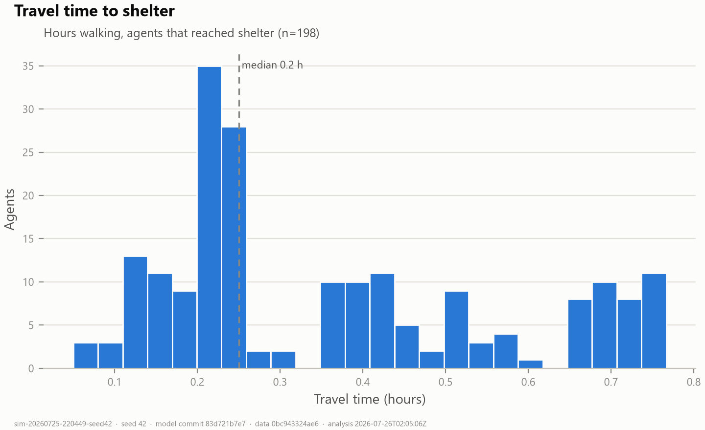
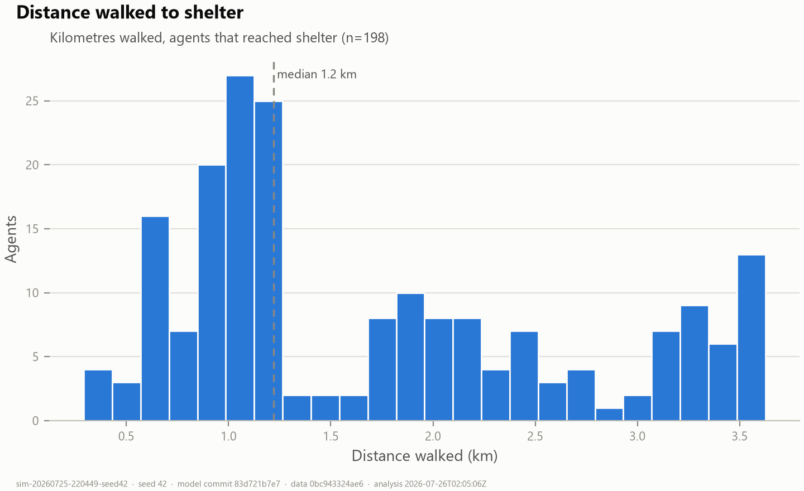
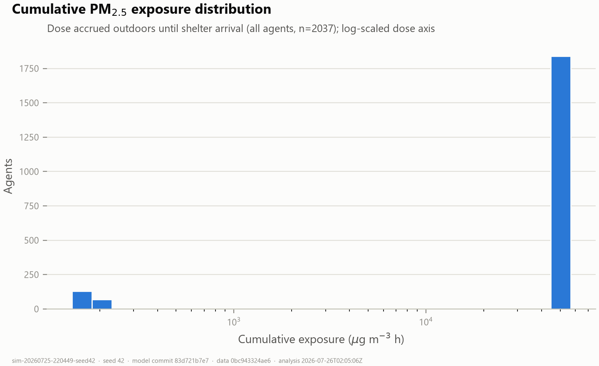
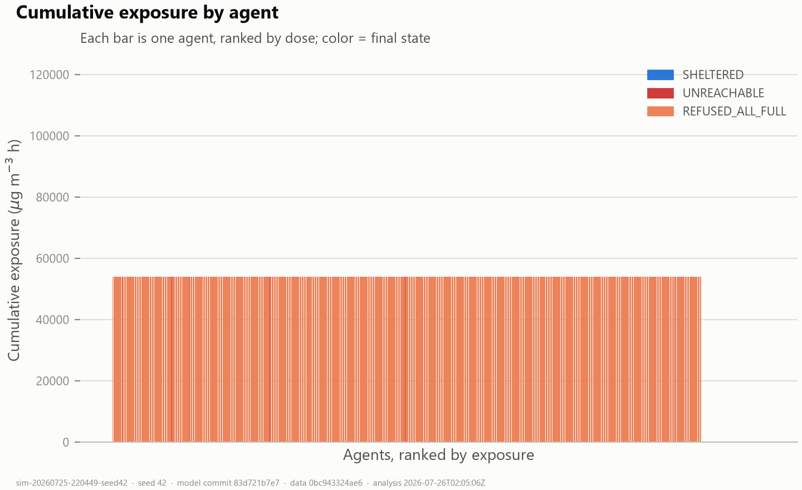
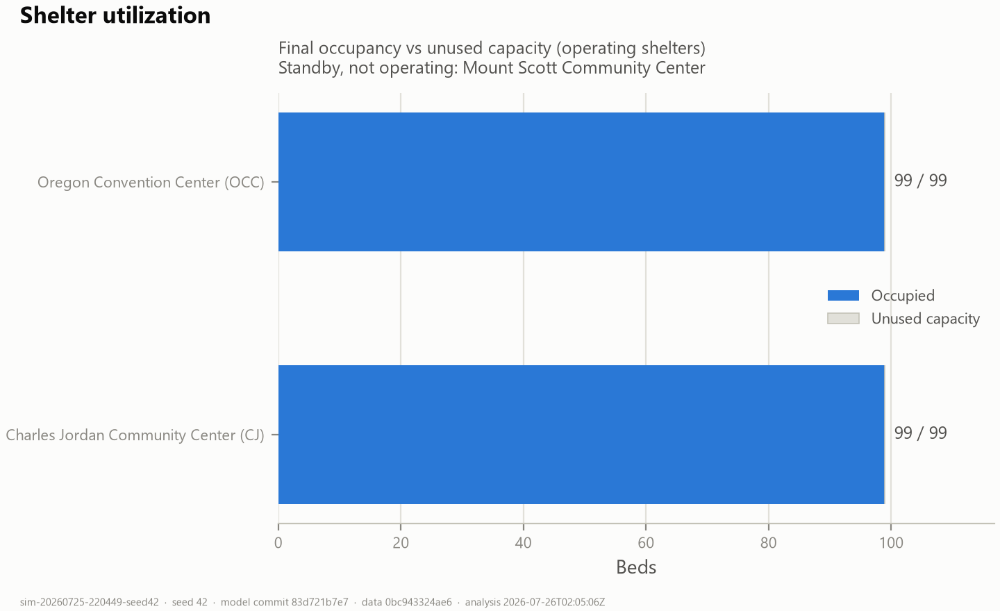

# Final Results Report — Wildfire-Smoke Shelter Access in Portland, OR (September 2020)

**Agent-based simulation of clean-air shelter access for unsheltered residents
of Multnomah County during the September 2020 wildfire-smoke event.**

| Run identity | Value |
|---|---|
| Production runs | `sim-20260725-220449-seed42` (primary), `sim-20260725-220529-seed43`, `sim-20260725-220551-seed44` |
| Population | n = 2,037 per run (measured; see §4) |
| Model git commit | `83d721b` (post routing-fix `3e4fad1`) |
| Data version tag | `0bc943324ae6` (SHA-256 over all four input datasets; per-file hashes in each `simulation.json`) |
| Verification | 38/38 automated cross-checks passed in every run, including the walked-vs-planned routing-integrity gate (A-17) |
| Archived artifacts | `docs/runs/production-n2037/seed{42,43,44}/` — `agents.csv`, `shelters.csv`, `simulation.json`, full analysis output |

Every number in this report is reproducible from the archived manifests:
seed + parameters + dataset SHA-256s + git commit.

---

## 1. Research question

**During the September 2020 wildfire-smoke event, could Portland's unsheltered
residents actually reach clean-air shelter — and how was the resulting PM2.5
exposure burden distributed between those who found a bed and those who did
not?**

The model measures *access* (can a person walking from a real encampment
location reach an operating shelter with an open bed over the real street
network?) and *exposure burden* (a time-integrated PM2.5 concentration index
accrued while outdoors). It does **not** simulate health outcomes.

## 2. What the model measures — and what it does not

**Measures:**
- Per-resident journey outcomes over the real Portland street network:
  shelter reached (or not), travel time, walked distance, capacity refusals.
- Per-resident exposure index: Σ C(t)·Δt (µg·m⁻³·h) accrued while outdoors,
  using measured hourly PM2.5; accrual stops at shelter arrival (the study
  endpoint).
- Population-level distribution of that burden (mean/median/percentiles,
  person-hours above the EPA "Unhealthy" concentration breakpoint, Gini).

**Does not measure:**
- Health outcomes (no concentration–response function, no breathing rate, no
  deposition). "Exposure" here is an *index*, not an inhaled dose.
- Indoor air quality or filtration benefit — shelter benefit in this model is
  *ending outdoor exposure time*, deliberately.
- Behavioural heterogeneity in evacuation decisions (all residents depart at
  the same trigger; see limitation L1).

## 3. Methodology

### 3.1 Model structure

Repast Simphony 2.11.0 agent-based model (Java 17), 1-minute ticks, 312
simulated hours anchored at 2020-09-07 00:00 local. Agents are unsheltered
residents placed at real encampment-report coordinates; shelters are the real
September-2020 clean-air shelter sites (2 operating, 1 standby) with capacity
enforced; movement is along the real RLIS street centerline network
(89,345 graph nodes / 112,070 edges after validation).

### 3.2 Behaviour rules (in execution order per tick)

1. **Exposure accrual** — every resident not yet sheltered accrues
   `C(t)·Δt` where `C(t)` is the measured county PM2.5 for the current hour
   and Δt = 1/60 h.
2. **Evacuation trigger** — residents shelter in place at their encampment
   until local PM2.5 first reaches 55.5 µg/m³ (the EPA "Unhealthy" AQI
   breakpoint lower bound — a sourced threshold, not a fitted one), then
   depart. In these runs the first crossing is 2020-09-07 16:00, so all
   residents depart simultaneously (registered artifact, limitation L1).
3. **Routing** — the resident targets the operating shelter with space at
   minimum street-network distance from its current graph node (Dijkstra
   shortest paths; edge weights = geodesic metre lengths, WGS84/Karney 2013)
   and walks the materialised path at 1.30 m/s (78 m per tick).
4. **Admission (V12)** — on arrival, the shelter admits if occupancy <
   capacity; otherwise the resident is refused.
5. **Refusal re-routing (D-6 / A-17, fixed this commit)** — a refused
   resident **remains at the refusing shelter's street node** and re-plans
   from that node to the next-nearest shelter with space. No
   return-to-encampment movement exists in the model. If no reachable
   operating shelter has space, the resident becomes `REFUSED_ALL_FULL` and
   remains outdoors for the rest of the event, still accruing exposure.

### 3.3 Equations

For resident *i* with outdoor indicator O_i(t):

- **Cumulative exposure index (V6):** E_i = Σ_t C(t)·Δt·O_i(t)  [µg·m⁻³·h]
- **Exposure Burden Index (V7, historically "VWE"):**
  EBI_i = Σ_t C(t)·RR_age,i·RR_com,i·Δt·O_i(t). Both RR factors are **1.0
  placeholders** (unsourced weights are refused), so EBI ≡ E in these runs.
- **Person-hours above Unhealthy (V8):** H_i = Σ_t Δt·1[C(t) > 55.5]·O_i(t)
- **Travel (V9):** geodesic metres walked along the street path;
  **initial accessibility (V11):** network distance from start node to the
  first selected shelter.
- **Inequality (V14):** Gini = Σ_i Σ_j |E_i − E_j| / (2 n² Ē)

### 3.4 Scenario

Status quo: the two shelters that actually operated (Charles Jordan "CJ",
Oregon Convention Center "OCC"), 99 beds each (provenance caveat, §5);
the standby site (MSCC) not operating. Population 2,037 (§4). Seeds 42
(primary), 43, 44.

## 4. Datasets (all real; provenance, checksums and limitations in `docs/science/DATA_SOURCES.md`)

| Dataset | Source | Role | Status |
|---|---|---|---|
| Street network | City of Portland / Metro RLIS `Streets.shp` (112,070 features) | Routable pedestrian graph | **Measured.** Validated: 27 corrupt attribute node IDs corrected with full provenance (exported per run); 0 impossible edges after fix. |
| PM2.5 | EPA AQS hourly, Multnomah County, Sept 2020 (576 hourly slices; peak 562.7 µg/m³) | Smoke field C(t) | **Measured.** Spatially uniform by assumption A-01 (2 in-county monitors). |
| Shelters | September 2020 clean-air shelter sites (geocoded) | Destinations + capacity | **Measured locations**; capacity 99/site is newsroom-sourced, **unconfirmed** (A-04, blocking). |
| Encampments | City of Portland IRP campsite reports | Start locations | **Measured points, temporally displaced**: 2025–26 reports used as a spatial proxy for 2020 (A-03); complaint-driven visibility bias. |
| Population size | 2,037 — January 2019 Point-in-Time count of unsheltered people, Multnomah County | Number of agents (D-5) | **Measured count**, used for a September 2020 event (temporal mismatch stated, limitation L3). |

## 5. Assumptions (register: `Geography/data/registry/assumptions.csv`, validated at startup)

Key active assumptions: **A-01** spatially uniform smoke field; **A-03**
2025–26 encampment proxy; **A-17** refused residents re-plan instantly from
the refusal location (no queueing/abandonment — the *implementation* now
matches the registered statement; the remaining content is behavioural).

**Assumptions still registered as blocking publication** (reported, not
hidden): **A-02** simultaneous evacuation at first threshold crossing (drives
limitation L1), **A-04** unconfirmed 99-bed capacities, plus A-09, A-12, A-16
(engineering-governance items listed in the registry). Placeholder variables
V2/V4/V7 (vulnerability weights) are inert at 1.0 and are not quoted as
results anywhere in this report.

## 6. Validation

1. **Compilation + startup governance** — the variable/assumption registries
   are schema-validated before any run; a registry defect aborts the run.
2. **Street-network validation layer** — corrupt RLIS node IDs corrected
   with per-correction provenance exported in every manifest; post-fix audit:
   0 impossible edges, max endpoint gap 11.9 m.
3. **Baseline regression gate** — after the routing fix, the n=50 seed-42
   baseline reproduces the archived reference exactly: all 25 shared
   `agents.csv` columns identical on all 50 rows; `shelters.csv`
   byte-identical (the fix is provably inert where capacity never binds).
4. **Capacity-binding golden** (`docs/runs/capacity-binding-n400-seed42/`) —
   n=400 forces refusals: 250/400 residents refused at least once, 53
   refused-then-sheltered, 198 admitted = exactly 2×99 beds.
5. **Routing-integrity failing check (A-17)** — for every routed agent,
   walked distance ≤ planned network legs + off-network snap gap + 200 m.
   Across all five post-fix runs the maximum unexplained walked distance is
   **8.9 m**. Before the fix, refused agents walked kilometres of phantom
   backtracking; that class of error can no longer pass silently — the check
   fails the run.
6. **Cross-file consistency** — 38 automated checks per run reconcile
   `agents.csv`, `shelters.csv` and `simulation.json` (census, occupancy,
   exposure/travel statistics recomputed from raw rows). 38/38 pass in all
   three production seeds.
7. **Multi-seed stability (D-5)** — headline outcomes vary by < 0.4% across
   seeds 42/43/44 (table below).

## 7. Results

### 7.1 Population outcomes (n = 2,037; three seeds)

| Outcome | seed 42 | seed 43 | seed 44 |
|---|---|---|---|
| **Sheltered** | **198 (9.72%)** | 198 (9.72%) | 198 (9.72%) |
| Refused everywhere (`REFUSED_ALL_FULL`) | 1,824 | 1,820 | 1,827 |
| Unreachable on street graph | 15 | 19 | 12 |
| Residents refused at ≥1 shelter door | 1,824 | 1,820 | 1,827 |
| Total door refusals (CJ + OCC) | 2,344 | 2,378 | 2,336 |
| Refused at both shelters | 520 (seed 42) | — | — |
| Shelter utilization | 198/198 beds (100%) | 100% | 100% |

**All 198 beds were claimed within ~48 minutes of evacuation start**
(departure 16:00; last admission 16:46–16:48 across seeds). After that
moment, no walking strategy could produce a bed: the system is
**capacity-bound, not access-bound**.

### 7.2 Exposure burden (µg·m⁻³·h; measured PM2.5, uniform field)

| Group (seed 42) | n | Mean | Median | Max |
|---|---|---|---|---|
| Sheltered | 198 | 177 | 167 | 210 |
| Refused everywhere | 1,824 | 54,003 | 54,003 | 54,003 |
| Unreachable | 15 | 54,003 | 54,003 | 54,003 |
| All residents | 2,037 | 48,771 | 54,003 | 54,003 |

- A resident who never reached shelter accrued the full-event outdoor dose of
  **54,003 µg·m⁻³·h** (312 h at a mean measured concentration of
  ≈173 µg/m³), including **194 hours above the 55.5 µg/m³ "Unhealthy"
  breakpoint**. A sheltered resident accrued ~177 µg·m⁻³·h — roughly
  **300× less** — almost all of it during the 16-hour pre-evacuation wait,
  with only ~30 µg·m⁻³·h accrued while walking.
- Population total: **99.35 million µg·m⁻³·h**; **356,841 person-hours above
  Unhealthy** (seed 42; other seeds within ±5 person-hours).
- Exposure Gini = **0.097**: *low*, because the burden is nearly binary —
  90.3% of the population shares the identical maximal outdoor dose. The
  inequality that matters here is the shelter/no-shelter cliff, not a
  gradient (interpretation §8).
- Among sheltered residents, travel time and exposure correlate at
  Pearson r = 1.00 — with a uniform field and simultaneous departure,
  time outdoors *is* the exposure mechanism.

### 7.3 Journeys (individual records: `agents.csv`, one row per resident)

Each of the 2,037 rows carries: agent ID, sim ID, commit, seed, data version,
starting encampment (real report ID), shelter reached, success flag,
departure/arrival times (tick + local), travel time, walked distance,
initial network distance (V11), planned route + snap gap + door refusals
(QC), average/peak PM2.5, cumulative exposure, exposure-while-traveling,
EBI, hours above Unhealthy, RR placeholders, final state.

- **Initial accessibility (V11):** the nearest reachable shelter was a median
  **5.5 km** walk (mean 6.5 km, p90 12.4 km, max 18.1 km) — ~70 minutes at
  1.30 m/s even before capacity is considered.
- **Sheltered residents** (n=198): walked mean 1.73 km (max 3.6 km), travel
  time mean 21.7 min (max 46 min). Fastest: `Site 2018` / `Site 1963`, 3 min,
  ~290 m. Slowest: `Site 1112` / `Site 1995`, 46 min, ~3.6 km.
- **Refused residents** (n=1,824, seed 42): walked mean **9.5 km** (median
  10.2 km, max 18.2 km) through hazardous smoke without obtaining a bed; 520
  of them were refused at *both* operating shelters (mean walk 10.9 km).
  Longest journey: `Site 1996`, 18.15 km walked against an 18.12 km planned
  route (surplus 38 m — the routing now accounts for every metre), refused
  at the door, everything else full, 194 h above Unhealthy.
- **Unreachable residents** (n=15): encampment points snapping to street-graph
  components disconnected from both shelters; they shelter in place and
  accrue the full outdoor dose. A data-quality outcome, reported as such.

### 7.4 Shelter-level results (seed 42)

| Shelter | Beds | Admitted | Door refusals | Mean walk of admitted | First / last admission |
|---|---|---|---|---|---|
| Oregon Convention Center (OCC) | 99 | 99 | 1,722 | 0.95 km | 16:03 / 16:16 |
| Charles Jordan Center (CJ) | 99 | 99 | 622 | 2.51 km | 16:03 / 16:46 |
| MSCC (standby, not operating) | — | 0 | 0 | — | — |

OCC — central to the encampment distribution — filled in 13 minutes and
turned away 17 people for every bed it had.

### 7.5 Figures (seed 42; per-seed copies in each archive)

## 8. Interpretation (what these results mean — and what they do not)

1. **Capacity, not distance, was the binding constraint.** With ~2,037
   unsheltered people and 198 beds, 90.3% of the population could not be
   sheltered under *any* routing, placement or information regime — beds ran
   out ~48 minutes after departure. Access improvements (better placement,
   wayfinding, transport) cannot change the headline number; only capacity
   can.
2. **The exposure burden is a cliff, not a slope.** Residents who found a bed
   cut their exposure index by roughly 300×; everyone else converged on the
   identical maximal outdoor dose. This is why the Gini is low (0.097) —
   near-total deprivation shared almost equally is still near-total
   deprivation.
3. **Seeking shelter had a real cost for the refused.** The refused cohort
   walked a mean of 9.5 km through smoke — with 520 people walking to two
   full shelters — and finished with the same dose as if they had never left.
   Under this model's assumptions, walking-based shelter-seeking without bed
   availability information is all cost and no benefit once capacity binds.
   (A reservation/notification mechanism is an obvious policy experiment this
   model could run; it is future work, not a finding.)
4. **These are exposure-index statements, not health claims.** Converting
   µg·m⁻³·h to health outcomes requires concentration–response functions and
   breathing/deposition modelling that this study deliberately does not
   include.

## 9. Limitations

- **L1 (A-02, blocking).** All residents evacuate at the *first* threshold
  crossing (Sept 7 16:00) — before the real shelters opened (Sept 10–11) —
  and simultaneously. Absolute dose magnitudes and arrival timing carry this
  artifact; the structural findings (capacity binding, exposure cliff,
  refused-cohort walking cost) are driven by the bed-to-population ratio, not
  the trigger time. Realistic staggered departure is registered future work.
- **L2 (A-04, blocking).** The 99-bed capacities are newsroom-sourced and
  unconfirmed. The 9.72% arrival rate scales directly with total beds; treat
  it as "≈198 beds' worth", not a precise percentage.
- **L3.** Population 2,037 is the measured January-2019 PIT count applied to
  a September-2020 event; the true event population is unknown.
- **L4 (A-03).** Encampment start locations are real city reports but from
  2025–26 (no 2020 records exist in the feed), with complaint-driven
  visibility bias.
- **L5 (A-01).** The smoke field is spatially uniform (2 in-county
  monitors); all between-resident exposure differences arise from time
  outdoors, none from spatial gradients.
- **L6.** Bed admission is arrival-order within a tick (seeded shuffle):
  *which specific residents* get the marginal beds varies by seed, though
  population-level results are stable (refused count varies by ±4 of ~1,824
  across seeds). Order-independent two-phase admission remains registered
  future work (`08-ENGINEERING.md` §3.5).
- **L7.** All mapped street centerlines are treated as walkable (no
  freeway-pedestrian exclusion yet); 12–19 residents per seed are
  "unreachable" due to disconnected graph components — a network-data
  artifact reported in the outcome census, not removed from it.
- **L8.** Vulnerability weighting is inert (RR = 1.0 placeholders); EBI
  equals raw exposure. No claim about differential susceptibility is made.
- **L9.** No shelter departures, no queueing, no abandonment (A-17
  behavioural residue); no indoor exposure model.

## 10. Provenance of each headline claim

| Claim | Measured | Literature-supported | Assumption-dependent |
|---|---|---|---|
| "198 of 2,037 (9.7%) reached shelter" | Street network, encampment points, shelter locations, PIT count | Walking speed 1.30 m/s (gait literature); Dijkstra routing | Capacity 99×2 (A-04); simultaneous evacuation (A-02); 2025–26 encampment proxy (A-03) |
| "Refused residents walked ~9.5 km through smoke" | Network distances; PM2.5 concentrations | Walking speed | Refusal behaviour: instant re-decision, no queueing (A-17); A-02 timing |
| "~300× exposure difference sheltered vs not" | Hourly PM2.5 (EPA AQS) | "Unhealthy" breakpoint 55.5 µg/m³ (EPA) | Uniform field (A-01); exposure ends at arrival (study-endpoint definition); A-02 inflates both sides' absolute values |
| "356,841 person-hours above Unhealthy" | Hourly PM2.5 | EPA breakpoint | A-01, A-02, population size L3 |
| "Beds exhausted in ~48 minutes" | Network, locations | Walking speed | A-02 (simultaneous departure compresses this interval); A-04 |

---

*Generated from archived runs at model commit `83d721b`; analysis pipeline
`scripts/analyze_run.py` v1.1.0. The routing defect that previously walked
refused residents back to their encampments (Finding A) was fixed and
validated before these runs; see `docs/science/phase2-human-agents/09-DECISIONS.md`
D-6 and the capacity-binding golden in `docs/runs/capacity-binding-n400-seed42/`.*
