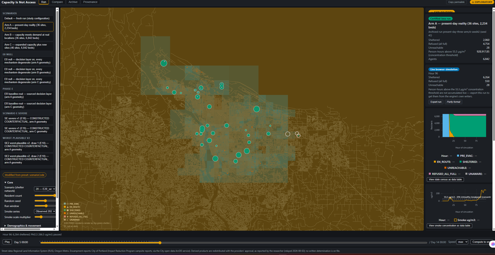
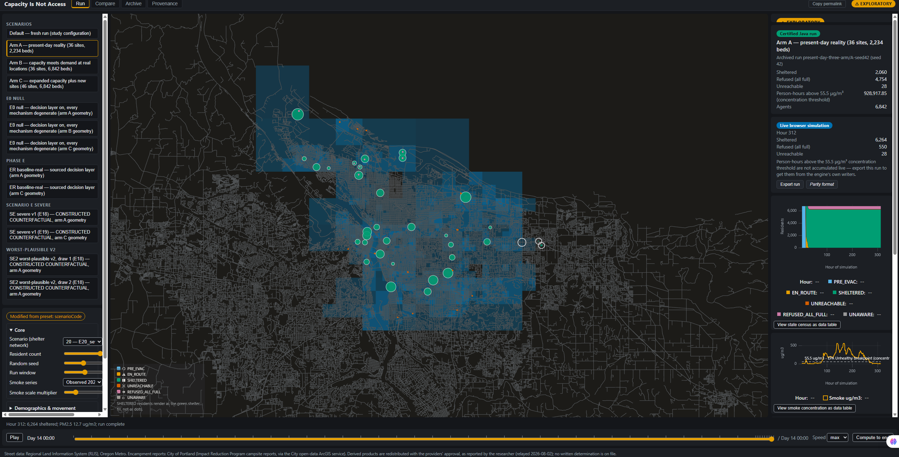
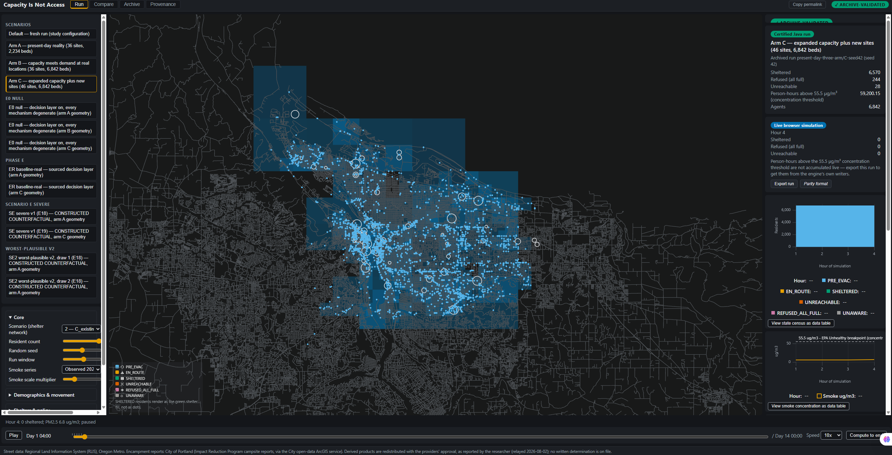

# The Complete Story

**Capacity Is Not Access: an agent-based model of wildfire-smoke shelter access among
unsheltered residents of Multnomah County, Oregon.**

Fatima Asghar · NSF REU

---

## How to read this document

This is the long version. It is written so that a person who has never seen the project
can start at the top, read straight through, and end up knowing not only what the model
does but why every single choice inside it was made that way and not some other way. It
covers the whole arc: the first two-shelter experiment that turned out to be broken, the
present-day three-arm redesign, the bed sweep, the human decision layer, the severe-event
counterfactual, the browser port, and every defect found and fixed along the way.

Three rules govern what is in here.

First, every number comes from a file in this repository, and the file is named in
parentheses right next to the number. If you want to check something, the path tells you
where to look.

Second, where two documents in this repository disagree with each other, this document
says so and shows both. It does not smooth over the disagreement. There is a running list
of every such conflict in Section 9 and in Section 12.

Third, where the repository does not record a reason for something, this document says
"the record does not say why" rather than inventing a plausible-sounding one. That
happens a few times, and each time it is flagged as a gap.

There are no em dashes anywhere in this document, by request.

**Jargon is defined at first use.** If a term appears that you do not recognise, it is
defined the first time it shows up, and the definition is in ordinary words.

---

## 1. What the project is, and what question it answers

### 1.1 The one-sentence version

When wildfire smoke fills a city, the people with the fewest choices about where to
breathe are the people sleeping outside, and this project builds a computer model of one
real city to ask whether the shelters that exist can actually be reached by the people
who need them.

### 1.2 The honest version

That sentence hides all the difficulty, so here is the same thing said carefully.

In September 2020, wildfire smoke settled over Portland, Oregon, and stayed for days. The
air quality monitors inside Multnomah County recorded hourly fine-particle concentrations
that peaked at 562.7 micrograms per cubic metre (`docs/final/SMOKE_FIELD_AUDIT.md` §2).
For scale, ordinary clean air in Portland during that same month sat between about 3 and
9 micrograms per cubic metre (visible in the hourly series embedded at
`docs/final/presentation/capacity-is-not-access-symposium.html`, the `DATA.pm` array). So
the smoke was roughly a hundred times worse than normal for over a week.

**PM2.5** is the standard shorthand for those particles. It means "particulate matter
2.5 microns or smaller", which is fine enough to travel deep into the lungs rather than
being caught in the nose and throat. It is measured in micrograms of particle mass per
cubic metre of air, written µg/m³.

The county opened emergency clean-air shelters. A person living in a house could close
their windows. A person living in a tent could not. So the question the project asks is
narrow and concrete:

> If a smoke event of that magnitude happened against the shelter system that exists
> today, and against the number of unsheltered people who live in the county today, how
> many of them would actually get indoors, who would be left outside, and what would
> change that?

The word doing the work is **actually**. It is not a question about how many beds exist.
It is a question about whether a specific person, starting at a specific place, walking
at a speed determined by their age and health, can reach a specific door before that door
fills up.

### 1.3 Why an agent-based model and not a map

The standard tool for questions like this is a **screening map**, which means a map that
colours each neighbourhood by some measure of risk or need, often combined with a buffer
showing what is "within a mile" of a shelter. Those maps are useful and they are cheap to
make. They also cannot answer this question, for two reasons that are worth stating
precisely because a reviewer will ask.

**A map cannot show reach.** A buffer drawn around a shelter says how far away things are
as the crow flies, or at best along roads. It does not know that the person inside the
buffer walks at 0.98 metres per second rather than 1.38, that the only bridge between
them and the shelter carries no sidewalk, or that the street they would use is a freeway
ramp where pedestrians are prohibited. This project found that last problem in its own
data and had to fix it, which is described in Section 9.

**A map cannot show a full door.** This is the deeper reason. The presenter's script puts
it in one line: *"A shelter that is full turns away the next person to arrive, and who
arrives first depends on where they started and how fast they walk. An average cannot
represent a full doorway"* (`docs/final/PRESENTER_SCRIPT.md`, Slide 4). The outcome the
project cares about is a collision between many people and a hard limit. Averages smooth
collisions away. The only way to see who loses a race is to simulate the race.

An **agent-based model** (ABM) is a simulation in which every individual in the
population is represented separately, as its own small program with its own attributes,
making its own decisions tick by tick. Here there is one simulated resident for every
real unsheltered resident: 6,842 of them. Each one has an age, a sex, a walking speed,
health attributes, a starting location, and a state. The model runs the clock forward one
minute at a time and lets them move.

The platform is **Repast Simphony**, a Java-based agent modelling toolkit (North et al.
2013, DOI 10.1186/2194-3206-1-3, cited at `docs/final/PRESENTER_SCRIPT.md` Slide 4). The
route-finding is **Dijkstra's algorithm** (Dijkstra 1959, DOI 10.1007/BF01386390), which
is the same shortest-path calculation a phone navigation app performs. Distances are
measured along the curve of the Earth using Karney's geodesic method (Karney 2013, DOI
10.1007/s00190-012-0578-z), which is named explicitly rather than being left as a vague
"we measured distance", because saying whose method it is makes the number checkable.

### 1.4 What "agent-based" buys, and what it costs

It buys the ability to observe a mechanism rather than a correlation. Section 6 reports a
result where adding beds to existing shelters raises total access enormously and, at the
same time, widens the gap between residents who walk easily and residents who do not. No
map produces that finding, because the finding is about arrival order.

It costs a very large number of assumptions. Every one of those assumptions is a place
the model could be wrong. That is why this project carries two machine-readable
registries listing every scientific quantity and every assumption, validated at program
startup, described in Section 3.

---

## 2. The world we built, piece by piece, and why each piece is the way it is

The simulated world has four physical parts: the streets people walk on, the air they
breathe, the people themselves, and the shelters they walk toward. Each was built from a
real dataset, and each dataset has a documented history, including its problems.

### 2.1 The street network

**What it is.** Every street in the Portland metro area, as a set of line segments with
endpoints, loaded from the Regional Land Information System (RLIS) street centreline
file maintained by Oregon Metro, the regional government
(`docs/science/DATA_SOURCES.md` D0). The raw file contains **112,070 features**, and
100% of them carry the `PDX_F_NODE` and `PDX_T_NODE` attributes, which are the file's own
labels for the intersections at each end of a segment.

**Why real centrelines rather than a grid.** A synthetic grid would make every route the
same shape and would erase exactly the thing being measured: that some encampments sit on
dead-end fragments, some sit behind a river, and some sit a block from a shelter. The
whole point is that geography is uneven.

**Why freeways are excluded.** Pedestrians may not legally walk on limited-access
freeways, but the RLIS file contains freeway mainlines and ramps like any other line. If
they are left in, the route-finder will happily walk a person up an on-ramp and across a
freeway bridge. The correction, registered as variable **V26**, excludes every feature
whose RLIS `TYPE` code is in {1110, 1120, 1121, 1122, 1123}, which are freeway mainline
and the four ramp/connector classes (`Geography/data/registry/variables.csv`, V26). The
counts were verified against the source file `Streets.dbf`: TYPE 1110 appears 1,372
times, 1120 appears 279 times, 1121 appears 466, 1122 appears 447, and 1123 appears 72,
which is **2,636 features and 614.1 kilometres removed**
(`docs/critique-response/11-ROUND5-REPORT.md`, U-27 section).

The consequence that matters most is bridges. Portland's Willamette River crossings
include the Marquam Bridge (Interstate 5) and the Fremont Bridge (Interstate 405), and
neither carries pedestrian access. Before the fix, the model let people walk across both.
After the fix, they are gone, and all eight pedestrian-legal crossings remain
(`scripts/audit_bridges.py`, reported in `11-ROUND5-REPORT.md`). One crossing, the Ross
Island Bridge, is retained because it carries a sidewalk and its RLIS TYPE is 1300, not a
freeway class. The round-4 external critique's list of "walkable bridges" had omitted it,
so the critique's list was incomplete and the model was right.

**The resulting graph.** After the freeway exclusion, the pedestrian network has
**109,434 edges and 88,100 nodes**, in 171 disconnected components, the largest of which
holds 59,725 nodes (`docs/final/TECHNICAL_REFERENCE.md` §13.7;
`docs/science/DATA_SOURCES.md` D0). Before the exclusion it had 112,070 features feeding
89,345 nodes in 154 components. A **component** is a set of nodes you can walk between;
171 components means the pedestrian map of the county is not one connected thing, and
some residents start on a fragment with no legal walking route to anywhere.

**The wormhole defect.** This is the single most consequential bug found in the project,
and it is described in full in Section 9. In short: the model originally trusted the
file's own intersection labels, and a small block of those labels is corrupt. The same
intersection ID was claimed at positions up to 18.5 kilometres apart by different
segments, which welded distant parts of the city into single points and created 50 edges
that a route could traverse for almost no cost while a walking person would physically
cross kilometres (`docs/validation/STREET_NETWORK_VALIDATION.md` §1 and §2). The fix
clusters the claims by location and splits the impostors, and after it there are **zero**
impossible-span edges.

**What is still not fixed, and is stated.** The RLIS file records centrelines, not
sidewalks, and carries no pedestrian attributes. Highway classes in the TYPE 1200 series
(2,139 features) are retained because the file does not say which of them have sidewalks,
and inventing that would be worse than keeping them; this is registered as a named
sensitivity in V26 rather than passed over. Also, the acquisition route for the file
itself predates version control, so its publication date is unknown
(`docs/science/DATA_SOURCES.md` D0). The redistribution status is stated exactly as
strongly as the record supports and no more: *the researcher reports that Oregon Metro
approved the redistribution (relayed 2026-08-02)*, and there is no written determination
on file anywhere in the repository. That is the honest form of that sentence and it is
repeated in the model's own footer.

### 2.2 The smoke field

**What it is.** A single number per hour, applied to the entire county, for 312 hours
starting 2020-09-07 at 00:00 and ending 2020-09-19 at 23:00
(`docs/final/SMOKE_FIELD_AUDIT.md` §2).

**Where it comes from.** The U.S. EPA's Air Quality System (AQS), which is the federal
repository of regulatory air monitoring data. The project retrieved hourly observations
of **parameter 88502** from 7 monitors across Multnomah, Washington and Clackamas
counties for September 2020: 4,795 rows, of which 1,454 are Multnomah
(`docs/science/DATA_SOURCES.md` D3; `docs/final/SMOKE_FIELD_AUDIT.md` §2). Retrieval is
scripted and reproducible at `scripts/fetch-aqs-pm25.ps1`, and the file's SHA-256
checksum is recorded.

**Why parameter 88502 and not 88101.** This question comes up because 88101 is the
"proper" one: it is the code for PM2.5 measured by a Federal Reference Method or Federal
Equivalent Method, the instruments EPA certifies for regulatory compliance. Parameter
88502 is "PM2.5 acceptable for AQI reporting" measured by a non-reference instrument. The
answer is blunt and is stated in the audit: **88101 has no Multnomah County monitors in
this period**, so 88502 was used because it is the only in-county data that exists
(`docs/final/SMOKE_FIELD_AUDIT.md` §6). All seven monitors report via method 771, heated-
inlet nephelometry, at POC 3, which means there is a single instrument type with no
method diversity and no co-located reference instrument, and the file's `Uncertainty`
column is empty in all 4,795 rows so there is no per-observation error to propagate.

The direction of the resulting bias is known and is stated rather than hidden: a heated
inlet evaporates semi-volatile organic compounds before the particles are counted, and
those compounds are a large fraction of the mass of fresh wood smoke, so **these readings
most likely understate the true PM2.5 during the event**
(`docs/chapter/Capacity_Is_Not_Access.tex`, the paragraph preceding Fig. 1). That is a
caution in the direction of the model looking better than reality, which is the direction
this project consistently reports its errors in.

**Why the field is uniform across the county, and why that is a limitation rather than an
oversight.** Only **two** of the seven monitors sit inside Multnomah County: site 0080 at
(45.4966, −122.6029) and site 2011 at (45.5622, −122.5757). The model computes the
unweighted arithmetic mean of those two for each clock hour and applies it to every
resident. There is no spatial interpolation of any kind
(`docs/final/SMOKE_FIELD_AUDIT.md` §1).

That was a deliberate refusal. Inverse-distance weighting or kriging fitted to two points
does not recover a real concentration field; it manufactures a gradient whose shape is an
artefact of the interpolation method and the accident of where two instruments happen to
sit. A kriging variogram, which is the statistical object that makes kriging meaningful,
cannot be estimated from two stations at all. Presenting such a surface would give every
"exposure hot spot" in the results the appearance of spatial precision the data cannot
support. The audit's own words for the alternative are that stating plainly that the
field is uniform is *"weaker-looking and more honest"* (`docs/final/SMOKE_FIELD_AUDIT.md`
§3). It is registered as assumption **A-01** in
`Geography/data/registry/assumptions.csv`, with a sensitivity plan attached.

The consequence has to be carried everywhere, and it is: **placement cannot help by
moving people to cleaner air, because in this model there is no cleaner air.** Better
shelter placement helps only by shortening journeys. Therefore every placement benefit
this study reports is a pure travel-time effect and is a lower bound on what placement
could achieve in a real, spatially varying smoke field.

**What the series looks like.** Over the 312-hour window there are zero missing hourly
slices. The county hourly mean peaks at **562.7 µg/m³** at 2020-09-12 20:00; the highest
single-monitor hour is **588.9 µg/m³** at site 2011 on 2020-09-13 at 21:00. Those two
numbers must never be conflated, and the model uses and reports 562.7 because that is the
field it actually integrates. The mean over the window is 173.09 µg/m³, and **194 of the
312 hours** sit at or above 55.5 µg/m³ (`docs/final/SMOKE_FIELD_AUDIT.md` §2).

The strongest external validation available is that EPA's own informational qualifier
`IT`, meaning "Wildfire, U.S.", is set on 1,576 rows spanning exactly 2020-09-07 to
2020-09-19, which is the simulation window to the day. That is the agency itself
attesting that these observations are wildfire-influenced.

**The shape matters and is disclosed.** The episode is not one continuous emergency. It
has two spells: a short spike at hours 16 to 21, then 57 comparatively clean hours, then
the main episode from hour 79 onward (the shaded bands in the deck chart at
`docs/final/presentation/capacity-is-not-access-symposium.html`, drawn from the zone list
`[[16,21],[22,78],[79,311]]`). This is disclosed deliberately, because "194 hours above
the threshold" would otherwise imply eight unbroken days.

### 2.3 The population

**What it is.** 6,842 simulated adults, each placed at a real campsite report location.

**Where 6,842 comes from, and why the number changed.** The earlier version of this study
used **2,037**, the unsheltered count from the 2019 Point-in-Time count
(`docs/science/DATA_SOURCES.md` D2 and D10). A **Point-in-Time count**, usually shortened
to PIT count, is a survey conducted on a single night in late January in which volunteers
attempt to count every person experiencing homelessness in a given area, both those in
shelter and those outside. It is required by the U.S. Department of Housing and Urban
Development and it is a documented undercount, because people sleeping in concealed
locations are missed. The 2019 count for Portland/Gresham/Multnomah County recorded 4,015
people total, of whom **2,037 were unsheltered**, on the night of 2019-01-23. That count
was chosen originally because it was the nearest count to the September 2020 event; there
was no 2021 unsheltered count because of COVID, and the next one was 2022.

The present-day study uses the **2025 Tri-County Point-in-Time count** published by
Portland State University's Homelessness Research and Action Collaborative on 2025-11-04,
which recorded **10,526 people experiencing homelessness in Multnomah County, more than
65% of them unsheltered, giving 6,842**
(`docs/final/PRESENT_DAY_THREE_ARM_RESULTS.md`, opening; `docs/final/TECHNICAL_REFERENCE.md`
§3.4).

**Why the change was necessary.** The research question changed. The earlier study asked
a historical question, "does shelter placement matter", against the 2020 shelter system.
The present study asks a policy question in the present tense: if this happened now,
against today's shelter system, what happens. Asking a present-tense question with a
2019 population would understate today's demand by more than a factor of three, and the
shelter inventory being tested is the 2026 one. The chapter states the reasoning for
using the unsheltered subset rather than the total ("people already in shelter are
indoors and do not walk anywhere in this model") and for using the PIT figure rather than
the county's annual service count of 6,731 ("the annual figure counts turnover across a
year rather than people outside on one night")
(`docs/chapter/Capacity_Is_Not_Access.tex` §sec:people).

**The caveat that travels with 6,842, always.** The 2025 report's own authors state that
changes in how administrative data were incorporated substantially increased the 2025
unsheltered count, so the 2019-to-2025 comparison is **not a clean time series and is
never presented as one**. That caution is carried verbatim in the chapter, in
`docs/final/TECHNICAL_REFERENCE.md` §3.4, and in
`docs/final/FINAL_DATA_VALIDATION_REPORT.md`. Treating all 6,842 as outdoors
simultaneously is described in the presenter's script as *"a disclosed worst-case
construct, not a claim about one night"* (`docs/final/PRESENTER_SCRIPT.md`, Q&A 1). A
sweep over the fraction actually present is registered as future work and has **not** been
run, which is stated as an honest gap rather than glossed.

**Where people start.** The City of Portland publishes campsite reports through its
Impact Reduction Program, and 3,400 were retrieved through the city's open-data ArcGIS
service. They resolve to **3,317 distinct coordinates** in the file. Each simulated
resident is placed at one of those, sampled with replacement, so a single run occupies a
subset of them.

> **A disagreement between two repository documents, stated rather than smoothed.**
> `docs/final/PRESENT_DAY_THREE_ARM_RESULTS.md` line 203 says the seed-42 arm-A run used
> **2,918 distinct start locations**. `docs/chapter/Capacity_Is_Not_Access.tex` line 297
> says **2,981**. Both numbers are real and both come from the same file, but they count
> different things: the same run's `agents.csv` has 2,981 distinct
> `starting_encampment` identifiers and 2,918 distinct start **coordinates**
> (`docs/critique-response/03-data.md` §"2,981 distinct campsite points", and
> `docs/critique-response/00-RESPONSE.md` lines 483 to 485). The two deliverables use
> near-identical wording for two different quantities. A reader comparing them will think
> one is a typo. The claim linter carries an entry, `campsite-2981-distinct`, whose
> correction text insists the figure be stated as a sampling outcome of one run rather
> than a property of the data file (`docs/claims.yaml`), but the id-versus-coordinate
> distinction is not resolved in the deliverables themselves. This is a real
> documentation defect and it should be fixed by naming the quantity in both places.

The campsite feed is used as a **spatial proxy**, which means a stand-in for something
that does not exist. There are no 2020 records in the public feed at all, so 2025 and
2026 report locations serve as a geographic stand-in for the 2020 distribution, and the
model prints a warning saying so at the start of every run. The reports are also
complaint-driven, which biases them toward camps visible from the street. This is
registered as assumption **A-03** (`Geography/data/registry/assumptions.csv`) and, as the
presenter's script notes, the bias makes access look easier rather than harder, which is
again the optimistic direction.

**A privacy decision that changed what the browser app can display.** Because these are
3,400 precise, current, complaint-reported locations of where people sleep, publishing
them as points creates a targeting and sweep risk. The browser version therefore snaps
every coordinate to its nearest street node (which is the only quantity the simulation
actually uses), replaces the incident identifier with a salted hash whose salt is
withheld, drops dates and vehicle flags, and **always displays density on a grid of at
least 150 metres, never individual points** (`websim/docs/IMPLEMENTATION_PLAN.md` §7,
decision Q4; `websim/docs/DR-Q4-encampment-disclosure.md`). A raw-coordinate public layer
is described in the plan as never acceptable, not togglable and not hidden behind an
Easter egg. This is why the teal squares in Section 8's screenshots are squares.

### 2.4 The shelters

**What the present-day inventory is.** 36 facilities holding **2,234 spaces**
(`docs/final/TECHNICAL_REFERENCE.md` §4.5 and §4.8). Every one is a real facility at its
real address with its real published capacity.

**How it was assembled, and why that took the longest audit trail in the project.** The
county publishes its shelter list in **five incompatible units**: beds, motel rooms,
village units or pods, family units, and unstated. A row saying "28 families" is not 28
people. The rule adopted was: never convert an ambiguous unit to a single number, always
to a range, and always record which rule was applied
(`docs/final/SHELTER_CAPACITY_AUDIT.md` §2; `docs/final/TECHNICAL_REFERENCE.md` §4.2).

| Published unit | Count | People per unit | Basis |
|---|---|---|---|
| Beds | 1,066 | 1.0 exactly | A bed is one sleeping place for one person |
| Motel rooms (adults) | 341 | 1.0 to 1.5 | The listings say "individuals and couples", so occupancy is at least 1 and at most 2 |
| Village units / pods | 205 | 1.0 to 1.2 | Predominantly single occupancy; one site lists "men, women, couples" |
| Family units | 85 | 2.5 to 4.0 | A household, not a person. No local sheltered-family size is published. **The weakest conversion in the table** |
| Unstated (youth "30") | 60 | 1.0 | Unit not stated; treated as people, the reading that cannot inflate the total |

The point multipliers actually applied in the build are the midpoints: beds ×1.0, motel
rooms ×1.25, village units ×1.1, family rooms ×3.25, and every row carries its own audit
string in a `capacity_basis` column, for example
`58_rooms_x1.25_per_SHELTER_CAPACITY_AUDIT_s2`
(`docs/final/TECHNICAL_REFERENCE.md` §4.2).

**How the coordinates were obtained, and the design decision behind it.** The raw
inventory file was deliberately created **without** coordinates. The comment in the
geocoding script says why, verbatim: *"I did NOT put coordinates in
shelters_multnomah_2026.csv on purpose. Guessing lat/lon from an address is exactly the
kind of plausible-looking fabrication that has already cost you once in this project"*
(`scripts/geocode_shelters.py`, quoted at `docs/final/TECHNICAL_REFERENCE.md` §4.3).
Coordinates enter only through a named geocoder and every row records which one and at
what confidence. The base facilities went through OpenStreetMap's Nominatim geocoder with
an identifying user agent and a 1.1-second rate limit, and every result was checked
against a Multnomah bounding box of latitude 45.42 to 45.65 and longitude −122.95 to
−122.35, with the comment *"A geocoder that silently returns the centroid of another state
must not enter the dataset."*

Three sites publish only an intersection or a block rather than a street address, and
Nominatim refuses intersection-style queries, so those were geocoded to the corresponding
hundred-block address instead. That is an approximation of a few hundred metres and the
`coord_confidence` column says so on the row. Only **3 of 36** rows carry non-street-
address confidence (`docs/final/TECHNICAL_REFERENCE.md` §4.4).

**What is missing, and why.** Two City facilities are excluded because neither publishes
a street address: **Clinton Triangle (160 units, the largest single site in the
inventory)** and **Multnomah Safe Rest Village (28)**, together about 207 people. Real
capacity is therefore about 207 people higher than modelled
(`docs/final/TECHNICAL_REFERENCE.md` §4.6).

Ten to eleven **day centres** are excluded because no capacity figure is published for any
of them. Including them would mean inventing ten numbers. The exclusion carries a
scientific point that cuts against the project's own framing and is stated anyway: during
a *daytime* smoke episode, day centres are arguably the most relevant clean-air spaces
that exist, so their absence understates daytime shelter availability
(`docs/final/TECHNICAL_REFERENCE.md` §4.6). The reason this is not "fixed" by estimating
them is the same standard that kept the model from inventing a walking-speed effect for
asthma: ten invented numbers would be fabrications.

**The reconciliation.** Modelled capacity had been roughly 18% low before this pass: 29
facilities holding 1,816, then plus six locatable City villages to 35 facilities and about
2,114, then plus Doreen's Place (90 beds, recovered by shortening a failed geocoder query
to `610 NW Broadway`) to the final **36 facilities and 2,234 spaces**, independently
verified as 36 data rows summing to exactly 2,234 (`docs/final/TECHNICAL_REFERENCE.md`
§4.5 and §4.8).

**The historical 2020 inventory, which is a separate thing.** For the historical
calibration run the model uses only the two September 2020 emergency clean-air
activations: the Oregon Convention Center (opened 2020-09-10) and Charles Jordan Community
Center (opened 2020-09-11), each with capacity 99, for 198 total. Mount Scott Community
Center was prepped and put on standby and is present in the file with `operating=false`,
because a faithful status quo has two operating sites, not three
(`docs/science/DATA_SOURCES.md` D1). The 99 figure comes from a Street Roots newsroom
report of 2020-09-16 and **has never been confirmed by a primary agency document**, which
is why assumption **A-04** is still marked `blocking` in
`Geography/data/registry/assumptions.csv`. The July 2026 county shelter list was checked
to see whether it could confirm the 2020 figure, and it cannot: it describes a year-round
shelter system, different in time, purpose and function from a nine-day smoke activation.
Substituting it would be a temporal and functional category error
(`docs/final/SHELTER_CAPACITY_AUDIT.md` §1). A negative audit result is reported as a
result.

---

## 3. Every variable that matters, and why its value is what it is

### 3.1 The registry, and what "evidence class" means

Two comma-separated files hold the model's entire scientific content in machine-readable
form: `Geography/data/registry/variables.csv` (**55 variables**) and
`Geography/data/registry/assumptions.csv` (**35 assumptions**), counts verified directly
from the files. Both are loaded and validated **fail-fast at model startup** by
`geography.science.ScienceRegistry`, and both are written into every run's
`simulation.json` manifest under a `governance` block. A run whose registries fail
validation produces no output at all (`docs/science/REGISTRY_SCHEMA.md`).

Each variable row carries sixteen columns, including the mechanism (why the quantity
belongs in the model at all), the maths, the units, the source, a DOI or dataset
identifier, an uncertainty range to sweep, four yes/no flags for what it affects, and its
**evidence class**. The classes are defined in `docs/science/REGISTRY_SCHEMA.md` §1:

- **M, measured.** Taken from a dataset in the repository.
- **L, literature.** Taken from a published paper, with a resolvable DOI.
- **C, calibrated.** Fitted to a target.
- **A, assumption.** A modelling decision, not a measurement.
- **F, future work.**

The census across the 55 rows is **A 29, M 15, L 11**, with no rows currently in classes
C or F. By status: 28 implemented, 23 specified (designed and registered but not yet
coded), 3 placeholder (present in the code but deliberately inert), 1 deprecated.

Two of the validation rules are the mechanised form of the project's founding rule, "no
invented values":

- A row with `evidence_class = L` **must** have a non-empty `doi_or_dataset`, and `M`
  must have a dataset identifier. As the schema document puts it, a literature value with
  no resolvable source is exactly the defect this project has twice been damaged by, so
  it is rejected at load rather than merely warned about.
- A row with class `L` or `C` **must** have a non-`none` uncertainty range, because a
  literature value with no stated range cannot be sensitivity-tested.

Placeholder rows are counted and named in the manifest under
`governance.placeholder_variables`, so a run that depends on an inert value cannot be
quoted as a finished result. The three placeholders are **V7** (the exposure burden
index), **V2** (`age_rr`) and **V4** (`comorbidity_rr`), and Section 3.6 explains why the
last two are switched off.

Four assumptions are marked `blocking`, meaning they must be resolved before publication:
**A-04** (shelter capacity is newsroom-sourced), **A-09** (susceptibility weights are
inert), **A-12** (everyone is assumed to know the shelters exist) and **A-16** (admission
order within a tick is randomised).

### 3.2 Walking speed, the one attribute that actually changes outcomes

**The base speed.** The original single constant was 1.30 metres per second, from
Bohannon 1997 (DOI 10.1093/ageing/26.1.15), a study of comfortable self-selected gait
speed in adults aged 20 to 79 (n = 230). The registry row V10 records that 1.30 sits below
10 of the 12 published age-by-sex cells and about 6% under the table mean of 1.381
(`Geography/data/registry/variables.csv`, V10). This is class **L**.

**Why speed matters mechanically.** Speed sets how long a person is outdoors, and time
outdoors is the proximate driver of everything: accrued exposure, inhaled dose, and
crucially whether they reach a door before it fills. In this model, a health condition can
change an outcome **only** by changing walking speed, because a diagnosis is never
allowed to multiply a dose. That is the single most important structural rule in the
science and it is discussed in 3.6.

**The heterogeneous version.** In the production runs every resident draws their own
speed. The mean comes from Bohannon and Williams Andrews 2011 (DOI
10.1016/j.physio.2010.12.004, n = 23,111), which publishes comfortable gait speed means by
age decade and sex. The within-population spread comes from Bohannon 1997's coefficient
of variation of 0.13. The chapter states explicitly why the spread does **not** come from
the 2011 meta-analysis's confidence intervals: those intervals describe uncertainty about
a group average across studies, not the spread among individuals, and using them would
understate real between-person variation by a factor of three to five
(`docs/chapter/Capacity_Is_Not_Access.tex`, §sec:speed).

**The truncation bounds (V27).** Sampling is by rejection: redraw until the value lies in
[0.40, 2.20] m/s, and after 100 failed draws clamp to the violated bound. The floor sits
below the impaired-walker mean minus 1.7 standard deviations and the cap above every
published age-sex cell mean plus 4 standard deviations. This was checked numerically
during the round-4 review: **0 of 61,578 sampled speeds hit either bound**, so the bounds
are inert in practice (`Geography/data/registry/variables.csv`, V27).

**The age ceiling (V28).** The published Bohannon decade table's oldest row is 80+, and
ages are sampled uniformly inside the PIT bands, whose top band is open-ended. The model
closes it at 90 so every lookup lands on a published row. The maximum sampled age across
nine seeds is 89, and about 2.01% of residents (roughly 138 per run) are 80 or over and
receive the real published 80+ row (0.968 m/s male, 0.943 female) rather than an
extrapolation.

**Residents whose sex is recorded as neither male nor female** take the unweighted mean of
the two published speed columns. The method's javadoc gives the reason in one sentence:
assigning such a resident a sex it does not have would be an invention
(`docs/critique-response/11-ROUND5-REPORT.md`, U-05 verdict).

**What would change if the base speed were wrong.** Speed enters everything, so a uniform
shift would move absolute travel times and absolute doses. It would move the *comparisons*
much less, because all three scenarios draw from the same distributions with the same
seed, and the byte-identity check in Section 6 proves the populations are identical
across arms.

### 3.3 Mobility limitation, and the replacement rule

**Prevalence.** 19.2%, from the 2019 Multnomah PIT (391 of 2,037). It is explicitly a
**lower bound**: the question was asked only of street-count survey completers but
divided by the full population (`docs/science/DATA_SOURCES.md` D10;
`Geography/data/registry/variables.csv`, V20).

**The age gradient is borrowed and the borrowing is declared.** The local PIT gives only
the marginal with no age breakdown. Sampling mobility independently of age is known to be
wrong because it under-represents people with compound vulnerability, which is exactly the
group the study exists to find. So the model imports the **ratio** from CASPEH, the
California Statewide Study of People Experiencing Homelessness (UCSF, June 2023, n = 3,198,
78% unsheltered): 22% overall versus 32% at age 50 and above. That ratio is applied while
holding the measured local marginal exactly, giving P(limited) = 0.1522 under 55 and
0.3478 at 55 and over. The gradient is donor-imputed; the total is measured. Registered as
assumption **A-18**.

**The mechanism is replacement, not multiplication.** A resident with a mobility
limitation does not get their age-by-sex speed scaled down. Their speed is **replaced**
by a draw from N(0.95, 0.32) m/s, the ambulant-impaired distribution from Boyce, Shields
and Silcock 1999 (DOI 10.1023/A:1015339216366), verified in secondary through Tinaburri
2018 (`docs/final/HEALTH_MODEL_AUDIT.md` §4). Replacement rather than multiplication
matters because the Boyce categories already describe an impaired walker; scaling would
double-count the impairment.

**And it is deliberately conservative.** Every mobility-limited resident is assigned the
**fastest** of Boyce's impaired categories, because no source gives the mix of walking
aids (cane, crutches, walker, wheelchair) for this population. CASPEH's finding that 20%
of a 22%-mobility-limited population use an aid suggests aid use is common, so real speeds
are likely lower and **the measured access disparity is likely larger than reported**
(assumption **A-19**).

### 3.4 COPD, and why asthma correctly gets nothing

This is the single most-asked question about the model, and the answer is one of its
better results.

**COPD** stands for chronic obstructive pulmonary disease. Prevalence in the model is
**10.5%**, from Zellmer et al. 2025 (DOI 10.1007/s11606-025-09814-x), an electronic-health-
record study of 20,139 adults with recent homelessness in Minnesota, which reports 10.5%
against 3.0% in the housed population (`Geography/data/registry/variables.csv`, V21b).

**The speed effect (V24).** COPD subtracts **0.19 metres per second** from the age-by-sex
comfortable gait mean, before dispersion is sampled, with a floor at 0.40. The source is
Buekers et al. 2024 (DOI 10.1183/16000617.0253-2023), a systematic review and meta-analysis
of 25 studies comparing 1,015 people with COPD against 2,229 healthy controls, reporting a
usual-speed mean difference of −19 cm/s with a 95% confidence interval of −28 to −11. Two
details in the registry row are worth naming because they are the kind of thing a reviewer
checks: the review's **fast-pace** difference was deliberately not used, and **the review's
own authors rate the evidence as low quality**, which is why the point estimate is
declared sweepable across the published interval rather than treated as fact. It is also
**not stacked** on the Boyce mobility-limited speed, for the same reason replacement was
chosen there.

**Asthma gets no speed effect, and this is the finding rather than the omission.**
Prevalence is 14.9%, from the same Zellmer study, and the model samples it (V21a). But
asthma enters no speed path at all. The reason is recorded in assumption **A-23**: the
literature supports lower total, moderate and vigorous **physical activity volume** among
adults with asthma, but **no verified quantitative comfortable-gait-speed decrement was
found**. Borrowing the COPD estimate for asthma would be an invention.

The consequence is visible in the results, and it is the model's own internal control.
Across all 27 production runs, asthma prevalence among sheltered residents tracks
population prevalence: at seed 42 arm A the sheltered share among asthmatic residents is
29.28% against a population rate of 30.11%, which is 0.64 standard errors, and the largest
absolute z-score across all 27 runs is 1.80 (`docs/critique-response/11-ROUND5-REPORT.md`,
U-19 verdict). This was then wired in as automated **invariant #38**: for every run, the
difference between P(sheltered | asthma) and P(sheltered) must be no more than two
binomial standard errors. The chapter states the point directly: had the COPD estimate
been borrowed for asthma to make the treatment symmetric, a finding would have been
manufactured, so *the asymmetry is evidence that the model is not inventing effects*
(`docs/chapter/Capacity_Is_Not_Access.tex`, §sec:equity).

**What would change if this were wrong.** If a gait-speed decrement for asthma were
published tomorrow, asthma would begin to show an access penalty and the equity table
would change shape. Nothing else would move, because asthma touches nothing else.

### 3.5 The evacuation threshold of 55.5, and the two traps in it

**What it does.** A resident in the `PRE_EVAC` state, meaning sheltering in place at their
encampment while accruing outdoor exposure, departs when the county concentration reaches
or exceeds the threshold **and** at least one shelter is open. That conjunction is
important and is discussed below (`docs/final/TECHNICAL_REFERENCE.md` §8.3, quoting
`GisAgent.java:217`).

**Where 55.5 comes from.** It is the lower bound of EPA's *Unhealthy* category in the Air
Quality Index breakpoint table, from EPA's *Technical Assistance Document for the
Reporting of Daily Air Quality* (`docs/science/DATA_SOURCES.md` D9). It is chosen because
it is a public standard rather than a number the researcher picked.

**Trap one, versioning.** EPA revised the PM2.5 AQI breakpoints on 2024-05-06. The
*Unhealthy* lower bound is 55.5 under **both** the pre-2024 and post-2024 tables, so this
particular number is stable, but the categories above it moved: *Very Unhealthy* begins at
150.5 pre-2024 versus 125.5 after, and *Hazardous* at 250.5 versus 225.5. Any metric that
uses a category above *Unhealthy* must state which table it uses. This project uses only
the stable one, which is why it uses this one.

**Trap two, and this is the more important one.** AQI breakpoints are defined on
**24-hour average** concentrations, while AirNow's real-time public display uses a
different algorithm called NowCast on hourly data. A model that counts *hourly*
observations above 55.5 is measuring something different from either. The project's
response is a naming discipline: the metric is called `hours_above_unhealthy`, it is
defined as **a concentration threshold**, and it is **never** called an AQI category
(`docs/final/TECHNICAL_REFERENCE.md` §8.3; registry rows V-EVAC and V8). This is why every
chart in this project labels the dashed line "EPA Unhealthy breakpoint (concentration
threshold)" and not "AQI Unhealthy".

**What it is honestly not.** A published air-quality reporting boundary is being used as a
**behavioural trigger**, which is a modelling decision and is labelled as one in the deck:
*"smoke crosses 55.5 µg/m³, an EPA reporting line used as a behavioral trigger, a
disclosed assumption"* (`docs/final/presentation/capacity-is-not-access-symposium.html`).
The bigger assumption sitting on top of it is that **everyone crosses it at the same
moment**, registered as **A-02**. Phase E exists to replace exactly that, and Section 5
describes what happened when it did.

**Why departure also requires an open shelter.** Without that clause, residents in the
2020 configuration would have departed on the brief 7 September spike, days before the
real shelters opened on 10 and 11 September, and would have walked to buildings that did
not yet admit anyone. The gate makes departure occur at 2020-09-10 07:00, the first
threshold crossing after an opening (`Geography/data/registry/assumptions.csv`, A-02). In
the present-day configuration every facility is open from hour 0, so the gate is inert and
departure happens at hour 16, the first crossing.

### 3.6 The three quantities that must never be multiplied together

This is the governing principle of the health side of the model, and it is the correction
the project is most proud of (`docs/final/HEALTH_MODEL_AUDIT.md` §0).

| Quantity | Formula | Units | Domain |
|---|---|---|---|
| **Exposure** | Σ C(t)·Δt | µg·m⁻³·h | physics of the **air** |
| **Inhaled dose** | Σ C(t)·IR(activity)·Δt | µg | physics of the **person** |
| **Health risk** | dose × susceptibility | | **biology** |

The rule enforced in code is: ventilation may vary with **activity** (walking versus
waiting) because that is measurable physics, and susceptibility may **never** enter the
dose term, because that is biology and no defensible person-level coefficient exists for
this population. `GisAgent.getHealthRiskMultiplier()` returns **1.0 for every resident, by
design**, and it exists so that a sourced coefficient would have exactly one place to
land, and so a reader can see that risk weighting is switched **off** rather than
**absent**. That is verified in output: `health_risk_score` equals `inhaled_dose_ug` in
100% of rows.

**Why the weights are 1.0: four citations that failed.** The project's original slide deck
carried two relative risks that were checked against their cited primaries and do not
appear in them.

- **RR ≈ 1.45 for adults 65 and over, attributed to Di et al. 2017.** The paper was
  retrieved. It reports a hazard ratio of 1.073 (95% CI 1.071 to 1.075) per 10 µg/m³ of
  annual PM2.5 for all-cause mortality, and subgroup effects by race, sex and Medicaid
  eligibility. It reports **no** age-band contrast, and it cannot: **the entire cohort is
  aged 65 and over** (60,925,443 Medicare beneficiaries). A study whose subjects are all
  65+ cannot produce a "65+ versus under-65" multiplier. No value near 1.45 appears in the
  paper (`docs/science/DATA_SOURCES.md` D5).
- **COPD RR ≈ 1.80, attributed to "Anderson et al. 2013".** No such paper could be
  located. The nearest match is Anderson, Thundiyil and Stolbach, *Clearing the Air*,
  J Med Toxicol **2012**;8(2):166-175, which is a narrative review, is the wrong year, and
  is not a source of a COPD-specific relative risk of 1.80
  (`docs/science/DATA_SOURCES.md` D6).

The health audit then searched for any defensible replacement and found that the real
wildfire-smoke epidemiology is the **wrong kind of quantity**: Alman et al. 2016 gives an
asthma emergency-department visit odds ratio of 1.04 to 1.07 per 5 µg/m³, which is a
population rate response to concentration and not a between-person contrast;
DeFlorio-Barker et al. 2019 gives +6.9% asthma hospitalisation per 10 µg/m³ on smoke days,
the same shape of quantity; Rappold et al. 2011's COPD RR of 1.73 is a county-level
dichotomous exposure and using it per agent is a scale error; and Kondo 2019's elderly-to-
adult meta-relative-risk-ratio of 1.008 (0.996 to 1.020) is null, and the same data yield
anywhere from 1.008 to 2.5 depending purely on which scale is chosen
(`docs/final/HEALTH_MODEL_AUDIT.md` §3.2).

So the decision (D-3) is to report susceptibility-**stratified** exposure and dose rather
than a weighted index. `V2` and `V4` remain in the registry as placeholders carrying the
words "UNSOURCED" and the exact reason.

**Why this matters beyond bookkeeping.** Separating dose from exposure changed the
headline. Optimised placement reduced **exposure by 5.65%** but **inhaled dose by 12.57%**.
The mechanism is exact: better placement removes *walking* time specifically, and walking
ventilation is higher than resting ventilation. Concentration-time exposure counts a
waiting hour and a walking hour identically; inhaled dose does not. Reporting exposure
alone understates the benefit of good shelter placement by more than half
(`docs/final/HEALTH_MODEL_AUDIT.md` §2.3).

### 3.7 The inhalation rates, and the open defect in one of them

**What is implemented.** Ventilation depends only on whether the resident is walking:
**1.62 m³/h** while `EN_ROUTE`, **0.61 m³/h** while outdoors and not walking, and zero
once sheltered because arrival is the study endpoint
(`Geography/data/registry/variables.csv`, V25).

**The walking rate is confirmed against the primary source.** On 2026-08-04 the U.S. EPA
*Exposure Factors Handbook 2011*, Chapter 6, EPA/600/R-09/052F, was downloaded from
epa.gov and text-extracted rather than consulted through a secondary description. 1.62
m³/h is exactly Table 6-2's Moderate Intensity mean for ages 31 to under 41
(2.7E-02 m³/min × 60). One caveat travels with it: it is **one age-group cell, not an
adult aggregate**. The adult moderate means span 1.500 to 1.740, and an adult-weighted
moderate mean would be about 1.59 (`docs/science/D16-EFH-VENTILATION-DEFECT.md` §2).

**The resting rate is not in the source, and this is an open defect.** 0.61 m³/h would be
1.017E-02 m³/min, and **no Table 6-2 cell holds 1.0E-02 at any age or activity level**.
The Light Intensity column steps 7.6E-03, 1.1E-02, 1.2E-02, 1.3E-02, straddling the value
without touching it. A regex scan of all 96 pages for "0.61" returns only unrelated cells.
The candidate adult cells that do exist, converted to m³/h, are: Moderate 1.500 to 1.740,
**Light 0.720 to 0.780**, Sedentary/Passive 0.252 to 0.300, Sleep or Nap 0.276 to 0.318
(`docs/science/D16-EFH-VENTILATION-DEFECT.md` §3).

> **A second disagreement between repository documents, stated rather than smoothed.**
> `Geography/data/registry/variables.csv` V25 and `docs/science/BIBLIOGRAPHY.md` call 0.61
> the *resting* rate. `docs/final/HEALTH_MODEL_AUDIT.md` line 62 calls it the
> *"Light-intensity adult cell"*. Neither reading matches the table, because Light
> Intensity is 0.720 to 0.780. The D16 memo names this contradiction explicitly and lists
> resolving it as decision item 5.

**What survives the defect and what does not.** The qualitative finding survives
analytically rather than by luck: the claim is that dose falls further than exposure
because placement removes walking time, and that depends only on IR_walk being greater
than IR_rest, which holds for **every** candidate cell in the table. What does **not**
survive is any absolute dose magnitude and the published "2.7×" walk-to-rest ratio, which
would become **2.25×** under Light Intensity or **5.40×** under Sedentary/Passive. As the
memo says, the correction could move the ratio either down or up; it is not a small
monotone nudge and it cannot be waved through. Note also that the registry's own
sensitivity sweep of 0.4 to 0.8 m³/h **excludes the source's own Sedentary/Passive cells
entirely**, so the existing sweep does not bracket the source's range.

Nothing was changed and no run was invalidated. The defect is written down, its blast
radius is enumerated (V25, V50, every archived dose column, five documents quoting "2.7×",
and the browser engine's golden-identity checks keyed on the literal `0.6100`), and the
decision is left to the author. That is the correct handling of a defect found four days
before a symposium.

### 3.8 Awareness, and the assumption that bounds every headline

**A-12 says: all residents know the shelters exist and where they are.** It is registered
as `blocking` (`Geography/data/registry/assumptions.csv`). It is contradicted by the one
piece of local behavioural evidence that exists for this exact event: Hines, Leickly,
Petteni and Knowlton 2021, *Stories from the Outside: Oregon Wildfires 2020*, PSU
Homelessness Research and Action Collaborative, PDXScholar hrac_pub/27, a survey of 73
unhoused Portland-area adults about the September 2020 event, in which **nearly 65% did
not hear about emergency shelters**, giving an aware fraction of 26/73 = **0.356**
(registry V29).

Because everyone in the base model knows, **every "got inside" figure in this study is an
upper bound**. That sentence appears in the limitations of every deliverable. Phase E
replaces the assumption with the measured value, and Section 5 reports what happened.

### 3.9 The values that are declared UNSOURCED, and why declaring is better

Several parameters have no source and say so in the registry. Naming them is not an
admission of weakness; it is the mechanism that stops a fabricated citation from entering
the record.

- **V41 `lambdaOutreachPerDay`**, the rate at which outreach converts an unaware resident
  to aware. The row reads "UNSOURCED, declared assumption (A-31)", anchored only loosely to
  the same survey's finding that 75% received no information during the wildfires, because
  a real outreach-contact rate for this event does not exist in the record. It is swept
  from 0 to 0.2 per day, **including zero**.
- **V49 `pStuck`**, the probability that someone who pushes through a street blockage is
  delayed. The row says no study estimates pedestrian push-through outcomes at
  smoke-obstructed urban blockages, and the closest literatures model blockage as binary
  impassability. Swept 0.1 to 0.5.
- **V50 `stuckDelayH`**, how long that delay lasts. Hour-scale impeded-route delays are
  documented only in vehicular contexts (freeway incident durations averaging 32.95
  minutes with a tail to 18.8 hours; Hurricane Rita evacuees whose 3.5-hour trips stretched
  to 24), which brackets 1 to 6 hours as a plausible order of magnitude but is never
  pedestrian-specific. Swept 1 to 6.
- **V51 `pushThetaThreshold` and `kPush`**, the rule deciding whether a blocked resident
  pushes through or reroutes. The coefficients are unsourced, but the **aggregate** is
  disciplined: the realised push-through share is checked against a 55 to 75 percent
  "continue" band drawn from three classic fire-incident studies (Wood 1972: 26% of the
  60% who moved turned back; Bryan 1977: 29.9% of 62.7%; Jin 1997 dense irritant smoke:
  45%, 14 of 31). Every one of those anchors is indoor or tunnel fire smoke, so
  **transferability to outdoor street closures is itself registered as an assumption**
  (A-35).
- **V31 `pHeavyBelongings`** is a midpoint, and the row says so: the floor is 10.8% from
  the Ozarks 2024 unsheltered PIT (n = 138) and the ceiling is 42 to 46% from CASPEH 2023
  and Herring et al. 2020 (n = 351), no Multnomah estimate exists, so **0.284 is a declared
  assumption inside verified bounds** (A-27) and the full bracket is swept.

The mirror image of this discipline is V33, `pHasDependents`, which **is** measured
(30 unsheltered adult-plus-child households against 6,831 unsheltered adults, HUD 2025 PIT
for CoC OR-501, giving 0.0044). The registry also records, under D15, that V33's stated
provenance for the number 0.022 does not match the source as written: the Pathways report's
Table 2.1 gives "Caretaker of a child 19 (3.7%)" and Table 6.1's unsheltered column gives
4 (2.2%), which is the likely intended provenance but is not what the row says
(`docs/science/DATA_SOURCES.md` D15). That is a recorded, unresolved discrepancy rather
than a silently corrected one.

### 3.10 One correction to make about the evidence-class letters

The current, machine-enforced vocabulary is **M, L, C, A, F**, and it is enforced in Java at
`Geography/src/geography/science/ScienceRegistry.java` lines 40 to 41, whose error message
reads "evidence_class ... is not one of M, L, C, A, F", with a TypeScript twin in
`websim/pipeline/src/registry.ts`. An older vocabulary using **P for placeholder** exists,
but only in `docs/archive/AUDIT.md` line 15, a document stamped "SUPERSEDED, HISTORICAL
RECORD ONLY". In the current registry, "placeholder" migrated from being an evidence class
to being a **status** value. Anyone who has seen the letters M/L/A/C/P has seen the retired
scheme.

---

## 4. The experiments, in the order they were built, and what each one taught

This is the part of the story that is usually left out of a talk, and it is the part that
makes the rest believable. The project's first real experiment was broken. Knowing exactly
how it was broken is what makes the redesign defensible.

### 4.1 The first design, and why it had no power

The original question was about **geography**: holding everything else constant, does
*where* clean-air shelters are placed change how much smoke unsheltered residents inhale?
The design was a two-arm comparison against the September 2020 world with 2,037 residents:
arm A put the two shelters at the real Charles Jordan and Oregon Convention Center
locations, and arm B put them at two street-network nodes chosen by an optimiser
(`docs/archive/UPDATED_FINAL_RESULTS_REPORT.md` §2).

Both arms were capped at **198 beds**, which is the real historical capacity.

The result was that placement changed nothing that mattered: **−0.03%**
(`docs/final/CLAIM_VALIDATION_AUDIT.md` §1). That number was published, and then it was
retracted, because the design that produced it had no power to detect a placement effect at
all.

Here is the reasoning, in plain arithmetic. There were 2,037 people and 198 beds. Whatever
the geography, at most 198 people can be admitted, which is 9.7%. That number is fixed by
the bed count before any person takes a single step. Moving the two buildings changes who
walks how far, but it cannot change 198. The experiment held constant precisely the thing
that determined the answer, so the answer was determined in advance. The audit's own
sentence is: the earlier result was *"an artefact of a broken experiment design"*, and the
experiment *"had no power to detect a placement effect at all"*.

Two more claims went with it. "**Capacity, not placement, is the limiting factor**" was
rejected as a study claim, because it came out of a design where capacity was held at 198
in both arms and therefore *had* to dominate; a study that holds a variable constant cannot
report a finding about it (`docs/final/CLAIM_VALIDATION_AUDIT.md` §5). And a claim of
"**about 3,000 times more effective**" was dropped outright, because it was a ratio with a
near-zero denominator produced by the same broken design.

**The lesson, and it is the general one.** If you want to measure X, you must remove
whatever else can determine the outcome. Otherwise you will measure that other thing and
name it X.

### 4.2 The redesign that fixed it

The corrected two-arm design held total system capacity **equal to the population**: 2,037
spaces across two sites, in both arms. Individual sites still had finite capacity, so
shelters filled in sequence, residents were still refused at a full door, and they still
re-routed. The mechanics stayed real. The only difference between arms was two coordinate
pairs. This is registered as assumption **A-26**, and its rationale names the earlier
failure explicitly (`Geography/data/registry/assumptions.csv`).

The corrected result: identical sheltered counts (2,021.7 in both arms, 99.25%, which
confirms capacity is not binding), mean walking distance down **25.50%**, total population
exposure down **5.65%**, and total inhaled dose down **12.57%**
(`docs/final/CLAIM_VALIDATION_AUDIT.md` §1). Per-seed ranges for the two arms do not
overlap on walking distance, exposure or dose, so the effect is larger than seed-to-seed
variation in every case.

That is where the dose-versus-exposure finding of Section 3.6 came from, and it is why the
optimiser's benefit is described as a **pure travel-time effect**.

### 4.3 The move to the present day, and why the scenario letters changed meaning

The present-day study asks a different question against a different world, and it reuses
the letters A, B and C. **This is a genuine trap for anyone reading the older documents,
and it should be stated at the start of any conversation about them.**

In `docs/final/SHELTER_CAPACITY_AUDIT.md` §5 and in registry assumptions **A-24** and
**A-26**, "Scenario C" means the retired *capacity-neutral demonstration* in the two-site
2020 experiment, with total capacity set to 2,037. In every present-day document, "Scenario
C" means the 46-site, 6,842-space present-day arm. They are unrelated. The same is true of
"Scenario A", which used to mean the two real 2020 sites and now means the 36-facility 2026
inventory.

### 4.4 Scenarios A, B and C in the present day

The three arms are laid out in `docs/final/PRESENT_DAY_THREE_ARM_RESULTS.md` and in
`docs/final/TECHNICAL_REFERENCE.md` §10.

| | What it is | Facilities | Capacity | What changed |
|---|---|---|---|---|
| **A** | **Reality.** Real shelters, real locations, real bed counts. | 36 real | 2,234 | nothing |
| **B** | **More beds in the buildings we already have.** Every real site grows 3.06 times. | 36 real | 6,842 | capacity only |
| **C** | **Existing sites grow modestly (1.5 times), and the rest is built as 10 additional shelters at optimiser-chosen locations.** | 36 real + 10 new | 6,842 | same total, more doors |

**They are not three guesses. Each one answers what the previous one measured.**

A is a **measurement, not a treatment**. Its only job is to reveal which constraint actually
binds. It reported: capacity. So B relieves capacity and nothing else. B then revealed a
*second* constraint, so C spends **the identical total capacity** differently.

**Why B is exactly 6,842 and not some round number.** Setting total capacity exactly equal
to total population is what makes the experiment interpretable, because it removes scarcity
as an explanation. Whatever failure survives at exactly one space per person cannot be
blamed on there not being enough spaces. The apportionment across the 36 sites uses
**largest-remainder** allocation, implemented in `scripts/build_scenario_bc_2026.py` lines
43 to 52, so the per-site integers sum exactly to the target rather than drifting through
rounding.

**Why C never moves an existing shelter.** Every one of the 36 real facilities stays at its
real coordinates. A real shelter system cannot be picked up and set down somewhere else, so
a scenario that relocates buildings answers a question nobody can act on. C only decides
where the *new* capacity goes: the 36 existing sites grow to round(capacity × 1.5), giving
3,350, and the remaining 3,492 spaces go into 10 new sites at 350, 350 and eight at 349
(`docs/critique-response/11-ROUND5-REPORT.md`, U-03 verdict).

**How the 10 new sites are chosen.** By a **p-median** procedure, which is the standard
facility-location method: given a set of demand points and a set of candidate sites, choose
the sites that minimise the total distance from demand to its nearest chosen site. Here the
objective is to minimise the sum of network distance times residents served, plus a penalty
of 60,000 metres for every unfilled bed, and facilities are placed largest-capacity-first
with served demand decremented before the next placement
(`docs/final/TECHNICAL_REFERENCE.md` §10.3). The 88,100-node graph is thinned to at most
500 candidates by keeping one node per roughly 600-metre grid cell inside the demand
bounding box, which realises **498** candidates in the reported runs, and a full Dijkstra
tree is computed from each.

Two things about the optimiser are declared rather than hidden. First, greedy selection over
candidates does **not** carry the classic near-optimality guarantee that greedy submodular
selection enjoys, because shelter catchments overlap. The result is a *good* placement, not
a *provably near-optimal* one, and the technical reference says so in those words. Second,
the optimiser sees only encampment geography, the street graph and capacity. It does not see
per-resident outcomes, realised walking speeds, health attributes or the smoke series, so it
cannot optimise against results it has not seen.

> A note on candidate counts, because two documents give different ones.
> `docs/final/FINAL_SYSTEM_AUDIT.md` §5 says **790** candidates on a roughly 500-metre grid.
> `docs/final/TECHNICAL_REFERENCE.md` §10.3 says at most **500** on a roughly 600-metre grid,
> and `docs/final/PRESENT_DAY_THREE_ARM_RESULTS.md` says **498**. These are not in conflict:
> 790 belongs to the retired two-site optimiser (`scripts/optimize_shelters.py`) and 498
> belongs to the present-day one (`scripts/optimize_2026_placement.py`). They are easy to
> conflate because the audit document does not say which script it is describing.

**The replication protocol.** Every arm is run at nine random seeds, 42 through 50, in three
batches of three: 42/43/44, then 45/46/47, then 48/49/50. That is **27 runs**. A **seed** is
the starting number for the random number generator; changing it re-draws which encampment
each resident starts at, which attributes they get, and the order in which agents act inside
a tick. Batch parameter files are at
`Geography/batch/batch_params_2026_{A,B,C}_seed{42..50}.xml` and every run's manifest is
archived under `docs/runs/present-day-three-arm/`.

### 4.5 Scenario D, the intake rule

Scenario D keeps B's 36 sites and B's 6,842 spaces and changes exactly one thing: **each
shelter holds 10% of its spaces in reserve for residents with a mobility limitation**. No
construction, no new capacity, no new site. It exists because arm B produced a result nobody
predicted, described in Section 6, and D is the test of whether the mechanism behind that
result is what we think it is.

Reserve fractions of 0, 10, 15 and 25 percent were run
(`websim/pipeline/out/archive-bundles/`, family `scenario-d-2026`, entries `D-seed42-r00`,
`r10`, `r15`, `r25`, plus `r10`/`r15` at seeds 43 and 44).

### 4.6 The random-siting control, which is the most important control in the study

C differs from B in two ways at once: the capacity is split across **more doors**, and those
doors are at **optimiser-chosen places**. Those two ingredients have to be separated, or the
optimiser gets credit for something dispersion alone would produce.

So a control was built: draw the ten extra sites **at random** from the same 498-node
candidate pool, three independent draws, at seeds 42 to 44
(`scripts/build_scenario_crandom_2026.py` and
`scripts/build_scenario_crandom_pool_2026.py`; archived under
`docs/runs/scenario-crandom-2026/`). The pooled version reproduces C's sheltered count
**exactly, run for run**: 6,570 / 6,565 / 6,566 at seeds 42 to 44, in all three draws
(`docs/critique-response/11-ROUND5-REPORT.md`).

This control refuted the project's own preferred story. The slogan "same beds, better
placed" was retired and replaced with "same total, more doors", and the claim linter carries
an entry, `same-beds-better-placed-slogan`, with status `retired`, to keep the old wording
from creeping back into a deliverable (`docs/claims.yaml`). The figure-generation script
carries the same instruction in a code comment, so a figure label cannot silently disagree
with the text (`scripts/make_chapter_figures.py`, the `LABEL` dictionary).

### 4.7 The bed sweep, and the knife-edge finding

The last question of the A-through-D era was: how much is C's siting advantage actually
worth, denominated in beds? The sweep answers it directly. Hold arm B's real 36 sites and
scale total capacity by s times demand, at seeds 42 to 44
(`docs/runs/phaseD-bed-sweep/`; results at `docs/final/results-2026/d2_summary.md`).

| s × demand | spaces | admitted % | mobility gap (percentage points) |
|---|---|---|---|
| 0.8 | 5,474 | 73.3 | 28.3 |
| 1.0 (= arm B) | 6,842 | 91.5 | 23.5 |
| 1.05 | 7,184 | **96.0 to 96.1 (matches C)** | 14.9 |
| 1.10 | 7,526 | **99.5 (every reachable resident)** | **−0.0** |
| 1.15 | 7,868 | 99.5 | −0.0 |
| 1.20 | 8,210 | 99.5 | −0.0 |
| 1.40 | 9,579 | 99.5 | −0.0 |
| 1.60 | 10,947 | 99.5 | −0.0 |

(`docs/final/TECHNICAL_REFERENCE.md` §13.7.)

Two things fall out of that table, and both contradicted registered predictions, which is
the subject of Section 6.

**The exchange rate.** 5% surplus, meaning 342 extra spaces at the sites that already exist,
already matches C's headcount. So **C's siting advantage on headcount is worth at most about
342 beds**. And 10% surplus, 684 extra spaces, admits every reachable resident and erases
the fairness gap entirely.

**The knife edge.** Both of the study's headline findings, the equity gap and the value of
splitting capacity across more doors, are properties of the narrow band where capacity is
approximately equal to demand. They dissolve at any real surplus. That band is exactly where
a system that sizes its capacity to counted demand would sit, which is why the finding is
policy-relevant rather than a curiosity, but calling it a general law would be false.

### 4.8 The window arms, which check whether the answer depends on when you look

The dose comparison between B and C was measured over the full 312 hours. But an emergency
manager cares about the first day. So the same runs were re-measured over from-start windows
of 24, 72 and 312 hours, at seeds 42 to 44 (`docs/runs/phaseD-windows/`;
`docs/final/results-2026/d1_summary.md`).

The B-to-C mean-dose ratio moves 1.29 at 24 hours, 1.33 at 72 hours, 1.98 at 312 hours. And
walking's share of C's dose benefit moves 100%, then 83%, then **4.5%**. Short windows are
dominated by the walking difference; long windows are dominated by who is still outside at
all. The audit's episode-aligned truncation is a different construction and gives 62%, 51%
and 2.7%, and that difference is reported as a difference rather than averaged away.

---

## 5. Phase E and Scenario E: what changed, and why it was needed

### 5.1 What was missing

Everything up to this point rests on two behavioural assumptions that the project's own
evidence contradicts.

**A-12: everyone knows the shelters exist.** The local survey for this exact event says
about 65% did not.

**A-02: everyone leaves at the same instant.** Real departures are staggered by awareness,
by risk perception, by whether you have a cart of belongings you will not abandon, by
whether you have a dog that will not be admitted.

A model missing both of those cannot answer the question a county actually asks, which is
not "how many beds" but "what happens". So Phase E adds a **human decision layer**, and it
is specified before it is coded, in `docs/critique-response/E-LAYER-SPEC.md`, with the
registry rows landing before the code per the project's rule R1.

### 5.2 What the decision layer is, mechanism by mechanism

**Awareness (V29, V41).** Each resident starts `UNAWARE` with probability 1 − 0.356 and, if
unaware, shelters in place accruing exposure. The only conversion channel in scope is
outreach contact at rate `lambdaOutreachPerDay`, and in the baseline configuration that rate
is set to **zero**, deliberately. The reason is not laziness: the measured 0.356 is awareness
**during** the event, so it already embeds whatever outreach actually occurred, and modelling
additional conversion on top would double-count it
(`docs/critique-response/13-PHASE-E-PREDICTIONS.md`).

**Hazard departure (V35 to V39).** The bright-line latch is replaced by a per-agent logistic
hazard evaluated every hour:

> u_i(t) = alphaHazard + bRisk · z_R(t) + wOfficial · officialCue(t) + theta_i − c_i

- **z_R** is a dose-accumulating risk cue with exponential decay, half-life swept 12 to 72
  hours. The **form** is anchored to Castillo et al., *Mitigating wildfire smoke inside
  homes: Evidence from Oregon September 2020* (Risk Analysis, DOI 10.1111/risa.14252,
  n = 543 same-event households), which finds that protective behaviour responds to the
  **number of exposure days**, not to instantaneous concentration. The **magnitude** is
  unsourced and swept.
- **officialCue** switches on at the first shelter activation and has weight `wOfficial`,
  anchored to a pooled evacuation-order odds ratio of 4.21 (natural log 1.44) from Tanim,
  Wiernik, Reader and Hu 2022 (DOI 10.1016/j.jenvp.2021.101742), a meta-analysis of 33
  models covering 29,873 households. The mapping from a mandatory evacuation order to a
  voluntary shelter activation is explicitly assumed.
- **theta_i** is a persistent personal trait drawn from N(0, sigmaTheta²). It is what
  staggers departures. Setting sigmaTheta to zero collapses the model back to the
  deterministic cohort behaviour of the old latch, which is what makes the null test in 5.4
  possible. Its variance ratio against the risk cue is anchored 1.0 to 2.0 using the Kincade
  fire evacuation study's split between persistent-trait predictor importance (31%) and
  momentary-cue importance (21%).
- **gammaVuln (V39)** lets residents with COPD, asthma, age 65 or over, or a mobility
  limitation weight the same smoke cue more heavily. **The sign is sourced; the magnitude is
  not.** The sign anchor is Coughlan, Huber-Stearns, Clark and Deak 2022, *Oregon Wildfire
  Smoke Communications and Impacts*, Ecosystem Workforce Program Working Paper 111,
  University of Oregon and Oregon Health Authority, n = 1,200 validated responses to the same
  2020 Oregon smoke season: households with a smoke-vulnerable member were significantly
  more likely to take protective actions and more likely to have evacuated. Three caveats
  ride along in the registry row: the comparison is within one recruitment arm only, it is a
  general-household survey rather than a survey of houseless residents, and **the report's
  definition of "vulnerable" does not include mobility limitation**, so that stratum rests on
  analogy alone.
- **c_i** is the sum of barrier costs, with per-barrier anchors of 0.10 to 0.42 log-odds
  from the same Tanim meta-analysis.

**The acceptance constraint that makes this not a thermometer.** There is a hard test
attached: at maximum observed PM2.5, the high-barrier stratum must **still** show
non-departure. This comes from Wachinger, Renn, Begg and Kuhlicke 2013, *The Risk Perception
Paradox* (Risk Analysis 33(6):1049-1065). A monotone risk-only trigger, where enough smoke
eventually moves everybody, is **forbidden** by that literature, so the model is required to
fail that shape (`Geography/data/registry/variables.csv`, V40).

**Barriers (V31, V32, V33, V34).** Heavy belongings, a pet, and dependent children each add
a cost. Their mechanism is **decision latency and abandonment threshold, never a walking
speed penalty**, because load carriage does not slow self-selected walking (Bastien 2005,
recorded in `docs/science/phase2-human-agents/03-MOVEMENT.md` as a negative result).
Dependents also exclude adults-only sites from the choice set, which is a documented 2020
reality, and slow the travelling group.

**Group pace (V34).** A resident travelling with dependents walks at the group's pace, at
0.04 to 0.08 m/s slower per additional member, measured by Moussaïd, Perozo, Garnier,
Helbing and Theraulaz 2010 (DOI 10.1371/journal.pone.0010047), whose fitted lines are
v = −0.04x + 1.26 at low density and −0.08x + 1.24 at high density. The slowest-member rule
is labelled a bounding assumption. It is applied as a derived per-agent field, never by
mutating the individual's sampled speed, so the original draw stays auditable.

**The L1 information regime and the utility chooser (V42, V43).** This is the piece that
makes the model behave like a person rather than an oracle. Every archived run before Phase E
used **L0**, which means each resident selects among shelters knowing live occupancy
everywhere. That is a full-information, zero-friction upper bound and it is now relabelled as
one rather than presented as the model. **L1**, the new default for E arms, knows shelter
**locations only** and discovers that a shelter is full **on arrival**, at which point that
site joins a per-agent believed-full set and the resident re-chooses. That matches the
documented 2020 reality, in which no live-occupancy channel existed for unhoused residents.

Choice under L1 maximises

> V_j = −betaT · walkTime_j(own speed) + betaS · ln(capacity_j) − barrierPenalty_j

The two ingredients are separately justified. Impedance dominance, meaning that travel time
dominates the choice, is verified in Cheng, Wilmot and Baker 2008 on hurricane destination
choice, where the distance term carries a t-statistic of about −6 in both models and the
supply term is positive. The capacity term is **declared a modelling assumption (A-32)**:
residents are assumed to believe larger sites are likelier to admit them, and there are no
queue-avoidance estimates for shelter-seeking during smoke events to calibrate that against.

The behaviour this produces is the one the study wanted and did not hard-code: fast residents
discount rejection risk and go to the near site, while slow or high-susceptibility residents
prefer larger, less-contested sites.

### 5.3 The pet-policy correction, which is a good example of the review process working

Assumption A-29 originally justified refusing pets everywhere on the grounds that the record
is silent. An adversarial review found that this is **true of the 2020 shelters and false of
the 2026 network the E arms actually run**. The county's own 2026 inventory carries a
`pets_allowed` column for all 48 facilities, and **4 of them record admit**: Laurelwood
Center, River District Navigation Center, Walnut Park Shelter and Willamette Center, together
422 beds. The derived per-arm shelter files had dropped that column, so the model was
asserting refusal at 422 beds whose own source records admission, and **pet owners came out
at exactly 0 percent sheltered**.

The fix (`scripts/build_shelter_policy_elayer.py`, registry V45) joins the recorded policy
into a separate `_elayer` variant file selected by a switch, and **the archived per-arm files
are never edited**, so the data version tag and the archived three-arm chain stay untouched.
`petPolicyDefault` still governs only the genuinely unrecorded remainder: 3 facilities absent
from the inventory plus arm C's 10 theoretical new sites. Refusal remains the conservative
default there because 48.1% of pet owners report having been turned away over pet policy at
some point (Henwood et al. 2020).

### 5.4 The E0 null, and what a null arm proves

This is the single most important verification object in the whole Phase E build, and it is
worth understanding exactly what it does.

**The nesting requirement, called R3.** If you set awareness to 1.0, the information regime
to L0, every barrier cost to zero, and sigmaTheta to zero (which makes the departure
threshold degenerate at 55.5), then the decision layer must reproduce the archived arms A, B
and C **exactly**. Not approximately, not within seed noise: the specification demands byte
identity on the shared columns.

**Why that is the right test.** A new layer that changes results is uninformative, because
you cannot tell whether it changed them because the new mechanism is real or because you
broke something. A null arm separates those. If the degenerate configuration reproduces the
old world bit for bit, then every difference the non-degenerate configuration produces is
attributable to the mechanisms you turned on, and to nothing else.

**How it is enforced.** The master switch V44 is built so that with `enableDecisionLayer = 0`
every new code path is skipped and the legacy branches execute verbatim, so the null holds
*by construction* rather than by luck. The invariant is checked by `scripts/verify_E_runs.py`
against the archived present-day three-arm runs, and it is re-proved at each new commit before
any matrix is run. Scenario E's specification names the three shared-projection hashes that
must be unchanged: `7d1e668cae3afd95` for arm A, `188beabf9b22fc6c` for B, and
`be84bc5f1cf94bf9` for C (`docs/critique-response/14-SCENARIO-E-SPEC.md` §5). It was re-proved
at commit `2d47d2a` and again at `257017d` before the v2 matrix.

The same logic applies to the obstacle layer: with `closuresCode = 0` the blocked-edge check
short-circuits on an `isEmpty()` test, so the layer costs one boolean and **can change
nothing**. That short-circuit *is* the argument.

### 5.5 What Phase E actually did to the results

Nine baseline-real runs, arms A, C and D at seeds 42, 43, 44, all from a clean tree, with
99 of 99 invariants passing (`docs/critique-response/13-PHASE-E-PREDICTIONS.md`).

| seed | A | C | D |
|---|---|---|---|
| 42 | 1,215 | 1,215 | 1,215 |
| 43 | 1,168 | 1,168 | 1,168 |
| 44 | 1,205 | 1,206 | 1,206 |

Between-arm difference: **at most one resident.** Between-seed spread: 47.

Read that table again, because it is the headline. Under measured awareness, all three arms
give the same answer. Arm A finishes with **1,019 empty beds** and 295 door-level capacity
refusals, which means individual sites still fill while capacity stands unused elsewhere,
but every refused resident re-routes and is eventually admitted.

**The caveat that outranks everything else in Phase E, stated in the source document and
repeated here because it is the sentence most likely to be misquoted:** because only about
1,220 of 6,842 residents ever depart, system capacity never binds, so **no supply-side
intervention can register**. The correct reading is that under measured awareness the
binding constraint moves from architecture to behaviour. It is **not** that placement and
triage were shown to be ineffective.

Arm D deserves its own sentence. It records **zero** capacity refusals, so its 667 reserved
beds arbitrate nothing. ER-D is therefore **not a test of triage at all**; it is an
arm-B-capacity run with an inert intake rule, and the prediction file instructs that this be
stated wherever ER-D is reported.

### 5.6 Scenario E: the severe counterfactual

Scenario E asks what happens to the same city and the same population under a far worse
event. Every artefact is labelled a **counterfactual**, meaning a constructed "what if"
rather than anything observed (`docs/critique-response/14-SCENARIO-E-SPEC.md`).

**The severe smoke series (V46, V47).** Built by `scripts/build_smoke_severe.py` as a
labelled transform of the hash-verified observed series: every hour scaled by a constant, the
main episode stretched by whole days, and the two-spell structure preserved exactly as
observed. Version 1 uses **1.75 times**, giving a peak of 984.75 µg/m³ over 456 hours and
3,890 rows, with 19 self-checks passing, a byte-identical dialect round-trip, and a
provenance sidecar. Every value has an observed pre-image.

**Street closures (V48).** As smoke thickens, streets close to pedestrians through emergency
operations, debris and visibility. Blocked edges leave the routing graph at scheduled waves,
which forces residents already walking to choose between pushing through and rerouting, and
makes every later departure detour. The base schedule is 3 pedestrian-legal Willamette
bridges plus 15 named arterials in one wave at hour 79; the extreme schedule is 4 bridges plus
30 arterials in waves at hours 79 and 150. All use real RLIS node identifiers and exclude
freeway types exactly as the model does.

**The gate that makes closures honest.** Every generated schedule passes a connectivity check
proving that **no shelter loses all its unblocked incident edges and none is severed from its
component** (`docs/runs/scenario-e-closures/`). A closure set can therefore never manufacture
unreachability at a shelter door, which means any closure effect must show up as time and
dose rather than as access. That is what makes the Section 6 result interpretable.

**The triage reserve and pet policy** carry over from Phase E unchanged, so scenario code 20
is arm B's shelter file with a 10% reserve, running under severe conditions.

### 5.7 Why version 2 exists, and what anchors it

Version 1's 1.75 multiplier was originally justified by an analogy to the January 2025
Palisades and Eaton fires in Los Angeles. **That justification was checked against the record
on 2026-07-30 and it is false.** The Los Angeles County regulatory hourly maximum was
**301.1 µg/m³** (EPA AQS daily files, site 06-037-1103, LA North Main Street, 2025-01-08 hour
4), and no regulatory hourly monitor sat in either burn zone. The highest published near-fire
hourly average from residential low-cost sensors was 629 µg/m³ (Chen et al. 2026, npj Clean
Air 2:3, DOI 10.1038/s44407-025-00042-5). The peer-reviewed public-data synthesis reports no
hourly peak at all and a regulatory daily maximum of 101.7 (Schollaert et al. 2025, DOI
10.1021/acs.estlett.5c00486).

**The Los Angeles regulatory hourly maximum was below Portland's own observed 562.7.** The
registry row for V47 states the conclusion in capital letters: the earlier "comparable to the
Palisades worst hour" phrasing is FALSE and must never be used. The claim linter enforces the
ban across the browser codebase as well.

So version 2 was anchored properly, and the anchoring is two-tier
(`Geography/data/registry/assumptions.csv`, A-33).

**The anchor that is used: 4.436 times, giving a peak of 2,496.1 µg/m³.** That is the worst
**verified** hourly PM2.5 ever recorded over an intact, non-evacuated city: Florey station,
Canberra, on the night of 5 to 6 January 2020, computed directly from the ACT Government's
raw open-data hourly records (dataset 94a5-zqnn) and matching the official Chief Health
Officer report. Two corrections are baked into that row: the widely quoted Canberra figure of
about 5,000 is an **AQI index value, not a concentration**, and Monash station's true hourly
maximum was 1,926.0. The worst official 24-hour mean from the same event was 1,147 µg/m³ at
Monash on 1 January 2020. The multiplier is simply 2,496.1 divided by 562.7.

**The ceiling that is cited and deliberately NOT scaled to: 5,229 µg/m³.** That is an hourly
value at a Fort McMurray community site in May 2016 (Landis et al. 2018, DOI
10.1016/j.scitotenv.2017.10.008, SHARP regulatory monitors; the network-wide industrial
maximum was 6,106). It is not used because **those monitors sat inside or adjacent to the burn
perimeter of an evacuated town**, which breaks the premise of the entire study. This model is
about a population sheltering inside an intact city. A concentration measured where nobody
was sheltering is not a stress test of the same thing. So it is named as the ceiling, and the
reason for not using it is written down.

**Why no real foreign series was imported.** Importing an actual measured Canberra or Fort
McMurray series was considered and deferred, because the model's county-uniform mean would
dilute a spatially localised plume, understating the very event it was chosen to represent
(A-33).

**Version 2's closures.** Code 3, the worst-case family: 72 edges over 6 waves, with the first
wave inside hours 2 to 6. The **timing is evidence-anchored**, and the evidence is enumerated
in A-34: major-road closures began within hours of onset in every documented severe event
examined (Camp Fire lost key egress arteries roughly 2 to 3 hours after its 06:20 ignition,
NIST TN 2252; the Delta Fire closed about 45 miles of Interstate 5 the same afternoon it
started; Lahaina's Honoapiilani Highway closed from 6:20 a.m. on day one; Almeda closed
Interstate 5 the same day; the Pacific Coast Highway closed on day one of the Palisades fire),
and closures accumulated over days. Smoke alone, with no flame at the road, has closed an
interstate: Interstate 75 at Paynes Prairie at about 00:15 on 29 January 2012, a visibility
event with 11 deaths in pileups after a premature reopening.

What remains **assumed** is stated just as plainly: the numeric class weights, the wave sizes,
and the mapping of documented same-day highway closures onto pedestrian-relevant city streets.
The local-street weight is justified only by mechanism and a reporting-bias argument, and the
**bridge weight is pure assumption, because no documented wildfire river-bridge closure was
found anywhere**. That is why results are always reported as a range across independent draws
rather than from one schedule.

Realised wave hours per committed draw: r1 at {3, 44, 72, 142, 265, 303}, r2 at
{5, 92, 130, 163, 214, 263}, r3 at {2, 35, 37, 40, 75, 76}
(`docs/critique-response/13-PHASE-E-PREDICTIONS.md`).

---

## 6. Every result, what it means, and the ones that disagreed with the prediction

### 6.1 The headline table

Seed 42 is the reported run and the range across all nine seeds is in brackets. Every one of
these numbers has been verified directly against the archived run bundle
`websim/pipeline/out/archive-bundles/present-day-three-arm__{A,B,C}-seed42.json` while
writing this document, and they match `docs/final/PRESENT_DAY_THREE_ARM_RESULTS.md` exactly.

| | **A, today** | **B, bigger existing sites** | **C, same total, more doors** |
|---|---|---|---|
| Facilities | 36 | 36 | **46** |
| Total spaces | 2,234 | 6,842 | 6,842 |
| Got inside | **2,060 (30.1%)** [2,053 to 2,064] | **6,264 (91.6%)** [6,257 to 6,268] | **6,570 (96.0%)** [6,563 to 6,574] |
| Turned away | **4,754** [4,750 to 4,763] | **550** [546 to 559] | **244** [240 to 253] |
| Could reach nothing | 28 [26 to 36] | 28 | 28 |
| Spaces left empty | 174 | 578 | 272 |
| Average walk | 18,244 m | 7,896 m | 5,904 m |
| Average hours in unhealthy air | 135.8 | 17.5 | **8.7** |
| Person-hours in unhealthy air | 928,918 | 119,973 | **59,200** |
| Average smoke inhaled | 23,373 µg | 3,056 µg | **1,536 µg** |

No range overlaps between arms on any headline metric. The one exception is stated
explicitly: the "could reach nothing" count is identical across arms **by construction**,
because it depends only on the street network and the start points, not on where the shelters
are.

**A to B:** sheltered up 3.04 times, exposure down 87.3%, walking down 56.7%.
**B to C:** sheltered up 4.9%, exposure down 50.7%, walking down 25.2%, and **refusals cut by
more than half, 550 to 244**.
**A to C:** sheltered up 3.19 times, exposure down 93.7%, inhaled dose down 93.4%, walking
down 67.6%.

### 6.2 Capacity binds, and that is the first-order answer

Arm A shelters 30.1% of residents against a system holding 2,234 spaces for 6,842 people.
That ratio, 32.7%, is not a coincidence: capacity is the binding constraint. The presenter's
script is careful about the title here, and the carefulness matters. *Capacity buys the first
sixty-one points*, from 30.1% to 91.6%. What capacity alone cannot buy is the last stretch.

### 6.3 The geography failure, and the part of it that is not evidence

Under arm B the system holds exactly one space per person and **still fails 578 of them**.

That needs stating carefully, because a related observation is not evidence at all. Arm B
leaves 578 spaces empty and fails to shelter 578 people, of whom 550 were refused at a full
facility and 28 could reach no facility. Those totals are equal **by arithmetic, not by
discovery**: when capacity equals population, empty spaces must equal unsheltered people. The
near-equality proves nothing on its own (`docs/chapter/Capacity_Is_Not_Access.tex`,
§sec:geography).

**What carries weight is that anyone was refused.** Supply matched demand exactly, and 550
people were still turned away at a door. That happens because the spaces are where the
buildings are rather than where the people are.

### 6.4 The equity result, and why the direction depends on the measure

This is the finding an analysis of totals cannot produce, because an evaluation tracking only
overall access would score arm B as a near-complete success.

| Group | Share | A | B | C | D |
|---|---|---|---|---|---|
| Everyone | 100.0% | 30.1 | 91.6 | 96.0 | 91.6 |
| Walks without difficulty | 80.1% | 32.6 | 96.3 | 98.5 | 91.5 |
| **Mobility limitation** | **19.9%** | **20.1** | **72.6** | **86.0** | **91.9** |
| Age 65 and over | 5.2% | 22.4 | 81.6 | 90.1 | 80.7 |
| COPD | 10.8% | 22.6 | 87.3 | 95.1 | 84.4 |
| Asthma | 14.8% | 29.3 | 91.1 | 95.8 | 91.2 |
| Chronic physical condition | 39.6% | 30.1 | 91.0 | 95.7 | 91.6 |
| Male | 68.6% | 30.1 | 92.0 | 96.0 | 92.5 |
| Female | 29.2% | 30.1 | 90.5 | 96.1 | 89.4 |
| Other / not stated | 2.2% | 30.7 | 90.0 | 95.3 | 92.7 |

(`docs/chapter/Capacity_Is_Not_Access.tex`, Table tab:groups; group shares and sheltered
shares independently confirmed against the archive bundles' `stratified_exposure` blocks.)

**The headline sentence, and the number that goes with it.** On a percentage-point scale,
capacity expansion **widens** the gap between residents who walk easily and residents who do
not, from **12.5** points in A to **23.7** points in B, and dispersion returns it to **12.5**
in C.

> **A note on which numbers you will see quoted, because the repository contains two sets.**
> Several documents in `docs/critique-response/` quote the gap as **13.0 → 24.5 → 12.9** and
> arm D's gap as **0.1**. Those are the **pre-U-27** values, computed before the freeway
> correction described in Section 9, and they survive in
> `docs/critique-response/06-equity-scales.md` and `08-scenario-D.md` as historical record of
> what the critique was answering. The current, corrected-graph values are **12.5 → 23.7 →
> 12.5** with arm D at about zero. The claim linter carries a retired entry,
> `pre-correction-gap-values`, specifically to keep the old numbers out of the published
> deliverables (`docs/claims.yaml`). If someone quotes 24.5 at you, ask which graph. Note
> also that 24.5 **does** legitimately reappear post-correction as **seed 43's** arm-B gap,
> which is a coincidence worth being ready for.

**A second, smaller inconsistency worth knowing about.** Arm D's gap is reported as **−0.5**
in `docs/final/PRESENT_DAY_THREE_ARM_RESULTS.md` and as **−0.4** in the chapter table and the
symposium deck (91.5 minus 91.9). Both are correct; they differ because one is computed at
full precision and the other is the difference of two figures already rounded to one decimal.
The figure script documents this rounding rule in a comment, precisely so a figure and a table
cannot print two different gaps for the same thing (`scripts/make_chapter_figures.py`,
`fig_equity`).

**Why the direction depends on the measure, and why three measures are reported.** The chapter
reports the gap three ways rather than one.

| Measure | A: today | B: more capacity | C: more doors |
|---|---|---|---|
| Access, walks without difficulty | 32.6% | 96.3% | 98.5% |
| Access, mobility limitation | 20.1% | 72.6% | 86.0% |
| Difference in percentage points | 12.5 | **23.7** | 12.5 |
| Ratio of access rates | 1.62 | 1.33 | **1.15** |
| Mobility-limited residents left outside | 1,087 | 373 | **190** |
| Their share of all left outside | 23% | 65% | 70% |

On the percentage-point scale the gap widens then returns. On the **ratio** scale it narrows
at every step. Counting **people**, the number left outside falls at every step. The reason
they disagree is a **ceiling effect**: at 96.3% access, residents who walk without difficulty
have almost no room left to improve, so a percentage-point difference is compressed on one
side of the comparison and not the other.

Reporting the percentage-point gap alone would present as widening inequality what is, on
other defensible scales, a narrowing one. The chapter then holds itself to its own standard:
it rejected a published parameter partly because the same data yield different values
depending on the scale chosen, so the same standard applies to its own results.

**Three statements survive every measure, and those are the equity findings claimed.** First,
every scenario improves absolute access for residents with mobility limitations, from 20.1%
to 72.6% to 86.0%; capacity expansion is not harmful to this group. Second, residents with
mobility limitations remain the worst-served group under every siting scenario and are
increasingly over-represented among those still outside: 19.9% of the population but 23% of
those left outside today, 65% under capacity expansion, 70% under dispersion. As the system
improves in aggregate, the people who remain outside are increasingly the people who cannot
walk fast, and that follows directly from first-come-first-served admission. Third, **the
intake rule, not siting, is what closes the gap**.

### 6.5 Scenario D, and the mechanism check that makes it believable

Reserving 10% of each facility's spaces for mobility-limited arrivals moves that group from
72.6% to 91.9%, which is **above** the unimpaired rate of 91.5%, at total admissions identical
to B's and at zero capital cost.

The reason it works is visible in the mechanism. A survival analysis of arrival times shows
that in arm B roughly **80% of the final mobility gap already exists one hour after
departure** (`docs/chapter/Capacity_Is_Not_Access.tex`, Fig. fig:race). The gap is a race, so
any rule that must be won by arrival order will be won by the fast. Under D, the race is
simply switched off for the reserved spaces.

Larger reserves overshoot. At 15% the reserve strands beds, admissions fall to 6,087 at seed
42, and the gap over-corrects to −13.3 points
(`docs/final/PRESENT_DAY_THREE_ARM_RESULTS.md`). That is a real finding about policy design:
the reserve has a right size, and it is not "more".

### 6.6 The registered predictions, and the ones that were wrong

Before running the Phase D sweeps, thirteen directional predictions were registered in a
committed file (`docs/critique-response/12-PHASE-D-PREDICTIONS.md`), with the git commit
serving as the timestamp. Ten hit. Here are the misses, which are reported because
**registered predictions mean nothing if only the hits are published**.

**P-3c: MISS.** We predicted that arm B would not match arm C's 96.0% access until capacity
reached 1.4 to 1.6 times demand. It crosses at **1.05 times** and, at 1.2 times, *exceeds* C.
Modest surplus beats optimal splitting on headcount.

**P-3d: MISS.** We predicted the mobility equity gap would persist under capacity surplus. It
does not. It **vanishes entirely** at 1.10 times demand and stays gone. The "capacity
expansion widens the equity gap" finding is therefore a property of the scarcity band where
capacity is approximately equal to demand, and not a general law.

**P-1f: PARTIAL MISS.** We predicted travel medians would move by no more than 2% on the
corrected street graph. Eight of 54 runs exceeded that, with a maximum of +3.2%, concentrated
in arm C, whose new sites sit where routing changed most.

**Why the misses made the answer better rather than worse.** Both P-3c and P-3d weakened the
placement story and simplified the policy claim. The honest synthesis every deliverable now
carries is: capacity is first-order; at the knife edge where capacity equals demand the intake
rule closes the equity gap at zero cost; dispersion buys headcount without needing an
optimiser; and surplus dissolves the failure mode entirely. Or, compressed: **buy surplus if
you can; where you cannot, the triage reserve buys the same equity for free.**

### 6.7 A retraction, and why it is in the permanent record

At one point the project described a regression coefficient as the machine-learning model
*discovering* the triage reserve rule, with an odds ratio of about 123. That was retracted.
The forensics are in `docs/final/results-2026/ML_MODEL_SUMMARY.md`: the **marginal** mobility
odds ratio in arm D is **0.95 to 1.07 pooled**, which is to say the gap is simply gone rather
than large. The conditional-on-speed coefficient is the logistic model recovering the
admission rule that was written by hand, which is a pipeline sanity check and not a discovery,
and its magnitude sits on **regional quasi-separation**, meaning three speed-band cells sit at
exactly 100% access (n = 958, 597 and 304), so no point value is quotable at all. The claim
linter carries entry `or-123-rule-recovery` to block the discovery framing structurally
(`docs/claims.yaml`).

### 6.8 Phase E results: the constraint moves

Covered in 5.5 and repeated here for the results ledger: under measured awareness, sheltered
counts collapse to about 1,215 at seed 42 in every arm, arm A stops being capacity-bound and
finishes with 1,019 empty beds, and the between-arm difference is at most one resident against
a between-seed spread of 47.

The registered Phase E predictions scored as follows
(`docs/critique-response/13-PHASE-E-PREDICTIONS.md`):

- **P-E1, MISS on magnitude, CONFIRMED on mechanism.** We predicted 10 to 15% sheltered;
  observed 15.9% before the pet correction and 17.8% after it. An appended correction, added
  after the runs and never editing the original, records exactly why the arithmetic behind the
  registered intercept was wrong: it under-counted evaluable hours (with the 2026 network every
  shelter is open from tick 0, so the official cue is on from the first hour) and treated the
  risk cue as a constant when it keeps accumulating through a 188-hour episode.
- **P-E2, CONFIRMED more strongly than stated.** The gap between arms A and C does not merely
  compress, it disappears.
- **P-E3, CONFIRMED.** 22.1% of departures occur before hour 79, with the mass aligned to the
  main episode, exactly as the two-spell structure predicted.
- **P-E4, CONFIRMED via its disconfirmation clause.** The mobility gap does not shrink, it
  **inverts**: 17.0% for limited residents against 15.7% for unimpaired ones. The clause "if
  D's effect vanishes entirely, that is a reportable disconfirmation" was registered in
  advance, and that is what happened.
- **P-E5, CONFIRMED.** Sheltered share was 19.1% with no barriers, 11.5% with one, and
  **0.0% with two or more**. The Wachinger constraint holds in every run: about 87% of
  high-barrier residents never depart even at peak PM2.5, so the model is demonstrably not a
  monotone risk-only trigger.
- **P-E6, CONFIRMED.** Asthma shows no gait-speed or dose difference (absolute speed difference
  0.004 m/s, dose z-score 0.70); any asthma signal is confined to departure timing.

### 6.9 Scenario E results, including the measure-zero finding

Eighteen runs at 455 hours, all clean-tree, with 387 of 387 checks passing in
`scripts/verify_E_runs.py --se` and zero out-of-range smoke lookups everywhere. Sheltered
counts, severe arms by seed: E18 1,252/1,223/1,247; E19 1,257/1,226/1,252; E20
1,257/1,225/1,252. Between-arm difference is at most 5 against a between-seed spread of about
29.

- **P-SE1, MISS on the band, CONFIRMED on mechanism.** We registered that the attempt share
  among aware residents would rise into 0.55 to 0.75. It rose at every seed but stopped about
  0.03 above the baseline. **The logistic squashes the larger risk cue, so multiplying
  concentration by 1.75 multiplies dose, not departures.** The mechanism claims all held.
- **P-SE2, CONFIRMED decisively.** Mean dose per capita is **2.74 to 2.75 times** the baseline
  against a 1.75 times concentration transform. The stretched episode and the never-departing
  majority carry the difference.
- **P-SE3, split verdict.** The sheltered-equality clause was confirmed. The cost-channel
  clause was **not evaluable, because the stratum it names is empty** (see P-SE5). Two adjacent
  observations are reported without being scored: population mean dose differs from the
  closure-free controls by less than 5 µg per capita, and the closure arms show consistently
  **fewer** capacity refusals than their controls (291 against 347, 229 against 259, 244
  against 271), because the recomputed routing spreads arrivals away from the small central
  sites that fill first. **A closure schedule redistributed where refusals happen without
  changing who gets in.**
- **P-SE4, CONFIRMED.** Arm 20 records zero capacity refusals at every seed; its 371/314/359
  refusals are all pet or adults-only policy bounces.
- **P-SE5, NOT EVALUABLE, and the emptiness is the finding.** **Zero blockage events in all
  nine closure runs.** The arithmetic is simple and it is the interesting part: departures
  spread over roughly 455 hours at 3 to 8 per hour while the median walk lasts 24 minutes
  (90th percentile 107 minutes), so about **four** of 6,842 residents are mid-walk at any wave
  instant, and none of their routes crossed the 18 closed edges. Stated plainly: **under
  hazard-staggered departure, street closures act through geometry, meaning detours and
  redistribution, not through face-to-face blockage gambles.** The push-versus-reroute
  machinery is implemented, proven inert under R3, and census-verified, and it is starved of
  subjects in any realistic staggered regime, because maximum concurrent walkers is roughly
  departure rate times walk duration and that stays in single digits.
- **P-SE6, CONFIRMED.** The gap in hours-above-unhealthy between never-sheltered and sheltered
  residents widened to 1.96, 1.97 and 2.02 times the baseline gap, above the 1.75 transform at
  every seed. The never-sheltered stratum saturates the entire 306 unhealthy hours of the
  severe series.

### 6.10 Scenario E version 2 results, at the worst verified severity on record

Twenty-four runs, all clean-tree, 546 of 546 checks passing, peak 2,496.1 everywhere, with R3
re-proved at that commit before the matrix ran.

- **P-SE7, CONFIRMED.** Mean dose 204,368 to 205,991 µg across every run, inside the
  registered band around 207,000, and 6.87 to 6.94 times the baseline. Dose tracks the
  concentration anchor linearly through the never-departing majority.
- **P-SE8, CONFIRMED.** Attempt share among the aware rose at every seed and stayed below
  0.60; sheltered share peaked at **19.2%** against the 35.6% awareness ceiling. **Even the
  worst verified urban smoke hour on record moves departure by about 2 percentage points.**
- **P-SE9, CONFIRMED on the ceiling and the mechanism; one sub-clause did not materialise.**
  Blockage events were **zero in all fifteen closure runs**. That is inside the registered
  ceiling and exactly zero for draw r3 as registered, but draws r1 and r2 did not "record the
  matrix's only events": there were none anywhere. The registered single-digit-per-wave
  concurrency estimate was itself an overestimate. With about four concurrent walkers and 72
  closed edges among roughly 110,000, the expected event count per run is of order one, and
  zero across 15 runs says it is below that. **The face-to-face gamble is a measure-zero event
  at any documented severity.**
- **P-SE10, MISS as registered, and the miss is the finding.** We registered that the closure
  arms would record fewer capacity refusals than their controls at every seed. That holds for
  draws r2 and r3 but **reverses for r1 at seeds 42 and 44**. The redistribution signature is
  real but **draw-dependent**: which streets close determines whether arrivals spread away from
  or pile into the small sites that fill first. This is precisely what the range-across-draws
  protocol (A-34) exists to expose. **A single-schedule design would have reported whichever
  sign its one draw happened to produce**, with no way to know.
- **P-SE11, CONFIRMED decisively.** Sheltered counts across draws vary by at most 2 residents
  (1307/1307/1309; 1272/1271/1271; 1301/1302/1301), because the connectivity gates guarantee no
  severance, while capacity refusals swing by more than 100 across draws at the same seed
  (443/406/327).

**The bounded headline.** At the worst verified urban wildfire-smoke severity on record, with
72 early, evidence-timed street closures, the model's structure holds: awareness still caps
arrival at about 19% sheltered, severity multiplies the dose of the unsheltered by about 6.9
times, placement and triage remain inert for who gets in, and closures act through silent
detours whose refusal-pattern consequences depend on the specific draw. **Every Scenario E
magnitude is a labelled counterfactual and must never be quoted as an observed quantity.**

### 6.11 The calibration bracket, which bounds every absolute number

There is exactly one observed occupancy record to check the model against: Street Roots,
2020-09-16, reporting approximately 90 occupants at the Oregon Convention Center and 40 at
Charles Jordan, about 130 of 198 beds. The historical reference configuration fills **198 of
198** at both sites.

Per site, that is roughly 1.1 times observed at the Convention Center, which is
right-censored because 99 is the cap, and roughly 2.5 times at Charles Jordan. Because the
record is approximate, the honest statement is a censored bracket: **the model over-admits by
1.5 to 15.6 times, of which 1.52 is only the uncensored lower edge**
(`docs/final/TECHNICAL_REFERENCE.md` §13.6). The direction is attributed to A-12, universal
awareness, against local survey evidence that 65% of unsheltered residents had never heard of
the shelters.

Consequently the required wording is fixed and used everywhere: *"splitting the same capacity
across more sites improves outcomes under the modelled assumptions"*, and **never**
*"recreates what actually happened"*.

---

## 7. Every figure and chart: why that chart, why those axes, why that scale

This section exists because someone will point at a graph and ask why. Everything below comes
from the generating code, which is `scripts/make_chapter_figures.py` for the book chapter,
`scripts/make_2026_results.py` and `scripts/make_readable_results.py` for the plain-language
result packs, `scripts/make_symposium_deck.py` for the talk, and
`websim/app/src/charts/` for the browser app. No figure in this project was drawn by hand;
the deck says so on its own first slide.

### 7.1 The decisions that apply to every chapter figure

**Vector PDF, not EPS.** The script's own docstring gives the reason: PDF is equally vector
and is the native format of the LaTeX engine used, whereas an earlier EPS set forced a
conversion step on every single Overleaf compile and blew the free plan's timeout. That is a
production reason, not an aesthetic one, and it is written down so nobody "improves" it back.

**Every figure must survive black-and-white printing.** Each series carries a distinct hatch
or marker **as well as** a colour, and every bar is directly labelled with its value. The
reason is that a conference proceedings volume may print in greyscale at 8.5 by 11 inches,
and a chart that relies on colour alone becomes unreadable. This is the same principle the
browser app applies with per-state glyphs.

**The palette is fixed and meaningful.** Arm A is red (`#c4342c`), arm B is blue
(`#1f6fb2`), arm C is green (`#0f7a5a`), and the hatches are none, `///` and `...`
respectively. They were chosen to be distinct in colour, distinct in lightness, and distinct
in texture, which is three independent channels.

**The labels are pinned to the tables.** The generating script carries a comment saying the
wording must match the chapter's tables exactly, because a reader looking from a table to a
figure must not see two different names for the same scenario. When the "same beds, better
placed" slogan was retired after the random-siting control refuted it, the label dictionary
in the figure script was changed in the same pass, so the figures cannot silently keep saying
something the text has withdrawn.

**Serif type, thin rules, no top or right spine.** The font stack is Times New Roman with a
fallback, sizes 8 to 9.5 point, axis lines 0.7 point, and `pdf.fonttype 42` so glyphs embed as
real TrueType outlines. This is set so the figures sit inside a book page rather than looking
like software output.

### 7.2 Figure 1, the smoke event

**What it shows.** Measured hourly PM2.5 in Multnomah County from 7 to 19 September 2020,
averaged across the two in-county regulatory monitors.

**Why hours on the x-axis, and why it is labelled with dates.** The underlying quantity is one
observation per hour and there are 312 of them, so the natural x is the hour index. But the
tick labels are dates every two days (`7 Sep`, `9 Sep`, and so on), because an audience reads
calendar time and an emergency has a calendar. The axis is therefore hour-resolution data with
human-readable ticks, which is the best of both.

**Why concentration on the y-axis, in µg/m³.** Because that is the physical quantity the model
integrates and the only one for which a published threshold exists. Converting to an AQI index
value would have introduced the 24-hour-averaging trap described in Section 3.5.

**Why the y-axis is linear and runs 0 to 610.** Linear, because the reader needs to see that
the peak is roughly a hundred times the clean baseline **as a distance on the page**; a
logarithmic axis would compress exactly the thing the figure exists to convey. The upper limit
of 610 leaves headroom above the 562.7 peak so the annotated peak marker is not jammed against
the frame. The figure script does not record a written rationale for the specific number 610,
so that last sentence is an observation about what it does, not a quotation of why.

**Why 55.5 is a dashed horizontal reference line and not a shaded region.** A dashed line is an
annotation; a shaded band would read as a second data series. It is drawn in the same red as
arm A, at a lighter weight than the data trace, and is labelled in plain text. There is a
comment in the script explaining that the label must be plain text because matplotlib is not
being run through LaTeX here, so TeX quoting and escapes would be drawn literally into the
image. That is a small thing, but it is the kind of small thing that has embarrassed papers.

**Why the line is labelled a threshold and never an AQI category.** Because of the two traps in
Section 3.5. The chapter caption, the registry, the code comment, the deck and the browser app
all use the concentration language, and the browser app's colour module contains an explicit
instruction that the file must not describe it as an AQI category.

**Why the caption says the field is measured and identical in all three scenarios.** Because a
reader must not think the smoke is an output. It is the one input the model does not compute,
and it is the same in every arm, which is what makes arm comparisons clean.

### 7.3 Figure 2, walking speeds

**What it shows.** Three overlapping distributions of sampled comfortable walking speed: no
mobility limitation and no COPD (mean 1.38), COPD (mean 1.19), and mobility limitation (mean
0.98).

**Why a histogram rather than three bars or a box plot.** Because the argument is about
**overlap**. The three groups are not separated; they are shifted distributions that share most
of their range, and the reader needs to see that a slow unimpaired walker can be slower than a
fast impaired one. A bar of means would erase that, and a box plot would state it less
directly.

**Why step outlines rather than filled bars.** Filled histograms occlude each other. Step
outlines let three distributions sit on the same axes and all remain readable, including in
greyscale where they are distinguished by line weight and position.

**Why bins are 0.05 m/s wide, spanning 0.30 to 2.20.** The bin width is fine enough to show the
shape and coarse enough not to be noisy at these sample sizes, and the range is exactly the
truncation interval of the sampler (V27) plus a little, so a reader can see for themselves that
nothing piles up at the bounds. It does not; zero of 61,578 sampled speeds ever hit a bound.

**Why asthma appears in no group here, and why the caption says so.** Because the absence is
the point. The caption states that asthma appears in no group because no published gait-speed
decrement exists for it, and that this absence propagates directly into the equity result. A
figure that quietly omitted asthma would look like an oversight; a figure that says why it is
absent is an argument.

### 7.4 Figure 3, access outcomes

**What it shows.** Two panels: (a) residents reaching a shelter, and (b) spare capacity against
unmet need, in the same runs.

**Why counts on the y-axis of panel (a) rather than percentages.** Because the panel carries a
dashed horizontal reference line at **6,842**, labelled "population". With counts, the reader
can see the bars against the total in one glance and read off both "how many got in" and "how
big is the shortfall". Each bar is then directly labelled with **both** the count and the
percentage, so nothing is lost. The y-limit is 8,600, which leaves room above the population
line for the value labels.

**Why the population reference line at all.** Because 6,264 means nothing without a denominator,
and putting the denominator on the chart is more honest than putting it in the caption.

**Why panel (b) is a paired bar chart rather than a stacked one.** Because the two quantities,
spaces left empty and residents turned away, are **not parts of a whole**. Stacking them would
imply they add up to something meaningful. Side by side, at the same scale, the reader sees the
comparison the panel exists to make: in arm B the two bars are the same height, and the caption
immediately says that this equality follows from capacity equalling population rather than from
a discovery. That is the disclaimer travelling with the picture rather than trailing three
paragraphs behind it.

**Why the legend sits inside the panel and the bars are labelled.** Same greyscale rule.

### 7.5 Figure 4, the map

**What it shows.** Resident start points in grey against facility locations sized by capacity,
in (a) today's system and (b) scenario C.

**Why longitude and latitude on the axes and not a projected coordinate system.** The data are
in WGS84, the model routes in WGS84, and reprojecting for display would introduce a coordinate
transform whose only purpose is cosmetic. The distortion is handled instead by setting the
aspect ratio to 1/0.70, which approximately corrects for the fact that at 45.5 degrees north a
degree of longitude is much shorter on the ground than a degree of latitude.

**Why there is a computed scale bar.** Latitude and longitude ticks do not tell a reader how
far anything is. So a 2 kilometre bar is drawn, and it is **computed** rather than eyeballed:
`deg_per_2km = 2000.0 / (111320.0 * cos(radians(45.5)))`. The code comment says the reason
directly, which is that the bar stays correct if the map extent changes. A hand-placed scale
bar silently becomes a lie the first time someone adjusts the view.

**Why facility markers are sized by capacity.** Because a scenario comparison about *where the
spaces are* has to show both position and quantity, and area is the standard channel for
quantity on a map. Existing facilities are open circles outlined in arm-A red; the ten new
sites in panel (b) are filled green triangles. Shape as well as colour, again, for greyscale.

**Why the two panels share x and y axes.** Because the whole claim of the figure is that the
existing 36 facilities **do not move** between panels and only the new capacity is placed. If
the panels had independent extents, that claim would be unverifiable by eye. The caption states
it too.

**Why start points are grey and small and rasterised.** They are context, not the subject, so
they are drawn at 1.4 points, 45% opacity, in a neutral grey, and rasterised so that 6,842
markers do not turn a vector PDF into a 20 megabyte file.

### 7.6 Figure 5, the race

**What it shows.** For each group, the cumulative share already inside a shelter, plotted
against minutes since departure. Left panel is arm B; right panel is arm D with the 10%
reserve.

**Why minutes since departure on the x-axis rather than clock time.** Because in this
configuration everyone departs on the same tick, so clock time and elapsed time differ only by
a constant, and elapsed time is what the argument is about. The claim is "the gap is decided in
the first hour", and an axis starting at the departure instant makes that readable directly.

**Why the x-axis stops at 240 minutes.** Four hours is where the curves have flattened. Showing
the full 312 hours would compress the informative region into a few pixels at the left edge.
The deck version puts a dashed vertical line at 60 minutes and labels it, because that is the
specific claim being made.

**Why cumulative percentage of the group on the y-axis, and why 0 to 100.** Cumulative, because
the quantity of interest is "how many of this group are already safe by now", which is a
running total. Percentage of group rather than count, because the two groups are very different
sizes (5,482 and 1,360 at seed 42) and raw counts would make the comparison meaningless. The
axis runs the full 0 to 100 and both panels share it, so the left and right panels are directly
comparable, which is the entire point of putting them side by side.

**Why two panels rather than four lines on one axes.** Four curves on one panel would cross and
tangle. Two panels with a shared y-axis let the reader see, in one saccade, that two curves
separate on the left and converge on the right.

### 7.7 The two figures that were cut, and why cutting them was right

The generating script still contains `fig_equity` and `fig_seeds`, and the main block
deliberately does not call them. The comment says why: the equity figure duplicated the first
three rows of the mobility-gap table exactly, and the 27-run seed figure showed three near-flat
lines that said less than the sentence reporting the spread.

That second one is where the project's only **logarithmic** axis lives. `fig_seeds` plots
residents sheltered against random seed with `ax.set_yscale("log")` and manual ticks at 2,000,
3,000, 5,000 and 7,000. The reason a log scale was reached for is that arm A sits near 2,060
while arms B and C sit near 6,300 and 6,570, so on a linear axis arm A's line is squashed
against the floor and its seed-to-seed variation is invisible. A log axis gives all three arms
comparable vertical room. The script also carries a comment explaining that the minor tick
formatter had to be silenced, because left on, matplotlib printed `4x10^3` next to a manually
formatted `3,000`, so the same axis showed two different number formats.

If someone asks whether this project uses a log scale, the accurate answer is: one figure does,
it is not in the chapter, and the reason it is not in the chapter is that the finding it showed
was better carried by a sentence.

### 7.8 The symposium deck's five charts

All five are drawn as inline SVG by JavaScript embedded in
`docs/final/presentation/capacity-is-not-access-symposium.html`, from a `DATA` object emitted
by `scripts/make_symposium_deck.py`. Every chart carries a "How to read it" caption naming both
axes in words, which is a deliberate accessibility and comprehension choice for a live talk.

**The PM2.5 strip.** Horizontal axis is clock time across the 312-hour window with tick labels
every two days; vertical axis is concentration in µg/m³ with gridlines at 0, 150, 300, 450 and
600. The dashed reference line is at 55.5 and is annotated with the value followed by the words
`EPA 'Unhealthy'`. Three shaded bands mark the two-spell structure: hours 16 to 21 labelled
"spike", hours 22 to 78 labelled "57 clean hours", and hours 79 to 311 labelled "main episode".
The peak is annotated in place. **The y-axis clamps at 600** via `Math.min(v, mx)`, which is
above the 562.7 peak so nothing is actually clipped; the clamp is a guard against a future
series overflowing the frame silently.

**Missing hours are gaps, never zeros.** The path builder is a single line and it is the
important line: `DATA.pm.forEach(function(v,h){ if(v===null||isNaN(v)) return; ... })`. A
missing hour contributes no vertex, so the drawn line breaks. The alternative, plotting a
missing hour as zero, would draw a spike down to the axis and read as "the air was clean",
which is the opposite of "we do not know". This is the same discipline the Java engine applies:
`SmokeField` stores missing hours as NaN with the comment that a gap is never silently zero,
and any lookup that lands outside the loaded window increments `outOfRangeLookups`, which is
exported in every manifest and **must be 0 for a clean run**
(`docs/final/TECHNICAL_REFERENCE.md` §7.2). It was that counter that caught the 456-versus-455
window error described in Section 9.

**The scenario bar chart.** Horizontal axis is scenario; vertical axis is the percentage of the
6,842 residents admitted, gridded at 0, 25, 50, 75 and 100. Each bar is labelled with its value
in large type and each has a one-line subtitle saying what the scenario is (`today, 2,234
spaces`; `spaces = people`; `same total, 10 more doors`; `B + 10% reserve`), so a reader who
missed the setup slide can still read the chart.

**The bed sweep.** Horizontal axis is total spaces at the existing 36 sites, expressed as a
multiple of demand; vertical axis is percentage admitted, and here the axis runs **70 to 100
rather than 0 to 100**. That is a deliberate zoom and it is the one axis choice on the deck
most worth being ready to defend. Every point in the sweep lies between 73.3% and 99.5%, so a
0-to-100 axis would compress the entire finding into the top quarter of the frame and the
crossing points would be indistinguishable. The chart compensates by drawing a horizontal
dashed line at C's 96.0% and two vertical dashed markers at 7,184 and 7,526 spaces, each
labelled in words, so the reader is anchored to the two numbers that matter rather than to the
axis floor.

**The equity dumbbell.** Horizontal axis is the percentage of a group admitted; each row is one
scenario; an open circle marks residents with no mobility limitation, a filled circle marks
residents with one, and a connecting bar spans them. The gap in percentage points is printed at
the right of each row. A dumbbell was chosen over paired bars because the quantity of interest
is the **distance between two points**, and a dumbbell encodes distance as length, which is the
most accurately read visual channel there is.

**The race chart.** Horizontal axis is minutes since departure over the first four hours;
vertical axis is cumulative percentage of the group already sheltered; a dashed vertical line
marks 60 minutes and is labelled. Three curves rather than four, because the fourth would add
nothing.

### 7.9 The plain-language result figures

`docs/final/results-2026/figures/` and `docs/final/readable/figures/` carry a parallel set built
by `scripts/make_2026_results.py` and `scripts/make_readable_results.py`, whose axis labels are
deliberately written in ordinary words rather than in metric names: "% who got inside",
"kilometres walked", "people", "micrograms of smoke breathed in", "count". The titles are
sentences, for example "Empty beds and turned-away people at the same time" and "How far people
had to walk". These exist because the same result has to be legible to a county staffer and to
a reviewer, and the honest way to serve both is two renderings of one number, not one rendering
that compromises.

---

## 8. The web simulation: what it is, why it exists, and what every part of the screen does

### 8.1 What it is

`websim/` is a complete, browser-native TypeScript re-implementation of the Java model, which
runs the simulation **on your own machine, in a web page, with no server**
(`websim/docs/IMPLEMENTATION_PLAN.md`). It is not an animation of pre-recorded results. It is
the model.

### 8.2 Why it exists

Three reasons, in order of importance.

**It makes the work inspectable by anyone.** A Repast Simphony model requires Java, a specific
toolkit version, a checkout of the repository and a working knowledge of batch parameter files.
A URL requires none of that. Anyone at a symposium can open the same configuration on a phone
and see the same numbers.

**It makes a claim falsifiable in public.** The app displays the **archived certified Java
result** and the **live browser result** side by side, in two separate blocks, and neither ever
overwrites the other. A viewer can watch the browser reproduce the archive, or watch it fail to.

**It forced a level of verification the Java model never had.** Porting a model is the harshest
possible audit, because every implicit behaviour has to be made explicit. The port found real
defects in the shipped assets, which are described in Section 9.

### 8.3 How it proves it is the same model

The claim is stated precisely rather than loosely, and the precision matters. From
`websim/README.md`: **Java-archive byte identity is not a goal.** Bit-exact reproduction of
`java.util.Random`, a bit-exact Mersenne Twister, and bit-identical initial-world construction
**are** goals. The within-tick agent ordering is a **declared, measured divergence**, and the
project measures it rather than claiming it away.

The verification is a five-tier ladder (`websim/docs/IMPLEMENTATION_PLAN.md` §5.1).

- **Tier 0, component bit-parity.** The random number generators were checked against fixtures
  dumped from real Java as raw IEEE-754 hexadecimal, never as decimal text: 263 sequences of
  10,000 draws, which is 2,630,000 draws, all byte-exact, plus a depth tier of
  **100,000,000** more (`websim/docs/DR-S5-rng.md`).
- **Tier 1, initial-world identity.** The whole world is built and compared against Java dumps:
  118 of 118 shelter shortest-path trees, **3,539,712 of 3,539,712** distances and predecessor
  edges bit-equal, 3,908 of 3,908 snap assignments, 39 of 39 world dumps covering 266,838
  residents (`websim/docs/DR-WP5-graph-runtime.md`, `DR-F1-world-fixtures.md`). One exception is
  registered and measured rather than hidden: the geodesic `snap_gap_m` **distance** is
  tolerance-equal at 1e-8 metres rather than bit-equal, differing in the last bits on 6,390 of
  6,842 rows with a maximum absolute difference of 3.181e-9 metres. The node **choice**, which
  is what routing actually reads, is exact.
- **Tier 2, own-engine null.** The browser's own E0-degenerate run against its own no-layer run,
  byte-identical on the shared columns. This is the R3 test of Section 5.4, run inside the
  browser engine.
- **Tier 3, statistical cross-validation against the archive.** Sheltered counts inside the
  nine-seed archive bands; the unreachable **id set** identical, not just the count; realised
  marginals **equal, not close**.
- **Tier 4, structural identity where the shuffle is inert**, with an honest accounting. 6,546
  of 6,842 rows, or 95.67%, are byte-identical across 46 shared columns, and 27 of those 46
  columns are bit-equal on every single row. `final_state` differs on 114 rows, decomposing
  into 57 lost and 57 gained, which sits at the 31st percentile of a 200-stream permutation
  distribution (two-sided p = 0.776), exactly as an ordering artefact should. The README
  explicitly refuses a more flattering framing, noting that counting "27 bit-equal plus 19
  divergent plus 10 not comparable" to reach a denominator of 56 would flatter the result, and
  that **the honest figure is 27 of 46**.

Cross-engine determinism is a gate, not an assertion: the same configuration produces
byte-identical output on Chromium, Firefox, WebKit and Node, checked over 34,869 canonical hex
tokens across 7 of 7 gated sections. The control for that test is instructive: the host
platform's own `Math` transcendental functions give **four different digests on four engines**,
two of which are both V8, which is exactly why the engine routes its own transcendental maths
through a vendored fdlibm implementation instead. Routing the geodesic library through the same
module moved it from 142, 126 and 249 of 1,200 doubles differing to **0 of 3,600 differing on
all three browsers**, and the gate assertion changed from a magnitude bound to an equality
(`websim/docs/DR-C1-geodesic-fdlibm.md`).

The commit `40aea5e` records the first fully green three-browser matrix: **111 of 111 tests
passing across 15 files, on all three engines**.

### 8.4 The screen, part by part

All four screenshots below are of the same application. They share a common frame, described
once here and then not repeated.

**The top bar** carries the title `Capacity Is Not Access` on the left, then four tabs:
**Run**, **Compare**, **Archive**, **Provenance**. Run is the simulator. Compare puts two
configurations side by side with delta cards. Archive browses the 154 archived Java runs.
Provenance shows the variable and assumption registries, the street-network corrections, the
output-quirk ledger and the prediction scoreboard. On the right sit a **Copy permalink**
button, which is disabled until a preset is selected because a permalink encodes the difference
from one, and the **badge chip**.

**The left rail** holds the preset list above a collapsible slider drawer. There are exactly
**13 shipped presets**, grouped by the prefix of their identifier
(`websim/shared/src/presets/definitions.ts`, `websim/app/src/controls/paramMeta.ts`):

- **SCENARIOS** (4). "Default", described as a fresh run in the study configuration; "Arm A",
  described as present-day reality with 36 sites and 2,234 beds; "Arm B", described as capacity
  meeting demand at real locations with 36 sites and 6,842 beds; and "Arm C", described as
  expanded capacity plus new sites with 46 sites and 6,842 beds.
- **E0 NULL** (3). "E0 null", described as the decision layer on with every mechanism
  degenerate, once each for arm A, arm B and arm C geometry.
- **PHASE E** (2). "ER baseline-real", described as the sourced decision layer, for arm A and
  arm C geometry.
- **SCENARIO E SEVERE** (2). "SE severe v1 (E18)", labelled CONSTRUCTED COUNTERFACTUAL with arm
  A geometry, and the E19 arm-C equivalent.
- **WORST-PLAUSIBLE V2** (2). "SE2 worst-plausible v2, draw 1 (E18)" and draw 2, both labelled
  CONSTRUCTED COUNTERFACTUAL.

The words CONSTRUCTED COUNTERFACTUAL are part of the preset label itself, and the component's
own header comment forbids shortening them. That is a deliberate design choice: the warning
cannot be lost by a UI tweak, because it is not a decoration on the label, it **is** the label.

The `Default` preset is annotated in the definitions file as not being an archived
configuration, so it can earn ENGINE-CERTIFIED but never ARCHIVE-VALIDATED. That is the badge
machine refusing to over-claim about its own default.

**The slider drawer** exposes 38 of the model's 41 parameters, in five collapsible sections,
with the first open by default:

1. **Core** (6): Scenario (shelter network), Resident count, Random seed, Run window, Smoke
   series, Smoke scale multiplier.
2. **Demographics and movement** (3): Walking speed (uniform, and it is disabled unless
   heterogeneity is switched off), Resident heterogeneity, Group slowdown per extra member.
3. **Shelters and policy** (4): Shelter opening dates, Triage reserve fraction (the arm-D
   lever), Pet policy at unrecorded sites, Shelter CSV variant.
4. **Decision layer (Phase E)** (19): the master switch plus initial awareness, the three
   barrier prevalences, outreach rate, information regime, departure model, risk-trait spread,
   hazard intercept, risk-cue weight, official-cue weight, vulnerability amplification, risk-cue
   half-life, the three barrier costs, and the two destination-choice weights.
5. **Closures (Scenario E)** (6): street-closure family, probability of getting stuck, stuck
   delay, push-through threshold, push burden coupling, and the committed schedule draw (which
   only becomes enabled when the worst-case family is selected).

Three parameters are deliberately **absent**: the dead arrival-radius parameter that no code
reads, `minutesPerTick` which is pinned at 1.0, and the 55.5 threshold which is treated as a
convention constant. Each absence is a decision, not an omission.

One structural constraint deserves naming because it encodes a bug that actually happened:
**Run window can never exceed the selected smoke series' slice count minus one** (575, 455 and
455 for the three series). The UI makes the violating value unreachable rather than warning
about it afterwards. Section 9 explains what happened when that guard did not exist.

Selecting smoke series 1 or 2 renders a banner next to the control reading CONSTRUCTED
COUNTERFACTUAL, NOT MEASURED DATA, and any parameter that deviates from the loaded preset
appears by name in a `Modified from preset:` chip.

**The centre map** is deck.gl drawing over a blank MapLibre canvas with a flat dark background,
opening on Portland at zoom 10.5. Its layers, in draw order:

1. **The street network**, drawn in two weights so that the graph is visible as texture without
   competing with the agents. The certified graph asset contains **no freeway-class features at
   all**, because the U-27 filter removes them before export, so there is nothing on this map a
   pedestrian could not legally use.
2. **The encampment density grid**, drawn as translucent teal squares. Cell size is 0.005
   degrees, roughly 390 metres east to west and 560 metres north to south at Portland's
   latitude, and the grid is anchored at zero degrees latitude and longitude, meaning it is a
   pure function of the cell size and **never of the data**, so it cannot be nudged to reveal a
   cluster. Opacity scales with the square root of the count, from alpha 24 up to 120. **The
   map draws density cells only, never per-report or per-node points**, for the privacy reason
   in Section 2.3. The output order is an explicit numeric sort so that map iteration order can
   never reach the display.
3. **The smoke scrim**, a single county-wide translucent amber polygon whose opacity is a
   function of the current hour's concentration.
4. **Shelters**, as two concentric circles: a capacity ring whose radius is
   `max(60 m, 22 × sqrt(capacity))`, and an occupancy fill whose radius is the capacity radius
   times the square root of the occupancy fraction, **so that a half-full shelter shows a
   half-filled ring by area rather than by radius**. A shelter closed at the current tick
   renders entirely grey.
5. **Agents**, as small dots coloured by state.

**The six agent states**, with the exact spellings the output files carry, use the Okabe and Ito
colourblind-safe palette and each also has a distinct glyph in the legend, so colour is never
the only channel (`websim/app/src/map/colors.ts`):

| State | Colour | Glyph | Meaning |
|---|---|---|---|
| `PRE_EVAC` | sky blue | circle | aware, waiting to depart |
| `EN_ROUTE` | orange | triangle | walking |
| `SHELTERED` | bluish green | square | inside; the study endpoint |
| `UNREACHABLE` | vermillion | cross | terminal: nothing reachable on the graph |
| `REFUSED_ALL_FULL` | reddish purple | diamond | everywhere full right now, and re-checked every tick |
| `UNAWARE` | grey | dotted circle | not yet reached by outreach |

Black is omitted because it is invisible on a dark theme, and yellow is held in reserve. There
is a seventh colour that should never appear: an unknown state renders **magenta**, chosen
precisely because magenta is **not** in the Okabe and Ito set, so a wire-format drift becomes
visible instead of being quietly recoloured into something plausible.

The map legend carries a note that matters for reading the screen: **SHELTERED residents render
as the green shelter fill rather than as dots.** They are collapsed to zero opacity as dots on
purpose, so the growing green disc at a shelter **is** the sheltered population. Without that,
thousands of dots would pile up invisibly on top of each other at 36 points.

**The right rail** carries the badge panel, then two clearly separated blocks, then the
export buttons, then two charts.

The **green "Certified Java run" block** shows the archived result for the selected preset: its
run directory and seed, and its Sheltered, Refused, Unreachable, Person-hours above 55.5, and
Agents figures. The **blue "Live browser simulation" block** shows the current hour and the
live counts. **They sit side by side and neither ever overwrites the other.** The live block
also carries an honest note explaining that person-hours above the threshold are not
accumulated live and that you must export the run to get them from the engine's own writers,
rather than showing a plausible-looking approximation.

**Export run** writes the browser's own v2-web outputs. **Parity format** switches the exporter
to a byte-faithful reproduction of the Java writer, including seven documented output quirks
such as bare `NaN` tokens in JSON that no standard parser accepts, local time in a field named
UTC, and Windows line endings. Number values are identical in both; only representation and key
names differ. Reproducing a quirk deliberately, in a mode labelled "for validation", is what
keeps the archive diffable while letting ordinary users have clean files.

**The state census chart** is a stacked area chart. The x-axis is `Hour of simulation`; the
y-axis is `Residents`. Stacking order is the engine's own state order, bottom band first, so a
reader who knows the state machine can read the chart without a legend. The y-axis runs from
zero to 1.03 times the maximum. The legend readout **de-stacks**: hovering shows the real count
of that state, never the cumulative sum that the plotted row happens to hold, because a stacked
chart that reports its stacked values on hover is a chart that lies on hover. There is a
`View state census as data table` toggle for screen-reader and keyboard users.

**The smoke chart** plots concentration against `Hour of simulation`. The dashed reference line
is drawn in neutral chart ink rather than a series colour, because it is an annotation and not
a second data series, and its label is the exact string
`55.5 ug/m3 - EPA Unhealthy breakpoint (concentration threshold)`, generated from the engine's
own constant so the chart cannot drift from the model. The series colour is derived from the
map's smoke scrim colour, so the chart and the map can never disagree about what smoke looks
like. Missing hours are `NaN` in the data and are converted to `null` only at the plotting
boundary, with gap-spanning switched off, **so holes are visible holes and never zeros and
never interpolated across**. Its data-table caption says the missing hours read "missing".

**The bottom bar** has a live text ticker, which is also an accessibility live region so a
screen reader announces state changes, a Play control, a day-and-time clock, a tick scrubber,
a Speed selector offering 1, 10, 60, 600 and max, and a "Compute to end" button.

**The footer** carries the data attribution on every screen, in wording whose exact strength is
pinned by a code comment: street data credited to the Regional Land Information System (RLIS),
Oregon Metro; encampment reports credited to the City of Portland's Impact Reduction Program via
the City open-data ArcGIS service; and derived products described as redistributed with the
providers' approval **as reported by the researcher**, relayed 2026-08-02, with **no written
determination on file**. The comment above that string states that saying "with the providers'
approval" without "as reported by the researcher" would be a stronger claim than the record
supports.

### 8.5 The badge machine, which is the honesty engine

Four states, and a badge is **earned per configuration, never assumed and never inherited**
(`websim/app/src/badge/machine.ts`).

| Badge | Colour | Glyph | What it means |
|---|---|---|---|
| ARCHIVE-VALIDATED | green | check | This unmodified preset reproduced the certified archive and the in-browser gate subset ran green for it |
| ENGINE-CERTIFIED | blue | diamond | The gates ran green for this unmodified preset, but no archive comparison confirms it |
| EXPLORATORY | amber | triangle | Nothing certified applies to this configuration |
| INVALID | vermillion | cross | A hard fault; the numbers cannot support any claim |

The rules are five lines and they run in order, first match wins:

1. Any out-of-range smoke lookup, **or** any difference between what the engine executed and
   what the user configured, gives **INVALID**. This is a hard veto that beats an archive match
   and beats green gates. The reasoning is in the code: each out-of-range lookup fabricated a
   zero concentration, so any positive count poisons every downstream number; and if the engine
   executed different values than were configured, the results say nothing about the configured
   claim.
2. A modified preset gives **EXPLORATORY**. Certification never survives an edit.
3. Archive match confirmed **and** gates green gives **ARCHIVE-VALIDATED**.
4. Gates green alone gives **ENGINE-CERTIFIED**.
5. Anything else gives **EXPLORATORY**, because **unknown evidence never upgrades a badge**.

That last principle is the one worth saying out loud in a talk. A missing check is treated as
weaker evidence than a passed check, not as equivalent to one. Every badge also carries exactly
one plain sentence saying why it is what it is, and those sentences are pinned by tests: one of
the tests asserts that each explanation is a single sentence, by checking that it ends in a full
stop and contains no internal sentence break.

The test file `websim/app/test/badge-machine.test.ts` contains 12 derivation cases, including
"INVALID beats even ARCHIVE-VALIDATED inputs", "green gate without an archive comparison is
ENGINE-CERTIFIED, not ARCHIVE-VALIDATED", and a totality test asserting the function always
returns a declared state.

### 8.6 Screenshot 1: arm A, live and archived side by side, in heavy smoke



**What this screenshot is for: the EXPLORATORY badge, the smoke scrim, and the two-block
layout.**

The badge at the top right is **amber, reading EXPLORATORY**, and below the preset list a chip
says `Modified from preset: scenarioCode`. The preset selected is Arm A, but the Scenario
dropdown in the Core section reads scenario 20, truncated to `E20_se...`, which is a Scenario E
code. Someone changed
one parameter, and the moment they did, the badge dropped. Nothing else changed; the run is not
broken; the numbers are not wrong. They are simply **not the numbers any archived or certified
result speaks to**, and the app refuses to imply otherwise.

The **green archived block** shows Arm A's certified figures: Sheltered **2,060**, Refused (all
full) **4,754**, Unreachable **28**, Person-hours above 55.5 µg/m³ **928,917.85**, Agents
**6,842**, from archived run `present-day-three-arm/A-seed42` at seed 42. Those five figures
were verified for this document directly against
`websim/pipeline/out/archive-bundles/present-day-three-arm__A-seed42.json` and they match to the
digit.

The **blue live block** shows Hour 96, Sheltered **6,264**, Refused **550**, Unreachable **28**.
Those are not arm A's numbers, and that is exactly the point of the screenshot. Scenario code 20
reads arm B's shelter file, which holds 6,842 spaces, so the live run produced arm B's outcome
while the archive block continued to show arm A's. **The two blocks disagree, the disagreement
is visible, and the badge already told you to expect it.** A design that showed one number would
have silently presented arm B's result under arm A's heading.

**The smoke scrim.** The entire map is washed in heavy olive amber. The ticker reads
`Hour 96: 6,264 sheltered; PM2.5 286.5 ug/m3; paused`. That tint is not decoration and it is not
a plume: it is a county-uniform amber overlay whose opacity is a published function of the
current concentration, with three anchors (`websim/app/src/map/colors.ts`). At 0 µg/m³ it is
fully transparent. At **55.5** µg/m³, the model's own threshold constant, it becomes clearly
visible for the first time. At **562.7** µg/m³, the worst hour of the certified 2020 series
adopted as the display ceiling, it reaches its heaviest. Between anchors the opacity is linear,
and above the ceiling it clamps. At 286.5 the scrim is a little past halfway between the second
and third anchors, which is what you are looking at.

The module's own documentation calls this a **display convention, not science**, and states two
constraints in the file itself: a data gap (NaN) is fully transparent, **never a fabricated
tint**, and the scrim is county-uniform because the model's smoke field is a county-uniform
scalar, so **the tint deliberately renders no spatial structure the model does not have**.
Making the whole map dirty rather than drawing a pretty plume is the honest rendering of
assumption A-01.

The clock reads `Day 5 00:00` against an end of `Day 14 00:00`, and the Speed selector is at
`max`.

### 8.7 Screenshot 2: the same run, finished, with the smoke gone



**What this screenshot is for: the scrim is a live variable, and this is the real shape of
September 2020.**

The ticker reads `Hour 312: 6,264 sheltered; PM2.5 12.7 ug/m3; run complete`. The clock is at
`Day 14 00:00` and the scrubber is at its end. PM2.5 has fallen to 12.7, which is below the
first visible anchor, so **the scrim is gone entirely** and the map has returned to its dark
base. The density grid, which looked muddy olive under the scrim, now reads clearly blue.

Put screenshots 1 and 2 side by side and the point makes itself: **the tint is data**. It rose
and fell with a measured series, and when the air cleared, the map cleared.

The smoke chart in the right rail now shows the complete 312-hour curve, and its shape is the
argument of Section 2.2 rendered as a picture. There is an early, short spike. There is a long
quiet stretch. Then there is the main episode, with **several distinct peaks** rather than one
smooth hump, because a real smoke event is driven by wind and by fire behaviour and does not
have a tidy shape. That is what "194 of 312 hours above the threshold, in two spells" looks
like when you draw it instead of summarising it.

The badge is still amber and the modified-preset chip is still present, because the badge state
is a property of the configuration and does not improve just because the run finished.

### 8.8 Screenshot 3: arm C, unmodified, and what "before the evacuation" looks like



**What this screenshot is for: the badge machine at its strongest state, and the starting
condition of the model.**

The Arm C preset is selected and **nothing has been touched**. There is no modified-preset chip.
The Scenario dropdown reads scenario 2, truncated to `C_existin...`, which is what the preset
itself sets. So rule 2
of the badge machine does not fire, and rule 3 does: **green, ARCHIVE-VALIDATED**. The
explanation sentence for that state, pinned by test, is that this unmodified preset reproduced
the certified archive and the in-browser gate subset ran green for it. Green requires **both**:
the configuration is unmodified **and** it matched the archive **and** the gates passed. Any one
of those missing drops it to blue or amber.

The archived block reads Sheltered **6,570**, Refused (all full) **244**, Unreachable **28**,
Person-hours above 55.5 µg/m³ **59,200.15**, Agents **6,842**, from
`present-day-three-arm/C-seed42`.

> **The 6,570 figure was verified for this document, as instructed, and it is consistent
> everywhere it appears.** Read directly out of
> `websim/pipeline/out/archive-bundles/present-day-three-arm__C-seed42.json`, the `headline`
> block gives `sheltered: 6570`, `refused_all_full: 244`, `unreachable: 28`,
> `total_person_hours_above_unhealthy: 59200.15`, `n_agents: 6842`, across 46 shelter sites with
> a capacity total of 6,842. The same file's first gate, `b_bed_sum_4way`, records the number
> four independent ways and finds them equal: the sum of per-shelter final occupancy, the
> manifest's sheltered field, the count of rows with `reached_shelter = yes`, and the count of
> rows with `final_state = SHELTERED` are all 6,570. Those figures match
> `docs/final/PRESENT_DAY_THREE_ARM_RESULTS.md`, the chapter's results table, and the symposium
> deck. **On this number, the repository's documents do not disagree with each other.** The
> disagreements this document did find are elsewhere and are listed in Sections 6.4, 2.3, 3.7
> and 12.

The live block reads Hour 4, Sheltered **0**, Refused **0**, Unreachable **0**, and the ticker
says `Hour 4: 0 sheltered; PM2.5 6.8 ug/m3; paused`. The map is dark, because 6.8 µg/m³ is below
the scrim's first visible anchor, and it is covered in **thousands of small blue dots**. Those
are `PRE_EVAC` residents: aware, outdoors, at their real start coordinates, waiting. Nobody has
moved because the concentration has not reached 55.5 yet. The shelter circles are drawn as thin
hollow rings with no green fill, because their occupancy is zero.

Two details in this frame are worth pointing out to a questioner. First, `Unreachable` reads
**0**, not 28, because unreachability is a routing outcome that is only determined once agents
try to route; the 28 appear later. Second, the state census chart on the right is a single solid
blue block, which is what a stacked area chart looks like when 6,842 of 6,842 residents are in
one state.

### 8.9 Screenshot 4: hour 20, mid-evacuation, and the reason the project exists


**This is the frame to put on the slide.**

The ticker reads `Hour 20: 5,999 sheltered; PM2.5 61.4 ug/m3; paused`, the clock reads
`Day 1 20:00`, the Speed selector is at `10x`, and the badge is still green
ARCHIVE-VALIDATED because nothing was modified.

61.4 is **just over 55.5**. The threshold crossed at hour 16, departure triggered, and four
hours later the city is in motion. The scrim has appeared as a faint olive wash, because 61.4 is
only a little above the first visible anchor, so this is the lightest tint the ramp produces
while still being visible. Live counts: Sheltered **5,999**, Refused (all full) **0**,
Unreachable **28**.

**The orange lines are the whole model.** `EN_ROUTE` residents are drawn as orange dots, and
because every one of them is walking a shortest path over the real street graph, they string out
into **visible lines that follow actual streets**. You can trace routes across the frame. They
converge on the green shelter circles, whose fills have grown as occupancy rose. Some run
north-south along arterials; some cut across the grid. Nobody is on a freeway, because the
freeways are not in the graph.

**This is the thing a static screening map can never show.** A map can shade a neighbourhood by
distance to the nearest shelter. It cannot show you 843 people simultaneously in transit along
particular streets, arriving at particular doors in a particular order, with the door that fills
first turning away whoever gets there next. That ordering is the mechanism behind the entire
equity finding of Section 6.4: roughly 80% of the final mobility gap already exists one hour
after departure, because the race is decided early and the fast win it.

The stacked-area chart in the right rail shows the same event as a census. The blue `PRE_EVAC`
band is collapsing from its full height toward zero. The green `SHELTERED` band is rising to
meet it. Between them is a **thin orange `EN_ROUTE` band**, and its thinness is itself a result:
at any given hour only a small fraction of the population is actually walking, because walks are
short relative to the event. That same arithmetic, concurrent walkers being small, is precisely
what produced the measure-zero closure finding of Section 6.10. The chart and the finding are
the same fact seen twice.

The smoke chart below it shows the curve just beginning its first rise, crossing the dashed
55.5 line. Four hours of history, and the story about to happen.

---

## 9. Everything we got wrong and fixed, told honestly

Every item below follows the same four beats: what happened, how it was caught, what changed,
and what it means for the results. The pattern across all of them is worth naming in advance:
**almost every one was found by a check built to embarrass the author, not by reading code that
looked correct.**

### 9.1 The wormhole defect in the street graph

**What happened.** The routing code keyed graph nodes by the `PDX_F_NODE` and `PDX_T_NODE`
attributes in the RLIS file, trusting them as authoritative topology. That seemed like the
rigorous choice, and it was the wrong one. A small block of those attributes is **corrupt**:
the same node identifier is claimed at locations up to **18.5 kilometres apart** by different
features. Twenty-seven identifiers in the raw file, all inside the contiguous block 107657 to
107723, were claimed at positions 9 to 18.5 kilometres apart across roughly 55 features, which
were short unnamed road stubs, freeway ramp pieces, and street ends.

Each such feature became a **wormhole edge**: its Dijkstra weight was its short polyline length,
tens of metres, while its physical span was kilometres. Shortest paths crossed town for free, so
recorded network distances were **under**-estimates, while walking agents physically traversed
the gap as long straight off-street legs at 1.3 m/s, **inflating travel time by about 15 times
and exposure by about 3 times for the affected cohort**, and sometimes changing which shelter
was judged nearest (`docs/validation/STREET_NETWORK_VALIDATION.md` §1).

**How it was caught.** By a consistency check that had no other purpose than to try to break the
model. `scripts/analyze_run.py` cross-checks every agent's walked distance against its
shortest-path distance. In the pre-fix demonstration runs, **22 of 50 agents at seed 42 and 48
of 100 at another seed** walked discrete, repeatable surpluses, clustered at roughly 1.7, 9.2,
17.3, 24.5, 40.8 and 65.0 kilometres, and shared by agents starting at completely **different**
encampments. Repeatable clustering shared across unrelated agents is not noise; it is a
structure. The measured surpluses then matched the measured attribute displacements almost
exactly: a surplus of 9,230 metres against a gap of 9,270; 17,260 against 17,219; 24,540 against
two crossings of a 12,204-metre pair.

A separate probe rebuilt the graph independently from the shapefile and confirmed the same 27
identifiers, and confirmed the shapefile has **zero multi-part features**, which rules out
geometry truncation and pins the fault as purely an attribute defect. A legacy-graph audit found
**50 edges** whose node-to-node span exceeded their polyline length plus 220 metres of slack,
which is impossible by construction.

**What changed.** The correction happens at load time and the source shapefile is **not
modified**. Every feature endpoint registers a claim consisting of an attribute identifier and a
coordinate. Claims of one identifier within `NODE_SITE_TOLERANCE_M = 100 m` form one node site.
The first site keeps the identifier; every additional site is either **reattached** to an
existing node within `REATTACH_TOLERANCE_M = 10 m`, meaning it is the same physical junction, or
**split** into a synthetic node with a negative identifier at its true location. Every correction
is logged with its kind, identifier, displacement, coordinates and claim count, and exported in
every run's `simulation.json`.

The 100-metre threshold is not arbitrary and its justification is registered as V-NODETOL:
legitimate RLIS endpoint scatter is **sub-metre**, and the smallest corrupt displacement observed
is about **1.65 kilometres**, so 100 metres separates two well-separated regimes with wide
margin. Behaviour is insensitive anywhere between roughly 1 metre and 1 kilometre.

On the current production graph the result is **25 corrupt identifiers, 3 reattached and 22
split** (`docs/validation/STREET_NETWORK_VALIDATION.md` §3). The original 2026-07-24 measurement
on the unfiltered graph was 27 identifiers, 4 reattached and 23 split, and that earlier census
survives in `docs/runs/final-baseline/simulation.json`. Both numbers are correct for their own
graph, and the difference is that two of the corrupt identifiers belonged to freeway features
that the later U-27 filter removes before the graph is built.

**What it means for the results.** Impossible-span edges went from 50 to **zero**. Maximum
endpoint gap went from about 18,552 metres to **11.9 metres**. Success rates and the fast half of
the travel distribution were essentially unaffected, with medians moving by 7 minutes or less,
but the **tails** were substantially corrupted and are now defensible: maximum travel time,
maximum distance, exposure means, person-hours above the threshold, and the exposure Gini among
sheltered agents. One detail is worth quoting because it shows the correction working in the
right direction: the seed-42 Gini **rose** slightly, from 0.80 to 0.82, because the single
unreachable agent now stands out even more against cheaper sheltered journeys, which is the
correct equity signal rather than a flattering one.

Three limitations remain and are stated. Twenty-two sites became synthetic nodes, and features
whose **both** endpoints are corrupt and not coincident with any junction become short isolated
spurs; they are real street pieces whose true connections are unknowable from the corrupt
attributes, and **the project does not invent connections**. Two *different* node identifiers at
the same location remain distinct nodes, which is a pre-existing property of the source. And the
source file is untouched by design, so **anyone rebuilding a graph from the raw attributes
without this validation layer re-creates the wormholes**.

### 9.2 The freeway defect, U-27

**What happened.** No street-class filter existed anywhere. `ContextCreator` added every
multi-line geometry to the network, and the method that added a street took no class attribute at
all. So 2,636 freeway-class features entered the pedestrian graph, including the Marquam Bridge
deck and the Fremont Bridge deck, neither of which carries pedestrian access
(`docs/critique-response/11-ROUND5-REPORT.md`, U-27 verdict).

**How it was caught.** By an external adversarial critique, item U-27 of a 27-item round-4
review, and then confirmed by reading the code and the source attribute table rather than by
accepting the claim.

**What changed.** The TYPE filter of Section 2.1, landing after the registry row V26 rather than
before it, per the project's rule that a variable may not enter the model without a registry row
in the same commit. Every exclusion is counted into the run manifest. A bridge audit script was
written to confirm the outcome by name against the pedestrian-legal crossing list.

**What it means for the results.** All 27 production runs were regenerated on the corrected
graph, and this is the interesting part: **every sheltered count in every arm and every seed is
unchanged to the digit.** A 30.1%, B 91.6%, C 96.0% all survive. About 12 residents per run whose
only route used a freeway fragment are reclassified from "turned away" to "could reach nothing",
which at seed 42 moves 16 to 28, so refusals fall by the same 12 in each arm. Travel medians move
between −1.9% and +3.2%, and exposure totals move by 0.3% or less.

The random-siting pooled control became **exact** after the correction, reproducing C's sheltered
counts to the digit in all three draws, which it had not quite done before.

### 9.3 The reproducibility break, and the rule that came out of it

**What happened.** Nine archived runs stamped a commit that contained **neither** the COPD
walking-speed effect **nor** the third scenario branch, because they had been produced from an
uncommitted working tree. The results report cited a **third**, different commit. Registry hashes
were stale, recording 26 variables and 21 assumptions against 27 and 24 actually on disk. And
`Streets.dbf`, the file holding the node identifiers that build the entire routing graph, was
**not checksummed** (`docs/final/FINAL_SYSTEM_AUDIT.md` §3).

**How it was caught.** By an audit that tried to reproduce a published number from its manifest
and could not.

**What changed.** Four things. All code was committed first, then every run was re-executed from
a clean tree. A `source_integrity` manifest block now checksums **12 files** including all five
shapefile sidecars, the PM2.5 CSV, all three shelter CSVs, the encampment CSV, and both governance
registries. A `git_working_tree_dirty` flag was added, so a run from uncommitted code now
**declares itself** instead of failing silently. And `data_version_tag` was deliberately left
unchanged, still hashing the four model inputs, so comparability with every earlier archived run
is preserved and the new block is purely additive.

The rule that came out of it is stated in the Scenario E specification in the plainest possible
language, and it is labelled as learned the hard way: **never let anything write to the repository
while runs execute. Commit first, then run, then rename the seed-keyed output directory
immediately** (`docs/critique-response/14-SCENARIO-E-SPEC.md` §5).

**And it caught a repeat.** During the Phase E cycle, six runs stamped
`git_working_tree_dirty = true` because agent-authored scripts landed on disk mid-run. The
verifier caught it and **the whole matrix had to be re-run**. The flag did its job. That is what a
tripwire looks like when it works.

A related contamination is recorded in the same audit: output directories were keyed on seed
only, and stale directories from a retired scenario were silently misclassified. It was detected
and removed, and the operational rule is to archive between runs.

### 9.4 The refusal-state bugs, and the feature that revealed one of them

There are two of these and they are different.

**Bug one, the re-plan origin (Finding A, decision D-6).** A resident refused at a full shelter
used to re-plan its route from `startNodeId`, which is immutable and points at the **encampment**.
The agent was standing at the shelter door, so the new route began by walking all the way back to
where it started (`docs/final/TECHNICAL_REFERENCE.md` §8.6).

*How it was caught.* By an adversarial pre-coding failure-mode analysis, recorded as Finding A in
`docs/science/phase2-human-agents/10-FAILURE-MODES.md`, and it is worth noticing why it had to be
caught that way: at the 50-agent demonstration scale **no shelter ever filled**, so no agent was
ever refused, so the bug was invisible to every byte-identity gate the project had. At production
scale it would have corrupted the headline distance and dose figures outright.

*What changed.* On refusal the resident now stays at the refusing shelter's street node and plans
its next leg from there, with full shelters excluded from the next choice, bounded by a retarget
limit to avoid livelock. It is registered as assumption A-17.

*The guard that keeps it fixed.* Check number 38 in `scripts/analyze_run.py` asserts for **every**
agent that walked distance is no greater than the planned route plus the snap gap plus 200 metres,
with `planned_route_m`, `snap_gap_m` and `door_refusals` exported as columns on every agent row.
In an archived capacity-binding reference run with 250 agents refused at least once, the maximum
unexplained walked distance was **8.9 metres**.

**Bug two, refusal treated as terminal.** Once real shelter opening dates were honoured, residents
refused at the Convention Center on 10 September **never tried Charles Jordan when it opened on 11
September**, leaving 99 real beds at zero occupancy (`docs/final/TECHNICAL_REFERENCE.md` §8.7).

*How it was caught.* By adding a real feature. The opening-date gate was implemented for a
scientific reason, and it exposed a behavioural assumption that had been invisible while every
shelter opened at once.

*What changed.* `REFUSED_ALL_FULL` now means "no shelter is available to me **right now**". It is
re-evaluated every tick and is final only at end of run. The comment in the code carries the
livelock argument: capacity never increases because no departures are modelled, and each shelter
opens exactly once, so re-entry is bounded by the number of opening events. It is registered as
assumption A-21, whose statement is careful about what is still assumed, namely perfect knowledge
of the opening and willingness to wait outdoors for it.

*Residue, reported not hidden.* The per-agent `door_refusals` counter **under-reports**, because it
resets when an agent re-enters the waiting state. Shelter-level `refused_count` is correct and is
what every report quotes. This is documented in the data dictionary rather than quietly worked
around.

### 9.5 The Repast batch parser silently zeroing negative constants

**What happened.** Every Scenario E configuration paragraph registers `pushThetaThreshold` as
**−0.25**, and every batch parameter file carries `value="-0.25"`. But **every run manifest records
the executed value as 0.0** (`docs/critique-response/13-PHASE-E-PREDICTIONS.md`, the appended
correction of 2026-07-30).

The root cause, probe-verified twice: **Repast's batch parameter parser silently zeroes negative
constants declared with `constant_type="number"`.** Positive values pass through fine. Declaring
the same value with `constant_type="double"` executes −0.25 correctly. The parameter generator now
emits `double` for negative values.

**How it was caught.** By a pre-push audit comparing the **registered** configuration against the
**executed** configuration recorded in the manifests. That comparison is only possible because the
manifest records what the engine actually used rather than what the user asked for, which is a
design decision made years earlier for exactly this class of failure.

**What it means for the results.** **Nothing**, and the reason is specific rather than hopeful.
The parameter is consulted only at a blockage encounter, and all 24 closure runs recorded **zero**
blockage events, so the decision rule it governs never executed in any run. The correction is
appended rather than editing the registered value; the band-anchored derivation of −0.25 stands
for future sweeps; the executed-config record stands as 0.0; **and the runs are deliberately not
re-run over a parameter nothing consulted.**

The sentence in the record that best captures the whole practice is: *the manifests were truthful
throughout, which is how the audit caught it.*

This defect is also why the browser port's badge machine treats any difference between executed
and configured parameters as a **hard INVALID veto**. The lesson was converted into a gate.

### 9.6 The simulationHours boundary, 456 against 455

**What happened.** The first 18-run Scenario E matrix ran at `simulationHours = 456`. The severe
smoke series is exactly 456 slices, indexed 0 to 455. The schedule's inclusive final tick reads
hour index `simulationHours`, so **every outdoor resident's final-tick lookup read one slice past
the end of the data and got back a fabricated zero**, roughly 11,200 lookups per run
(`docs/critique-response/13-PHASE-E-PREDICTIONS.md`, the amendment of 2026-07-30).

Numerically this was about one minute of zero concentration and it would have changed nothing
anyone could measure. That is not the point.

**How it was caught.** By the invariant that the Scenario E specification had itself registered in
advance: `out_of_range_lookups == 0`. The counter exists precisely because a fabricated zero is a
fabrication regardless of its size.

**What it means.** The matrix was **stopped, discarded** into a directory named
`superseded-456h`, never verified and never scored, and re-run at **455 hours**, which is inside
the specification's registered "no more than 456" and consumes every real slice with zero
fabrication. No prediction referenced hour 456, so every registered prediction stood unchanged.

The observed 2020 file carries **576** slices against a 312-hour window, which is why no baseline
run ever tripped this and why it lay dormant until a series was used near its own length.

The rule `simulationHours <= slices - 1` is now one of four **never-regress gotchas** in the
browser port, enforced structurally in the slider drawer so the violating value is unreachable
through the interface, and checked as archive gate `gotcha3_hours_le_slices_minus_1` in every
bundle.

### 9.7 The citation defects, all five of them

This project has been damaged twice by unverifiable numbers, which is why the registry rejects a
literature value without a resolvable source at load time rather than warning about it. Here is
the full list of what went wrong.

**One: Di et al. 2017 cannot yield an age contrast.** The slides claimed a relative risk of about
1.45 for adults aged 65 and over, citing Di et al. 2017 in the New England Journal of Medicine.
The paper was retrieved and its effect estimates were read. **The entire cohort is aged 65 and
over**, all 60,925,443 Medicare beneficiaries, so the study is structurally incapable of producing
a "65 and over versus under 65" multiplier, and no value near 1.45 appears anywhere in it. Caught
by retrieving the primary source instead of trusting the slide. Result: registry row V2 carries
the word UNSOURCED and a default of 1.0 (`docs/science/DATA_SOURCES.md` D5).

**Two: "Anderson et al. 2013" does not exist.** The slides claimed a COPD relative risk of 1.80
citing that reference. No such paper could be located. The nearest match is Anderson, Thundiyil and
Stolbach, *Clearing the Air*, Journal of Medical Toxicology, **2012**, volume 8 issue 2, pages 166
to 175, which is a **narrative review**, is the wrong year, and is not a source of a COPD-specific
relative risk of 1.80. Caught by trying to fetch the citation. Result: registry row V4 carries
UNSOURCED and a default of 1.0 (`docs/science/DATA_SOURCES.md` D6).

**Three: "Evers et al. 2022" does not exist either, and the real source is Coughlan et al. 2022.**
Registry row V39, the susceptibility increment in the departure hazard, originally attributed its
sign anchor to a nonexistent "Evers et al. 2022". A CrossRef sweep found no such work, and every
substantive detail verified instead against **Coughlan, Huber-Stearns, Clark and Deak 2022,
*Oregon Wildfire Smoke Communications and Impacts: An Evaluation of the 2020 Wildfire Season*,
Ecosystem Workforce Program Working Paper 111, University of Oregon and Oregon Health Authority,
n = 1,200 validated responses, Scholars' Bank handle 1794/27179**, a working paper for which no DOI
exists. The correction landed 2026-07-30 at commit `e2b3a8e`
(`Geography/data/registry/variables.csv`, V39). The claim linter enforces the ban on the old name
across the browser codebase as one of the four never-regress gotchas, so it cannot come back.

**Four: the Pathways pooled sample.** This one is different from the others, because it is not an
error; it is a deliberate choice that looks like an error until it is explained, which is exactly
why it is written down. The age bands and chronic-condition prevalence come from The Pathways Study
(Conte et al. 2026, PSU Homelessness Research and Action Collaborative, published 9 April 2026, no
DOI, persistent identifier `archives.pdx.edu/ds/psu/44627`). The values are taken from Table 2.1,
which is the **pooled** analytic sample of N = 541, comprising people living unsheltered, people
currently in shelter, and people who recently exited homelessness. This model's agents are
**unsheltered only**, and the report publishes an unsheltered-only breakdown in Table 6.1, with
N = 192 (`docs/science/DATA_SOURCES.md` D15).

| Quantity | Implemented, Table 2.1 pooled | Table 6.1, unsheltered only |
|---|---|---|
| Age 18 to 44 | 52.7% | 53.4% |
| Age 45 to 64 | 42.3% | 44.0% |
| Age 65 and over | **5.0%** | **2.6%** |
| Chronic physical condition | **39.1%** | **31.1%** |

The pooled figures are **older and report more chronic illness**: the share aged 65 and over is
roughly double, and chronic-condition prevalence is 8 points higher, because the pooled figure
includes a housed subgroup at 45.3%. This is **not inert**, because age drives walking speed
through the gait-speed lookup.

The choice is deliberate and author-confirmed as of 2026-08-04, and two reasons are given for
whoever has to defend it: N = 541 against N = 192 is materially more stable, and the report's own
framing on its printed page 20 is that the main focus of the report is the full sample. The
comparison table above is **retained on purpose**, as evidence that the alternative was considered
rather than missed, because a reviewer who knows the report will look for exactly this. The
instruction attached is that anything written up must say **"pooled sample"**, never
**"unsheltered"**, which the chapter's Table 2 now does. The verification also checked provenance by
hash: the repository's copy of the report is SHA-256 byte-identical to the file served by the
county, re-fetched on 2026-08-04.

**Five: the EPA resting ventilation rate is not in the cited table.** Covered in full in Section
3.7. It was found by the same 26-variable primary-source sweep, on 2026-08-04, and V25 was the
sweep's highest-value target **because the registry itself flagged it**: the uncertainty field
carried a marker saying the table cells had not been re-read from the primary during
implementation. They were re-read; the flag was warranted; the walking half verified and the
resting half did not. It is an **open defect**, recorded with its full blast radius and its
required decisions, with nothing changed and no run invalidated
(`docs/science/D16-EFH-VENTILATION-DEFECT.md`).

### 9.8 The wording defects, which are smaller but not trivial

**"Clean-air-capable" was an overstatement and was corrected.** Earlier drafts described the 36
present-day facilities as clean-air-capable. Nothing in the sources establishes that those
buildings filter their air, and the model does not simulate indoor air at all, because the study
endpoint is arrival at the door. They are the county's existing shelter facilities, catalogued for
a different purpose (`docs/final/PRESENT_DAY_THREE_ARM_RESULTS.md`, wording note).

**"Same beds, better placed" was retired.** Refuted by the random-siting control of Section 4.6,
replaced by "same total, more doors", and blocked by a linter entry.

**"A free consistency check" was reworded.** The observation that arms A, B and C share an identical
set of unreachable residents was framed as a consistency check. It is not a check, because A and B
are forced to agree by construction: same graph, same shelter nodes, same start points. It is now
described as an optimiser-connectivity diagnostic
(`docs/critique-response/11-ROUND5-REPORT.md`, U-18).

**A signal-to-noise claim of "28 times" was retired**, and a claim that the second-best
intervention is free was refuted. Both carry linter entries with status `retired` and `refuted`.

**The claim linter itself** is the mechanism that keeps all of this from creeping back. It is
`scripts/lint_claims.py` reading a registry of **22 claim entries** at `docs/claims.yaml`, each
with a pattern, a status drawn from {live, corrected, corrected-pending, refuted, retired}, and, if
corrected, a mandatory replacement text. It scans ten registered deliverables and exits with status
1 if any hit is found. It went from a baseline of **50 hits across 10 files** to **exit 0, zero
hits** (`docs/critique-response/11-ROUND5-REPORT.md`, phase A4). The browser port runs the same
linter over its entire source tree from its first work package.

### 9.9 Defects the browser port found in the shipped assets

Porting the model was itself an audit, and it found real defects in things that had already
shipped.

**The encampment display grid was publishing single-report cells.** The privacy policy said
density-only, never points. The built asset shipped **1,863 cells, of which 1,773 carried fewer
than 5 reports and 1,100 carried exactly one**. A 150-metre cell containing a count of one is a
campsite location to within a city block. Node-snapping had removed the coordinate and the grid
handed the location straight back. The decision record is unsparing about it: the builder **had
measured this and published anyway, which is worse than not measuring**. Fixed by enforcing
k-anonymity at k = 5, giving 506 cells with zero below threshold while retaining 99.1% of the
points (`websim/docs/DR-Q4-encampment-disclosure.md`). It was found by adversarial review of the
**built bytes** rather than of the code, which is the general lesson.

**A byte-order-mark difference.** The browser's text decoder deletes a leading byte-order mark by
default and Java does not, which would have made the two parsers disagree on the first field of
some files (`websim/docs/DR-WP5-graph-runtime.md`, defect WP5-F1).

**A tie-break that was not what anyone assumed.** When two street nodes sit at exactly the same
coordinate, the Java spatial index breaks the tie by hash-map bucket order, not by lowest node
identifier as the port had assumed. One encampment in the already-shipped asset had been snapped to
the wrong node, **across a component boundary**, which means that resident's entire routing
situation was different. Corrected and regression-locked (defect WP5-F2).

**A test suite with a hole in it.** Every Tier-3 gate was an **aggregate**. Not one test compared a
single resident's displacement on a single tick against Java. This was proved by injecting a 10%
error into the movement step length and observing that the entire suite of 68 files and 1,084 tests
**still passed**. A per-tick movement oracle was then built by calling the certified Java agent step
in a live headless runtime, after which a **1 unit-in-the-last-place** error in the step length is
caught (`websim/docs/DR-FIXA-movement-oracle.md`).

**And a screen that was never mounted.** The permalink hook was implemented, tested against 46
passing tests, and never actually wired into the application, so the codec worked perfectly while
the product could not read a link. A comment now sits in the app root forbidding removal of the
call without removing the acceptance clause.

### 9.10 Documentation that has drifted, and is known to have drifted

These are not model defects. They are places where a document says something that was true once.
They matter because a reader will find them.

**Assumption A-05 is false and is deliberately left unedited.** It states that every mapped street
centreline is walkable by pedestrians, with the rationale that freeway segments are "not yet
filtered", and its status is `active`. Both of those are now false: V26 filters them, and the row
should be retired. There is a decision record explaining that the file is being left unedited on
purpose and the discrepancy recorded instead, because editing it changes no code and no data
(`websim/docs/DR-A05-registry-assumption.md`). If a reviewer opens the registry and reads A-05,
this is the answer.

**Registry row V15 is stale.** It describes `numAgents` as a demonstration value of 50 with
production runs at 2,037, which was true for the historical study and is not true of the present-day
one at 6,842.

**`docs/science/DATA_SOURCES.md` does not cover the present-day inputs.** The strings "6,842" and
"2025 Tri-County Point-in-Time" do not appear in it at all, and neither does the 2026 shelter
inventory. That provenance lives in `docs/final/TECHNICAL_REFERENCE.md` §3.4 and §4, which reuses
the label D10 for a different dataset than the D10 in DATA_SOURCES.md. Anyone told "the datasets are
in DATA_SOURCES.md" will not find the present-day population there.

**Several cross-references point at files that have moved.** `docs/science/DATA_SOURCES.md` and the
phase-2 specifications link to `docs/science/DESIGN_SPEC.md`, `VARIABLES.md`, `AUDIT.md` and
`VALIDATION_STRATEGY.md`, all of which now live under `docs/archive/` and are stamped SUPERSEDED.

**The published realised marginals in one place are seed 48, not seed 42.** The values
0.195/0.147/0.104/0.235/0.259/1.280 appear as though they were seed 42's; seed 42's are
0.1988/0.1478/0.1079/0.2381/0.2622/1.2805, and the first set is seed 48. This was found by the
fixture exporter and is recorded as finding F1-F1 (`websim/docs/DR-F1-world-fixtures.md`). The
archive bundles carry the seed-42 values, which is what this document quotes.

**`docs/final/FINAL_SYSTEM_AUDIT.md` says `agents.csv` carries no start coordinate.** That was true
at its audit date of 2026-07-26. The present-day output files do carry `Start longitude` and
`Start latitude` on every row.

**The websim README's status paragraph predates the UI.** It says the entire user interface is still
not built, and a dated status note further down corrects it: where the README says no screen exists,
the honest current reading is that the screen exists and its evidence table has not been written yet.

**Governance counts differ between documents.** `FINAL_SYSTEM_AUDIT.md` and
`CLAIM_VALIDATION_AUDIT.md` record 28 variables and 26 assumptions, which was the state at their
audit commit. The registries now hold 55 and 35.

---

## 10. What this does not show

These are limitations, and they are strengths of the work rather than apologies, because a model
whose limitations are enumerated can be reasoned about and a model whose limitations are hidden
cannot. Every item below is registered somewhere in the repository, not discovered here.

**It does not recreate September 2020, and does not claim to.** The one available observation
records about 130 of 198 beds occupied; the historical reference configuration fills 198 of 198.
The honest statement is the censored bracket of **1.5 to 15.6 times over-admission**. Every
absolute figure in this study is an **upper bound**.

**It does not model transport, and the real response had transport.** The county's own 2020 press
release describes access via 211 with transport arranged by outreach teams. This model is
**walk-only**. That omission is the main content of the calibration bracket, and it is quantified
rather than asserted to be small (`docs/critique-response/11-ROUND5-REPORT.md`, U-10).

**It does not model self-rescue.** The only destination in the state machine is a shelter. There is
no transit, no exiting the county, no staying with a friend. That is now registered rather than
implicit (U-17).

**It does not resolve smoke in space.** With two in-county monitors, everyone breathes the same
concentration at the same hour, so every exposure difference in this study is a **duration**
difference wearing exposure units. Any Gini coefficient or stratified exposure contrast reported
here is an access statistic, not an environmental-inequality statistic. That distinction is stated
in `docs/final/SMOKE_FIELD_AUDIT.md` §4 and is easy to get wrong.

**It does not model health outcomes.** It measures environmental exposure and inhaled particulate
mass. It does not predict illness, hospitalisation or death, and the risk multiplier is 1.0 for
every resident precisely so that no result can silently become a health claim.

**Its inhaled dose magnitudes rest on one unverified constant.** See Section 3.7. The direction and
the mechanism survive any choice of the resting cell; the absolute magnitudes and the published
walk-to-rest ratio do not.

**Its ten new sites are street-network nodes, not buildings.** No zoning, no ownership, no
construction cost, no staffing, no accessibility compliance, and no indoor air filtration is
modelled. The chapter says outright that some of C's site capacities exceed any real facility in
the county.

**Its expansion factors are policy parameters, not measurements.** B's uniform 3.06 times scale-up
and C's 1.5 times growth plus ten sites are constructs. The direction of the comparison is what the
experiment establishes; the magnitudes are conditional on those choices. And the realisability
problem is stated concretely: at B's scale factor the largest facility goes from 175 to 536 places,
six motels go from 425 to 1,301 rooms, and sixteen pod villages go from 574 to 1,758 pods, which is
physically unrealisable in place for most of the inventory (U-24).

**Its optimiser is evaluated on the demand it was fitted to.** All 27 runs use identical resident
starting coordinates, so the procedure that chooses the ten new sites selects them to serve exactly
the campsite locations against which scenario C is then measured. C's advantage over B is therefore
an **upper bound** on what the same procedure would achieve against a distribution it had not seen
(`docs/chapter/Capacity_Is_Not_Access.tex`).

**Its capacity figure for 2020 is newsroom-sourced.** A-04 is still blocking. The 99-per-site figure
is consistent across contemporaneous reports and confirmed by no agency document, and the **unit**
of that 99, whether cots or sleeping positions or persons admitted, is never stated by the source.

**Its admission is order-dependent, and that is an unresolved blocking assumption.** A-16 specified
order-independent two-phase admission as a prerequisite for any run with more residents than beds,
and it was never implemented, so the last bed is awarded by the per-tick shuffle. That matters most
in arm A, where capacity binds hardest.

**Its population geography is a five-year-old proxy with a known bias.** 2025 and 2026
complaint-driven campsite reports stand in for 2020, and complaint-driven reporting is biased toward
camps visible from the street. That bias makes access look **easier**, not harder.

**Its demographic vintages are mixed, and every vintage is disclosed.** Smoke is 2020 measured.
Population count is 2025. Shelter inventory is 2026. Age bands and chronic condition are 2026 local.
Sex and mobility distributions are **2019**, because no newer local source was found. Asthma and
COPD prevalence are imported from a **Minnesota** cohort. Mobility's age gradient is imported from
**California**.

**Its scope is adults only.** Six unsheltered minors were counted in the source, at 0.3%, and every
mobility and susceptibility parameter adopted is an adult parameter. This coincidentally matches the
2020 emergency sites' adults-only intake but not the general shelter system.

**Two real facilities and ten day centres are missing.** About 207 people of real capacity, plus an
unknown daytime capacity, so arm A understates today's system, and understates it most in exactly
the daytime scenario where day centres would matter most.

**Its Phase E arms are not a placement or triage experiment.** Because only about 1,220 residents
depart, capacity never binds and no supply-side intervention can register.

**Its Scenario E magnitudes are counterfactual.** They have no observed pre-image and must never be
quoted as measured quantities.

**Its knife-edge findings are knife-edge findings.** The equity gap and dispersion's headcount value
are properties of the band where capacity is approximately equal to demand. Both dissolve at 10%
surplus. This was not predicted and is reported as a prediction miss.

**And there is one thing nobody can enumerate.** Asked what else is wrong that has not been found,
the presenter's script gives the only honest answer: *"I genuinely don't know, and anyone who says
otherwise is guessing. What I can tell you is the method that found these, and that the
infrastructure exists because I assume there are more."*

---

## 11. Questions, with complete answers

### Q1. Isn't this just a made-up city?

No. Every physical component is a real, checksummed dataset. The streets are Oregon Metro's own
RLIS centreline file, 112,070 features, of which 109,434 are in the pedestrian graph. The smoke is
4,795 rows of EPA regulatory monitoring data with EPA's own wildfire qualifier set on exactly the
study window. The shelters are 36 real facilities at geocoded real addresses with capacities
converted from the county's published list by a documented rule. The start points are 3,400 real
City of Portland campsite reports. The population count is the county's own published
Point-in-Time count.

What **is** constructed, and is labelled as constructed everywhere it appears: the ten new sites in
scenario C, the expansion factors in B and C, the severe smoke series, and the street-closure
schedules. Every one of those carries a registry row with evidence class A and a sweep range.

### Q2. Why should I believe a browser simulation?

Because it is not asked to be believed; it is asked to be checked, and the checking is the
product. The browser engine reproduces the certified Java engine's random number generators
bit-for-bit over 100,000,000 draws. It reproduces the entire initial world bit-for-bit: 118 of 118
shortest-path trees and 3,539,712 of 3,539,712 distances. It runs on four independent JavaScript
engines and produces byte-identical output on all of them, verified over 34,869 canonical tokens.

And where it does **not** match, it says so with a number. The residual difference in per-agent rows
is 27 of 46 columns bit-equal on every row, with `final_state` differing on 114 of 6,842 rows,
decomposing into 57 lost and 57 gained, sitting at the 31st percentile of a 200-stream permutation
distribution. That is the signature of a within-tick ordering difference, which is a **declared**
divergence, and anything not attributable to it is treated as a release-blocking bug.

Finally, the app never lets you mistake exploration for validation. Change one parameter and the
green badge drops to amber, with a sentence saying why.

### Q3. Your population data is from a different year than your smoke data. Why?

Deliberately, because the question is present-tense policy. The study asks what would happen **if a
2020-magnitude event hit the system that exists now**. Answering that with a 2019 population would
understate today's demand by more than a factor of three and would test a shelter inventory that no
longer exists.

Every vintage is disclosed in one table in every deliverable: smoke 2020 measured, population count
2025, shelter inventory 2026, age and chronic condition 2026 local, sex and mobility 2019, asthma
and COPD Minnesota 2025, campsites 2025 to 2026. The weakest links are named rather than buried: the
2019 sex and mobility distributions, because no newer local source was found, and the Minnesota
respiratory prevalences.

### Q4. You used a pooled sample for an unsheltered population. Defend that.

Yes, and it is written down at `docs/science/DATA_SOURCES.md` D15 including the comparison table for
the alternative, because a reviewer who knows the report will look for exactly this.

The Pathways Study intentionally recruited unsheltered people, sheltered people, and people who had
recently exited homelessness. Table 2.1 is the pooled analytic sample at N = 541. Table 6.1 gives an
unsheltered-only breakdown at N = 192. The pooled figures give age 65 and over at 5.0% against 2.6%
unsheltered, and chronic physical condition at 39.1% against 31.1%.

Two reasons for the pooled sample. First, N = 541 against N = 192 is materially more stable, and the
age bands feed a gait-speed lookup that then feeds every travel time in the model, so estimator
variance there propagates everywhere. Second, the report's own framing on its printed page 20 is
that its main focus is the full sample.

And the direction of the bias is stated rather than hidden: the pooled sample is **older and
sicker**, which makes the modelled population walk slightly slower and therefore makes access look
slightly **worse**, not better. If this choice biases the headline, it biases it against the
model's own optimism. The write-up says "pooled sample", never "unsheltered", and the chapter's
Table 2 already does.

### Q5. Where does 6,842 come from, and are they really all outside at once?

The 2025 Tri-County Point-in-Time count: 10,526 people experiencing homelessness in Multnomah
County, more than 65% unsheltered. Treating them all as outdoors simultaneously is a **disclosed
worst-case construct, not a claim about one night**.

If someone objects that the count was administratively augmented, they are right, and the report's
own authors say so, which is why that caveat travels with the number everywhere it appears. It is
the best local figure that exists.

If someone asks what happens if only half are outside, the honest answer is that scarcity in arm A
binds so hard that the ordering survives while absolute counts scale, **and that a presence-fraction
sweep is registered future work and has not been run**. That is a real gap.

### Q6. Why does everyone leave at the same moment?

Because in the base model departure is a bright-line trigger: the concentration crosses 55.5 and at
least one shelter is open. On this event that is hour 16. This is registered as assumption A-02 and
it is a known artefact rather than a claim about behaviour.

Phase E replaces it with a per-agent logistic hazard, and the result is in Section 5.5: departures
stagger, 22.1% occur before the main episode, and the whole picture changes. So the assumption is
not left hanging; it was replaced and the replacement was run.

### Q7. Why 55.5 rather than some other number?

Because it is EPA's published lower bound for the *Unhealthy* category, so it is a public standard
rather than a number chosen by the researcher, and because it is the one breakpoint that is
**identical under both the pre-2024 and post-2024 tables**. Every category above it moved in the
2024 revision.

The honest caveat, which the project states first rather than waiting to be asked: AQI breakpoints
are defined on 24-hour averages, and counting hourly observations above 55.5 measures something
different from either the AQI category or AirNow's NowCast display. That is why the metric is named
`hours_above_unhealthy`, defined as a concentration threshold, and never called an AQI category
anywhere: not in the registry, not in the chapter, not on the charts, and not in the browser app,
whose colour module contains an explicit instruction to that effect.

### Q8. Why walking only? The county offered rides and a hotline.

It did, and that is stated in the limitations of every deliverable. The county's own 2020 press
release describes access via 211 with transport arranged by outreach teams, and the technical
reference records that transport assistance is not modelled.

The size of that omission is not asserted to be small; it is the **main content** of the 1.5 to
15.6 times calibration bracket. A 211-style channel with uptake as a swept parameter is specified in
the Phase E design and is gated on sources.

### Q9. Why these ten sites? Does the chooser actually matter?

An algorithm picked them by p-median minimisation over 498 candidate street nodes. Then they were
re-picked **at random** from the same pool, three independent times, and admissions were identical
run for run: 6,570, 6,565, 6,566 at seeds 42 to 44.

So for **headcount**, the chooser does nothing. What produces the gain is **more doors**, not
better-chosen doors. The optimiser earns its credit in walking distance, and that credit is
conditional on perfect information about where demand is.

That control refuted the project's own preferred story, the slogan was retired, and a linter rule now
blocks it from reappearing. This is the answer to give if someone suspects the study is
self-serving: the study built the control most likely to embarrass it, and then reported the
embarrassment.

### Q10. Isn't 578 equals 550 plus 28 circular?

Yes, and the chapter says so in the same breath. When capacity equals population, empty spaces and
unsheltered people are the same number counted twice. The near-equality proves nothing.

What is informative is **who** is outside, which is the slowest walkers, and **that anyone was
refused at all** when supply exactly matched demand. The design exists to remove scarcity as an
explanation so that whatever failure survives can only be geography.

### Q11. Why did you deliberately build a design where capacity equals demand? Isn't that unrealistic?

It is a design choice, not a forecast, and it was made for the reason in Section 4.1: the previous
design capped both arms at the same bed count and therefore could not detect anything but the bed
count.

The bed sweep then puts that choice in its place. Access reaches 99.5% at 1.10 times demand and the
equity gap vanishes there too, so both headline findings are properties of the narrow band where
capacity is approximately equal to demand. That band is exactly where a system that sizes capacity
to counted demand would sit, which is why it is the policy-relevant regime, and calling it a general
law would be false. We say both.

### Q12. Nine random seeds. Is that enough?

Across nine seeds, admissions move by at most 11 people, while the smallest gap between scenarios is
306. Those are reported side by side rather than as a ratio, because a seed spread measures only
random-draw variability.

What seeds do **not** cover is structural and parameter uncertainty, and that is what the capacity
sweep, the random-siting control, the window arms and the registered sweep ranges exist for. More
seeds buy precision, not direction. A conclusion would only flip if a gap of hundreds were hiding
inside a spread of eleven.

### Q13. Who are the 28 who reach nothing, and why is that number the same in every arm?

They are residents whose campsites sit on street fragments with no legal walking path to any
shelter, which is a consequence of the pedestrian graph having 171 disconnected components. The count
is identical across arms **by construction**, because it depends only on the network and the start
points, and this is not merely asserted: the **identity of the individuals** is verified as an
automated invariant, and the browser port reproduces the same id set exactly.

What helps them is not siting. It is outreach or transport. The model marks them as a floor that no
bed arrangement reaches, which is itself a policy finding.

### Q14. How do you know the simulation is not simply wrong?

It cannot be proved right. It was made **checkable**: archived manifests recording commit, seed,
parameters, dataset checksums, registry hashes and a working-tree cleanliness flag; automated
invariants; independent recomputation of the exposure integral from the raw file; and controls
designed to embarrass the author.

Has that ever caught anything real? Twice, structurally: the corrupt intersection labels and the
freeway defect. Both were fixed, everything was re-run, and every headline survived unchanged. It
also caught a dirty-tree contamination mid-cycle, a fabricated-zero smoke lookup, and a batch parser
silently zeroing a parameter.

What else is wrong that has not been found is unknown, and the infrastructure exists because the
assumption is that there is more.

### Q15. What did you get wrong?

Two registered predictions in Phase D, plus a partial miss on travel distances, plus one on the
Phase E attempt magnitude, plus two in Scenario E. The full ledger is in Section 6.

One claim was **retracted**: a regression coefficient was briefly described as the model
*discovering* the triage reserve rule. The honest statement is that it **re-found a rule that was
written by hand**, which is a pipeline sanity check, and its magnitude is not quotable at all because
three speed-band cells sit at exactly 100% access, which is quasi-separation.

Why advertise mistakes? Because registered predictions mean nothing if only the hits are published,
and because both Phase D misses made the policy answer **cheaper**, not more expensive.

### Q16. Your title is "Capacity Is Not Access", but your own scenario B shows capacity buying 61
points. Doesn't the title overclaim?

Capacity buys the first sixty-one points, and the results slide says so in the same breath. What
capacity alone cannot buy is the last stretch: at capacity exactly equal to demand, 578 spaces sit
empty while 578 people stand outside, and the ones outside are the slowest walkers.

The title is a question and its answer. Capacity is necessary and, at the margin a county actually
operates on, not sufficient. "Capacity is most of access" would be a worse title, because the
marginal decision is precisely the regime where the equivalence breaks.

### Q17. Why does COPD show a large effect and asthma almost none? Isn't that suspicious?

It is the opposite of suspicious; it is the model's own negative control.

A diagnosis can affect an outcome in this model **only** by affecting walking speed, because a
diagnosis is never a dose multiplier. COPD carries a published gait-speed decrement from a
meta-analysis of 25 studies. Asthma does not: the literature supports lower physical activity
volume, which cannot be converted into metres per second without inventing a number.

Borrowing the COPD estimate for asthma to make the treatment symmetric would have manufactured a
finding. Instead, asthma's sheltered share tracks the population rate within 0.64 standard errors at
seed 42, and the largest absolute z-score across all 27 runs is 1.80. That is now an automated
invariant: the difference must stay within two binomial standard errors, every run.

The asymmetry is a gap in the evidence base made visible, and it is evidence that the model is not
inventing effects.

### Q18. Your dose numbers look enormous. Are those real micrograms?

They are modelled inhaled mass: measured concentration times published breathing rates times time
outdoors. They are not a health outcome and no output in this project should be read as one.

Two honest caveats. First, they depend on the measuring window, which is why both the 24-hour and
full-event ratios are reported: short windows are dominated by the walking difference, long windows
by who is still outside. Second, **the resting ventilation constant is currently an open defect**:
0.61 m³/h is not in the EPA table it is cited to, and the correction could move the walk-to-rest
ratio to 2.25 or to 5.40 depending on which real cell is chosen. The **direction** of the finding
survives any of them, because it depends only on walking ventilation exceeding resting ventilation.
The absolute magnitudes do not, and until that decision is made, V25 should not be published as
currently sourced.

### Q19. Two air monitors for a whole county. Isn't that a fatal flaw?

It is a real limitation and it is the reason for a deliberate refusal. With two in-county stations,
any interpolated surface would be an artefact of the interpolation method and the accident of
instrument placement, and a kriging variogram cannot be estimated from two points at all. Presenting
such a surface would make every apparent exposure hot spot a fabrication.

So the field is county-uniform and everything that follows is stated: placement cannot help by
moving people to cleaner air, because there is no cleaner air, so **every placement benefit reported
here is a pure travel-time effect and a lower bound** on what placement would achieve in a real,
spatially varying field. And any Gini coefficient computed on exposure here is an access statistic
wearing exposure units.

### Q20. Do the monitors under-read?

Probably, and the direction favours caution. All seven use a single instrument type, heated-inlet
nephelometry, with no method diversity and no co-located reference instrument, and the uncertainty
column is empty in all 4,795 rows. A heated inlet evaporates semi-volatile organic compounds, which
are a large mass fraction of fresh wood smoke, so these readings most likely **understate** the true
PM2.5 during the event. Reality was probably no better than the chart shows.

### Q21. Why parameter 88502 rather than the Federal Reference Method?

Because parameter 88101, the reference-method series, has **no monitors in Multnomah County** in this
period. In Oregon, only Harney, Klamath and Lane counties reported hourly 88101 in 2020. The trade-off
is that 88502 is approved for index reporting but is not a reference method, and that trade-off is
stated in the chapter, in the data README, in the fetch script's own comments, and in the smoke
audit.

### Q22. What is actually in your shelter capacity number? Beds, rooms, or pods?

Five different units, converted to people by a documented rule, with a range stated wherever the unit
is ambiguous and the weakest conversion named as the weakest. The total is 2,234 across 36 facilities,
independently verified as 36 rows summing to exactly that, and every row carries its own conversion
audit string.

Two real facilities are excluded because neither publishes a street address, together about 207
people, and ten day centres are excluded because no capacity is published for any of them. Both
exclusions make today's system look **worse** than it is, and the day-centre exclusion in particular
cuts against the project's own framing, because in a daytime episode day centres are arguably the
most relevant clean-air spaces available. The reason for not estimating them is the same standard
that stopped the model inventing an asthma speed effect.

### Q23. Isn't a 10% triage reserve just discrimination by another name?

It is a prioritisation rule, and it is the same class of rule that triage in an emergency department
already is. The empirical content is what matters here: it moves mobility-limited access from 72.6%
to 91.9% at **total admissions identical to arm B's** and at zero capital cost, which means it does
not reduce how many people get inside; it changes which of them do when a door is contested.

The model also finds its limits, which is the more useful policy result. At 15% the reserve strands
beds, total admissions fall from 6,264 to 6,087, and the gap over-corrects to −13.3 points. The
reserve has a right size and "more" is not it.

And the mechanism is understood rather than merely observed: 80% of the final gap exists one hour
after departure, so the gap is a race, and the reserve works by removing some spaces from the race.

### Q24. If a county had a million dollars tomorrow, what does your model say to do with it?

First the free thing: a 10% reserve at intake, which closes the fairness gap at zero capital cost.
Then buy slack toward 10% surplus, where the entire failure mode dissolves.

Not new sites, for headcount: 342 additional spaces at existing sites buys the same gain that ten
optimally chosen new shelters buy. Build new sites for **shorter walks**, and only if there is an
information system that can route people to them.

What the model cannot tell them is real uptake, and the 1.5 to 15.6 times bracket is the honest size
of that unknown.

### Q25. Why is the equity result reported three different ways? Isn't that hedging?

It is the opposite of hedging; it is refusing to pick the scale that tells the best story. On a
percentage-point scale the gap widens from 12.5 to 23.7 and returns to 12.5. On a ratio scale it
narrows at every step, 1.62 to 1.33 to 1.15. Counting people, the number of mobility-limited
residents left outside falls at every step, 1,087 to 373 to 190.

They disagree because of a **ceiling effect**: at 96.3% access, the unimpaired group has almost no
room left to improve, so a percentage-point difference is compressed on one side and not the other.
Reporting the percentage-point gap alone would present as widening inequality something that is, on
other defensible scales, narrowing.

The project rejected a published parameter partly because the same data yield different values
depending on which scale is chosen, so the same standard has to apply to its own results.

### Q26. What is an E0 null and why should I care?

It is the model's own control. Take the new decision layer and set every one of its mechanisms to its
degenerate value: awareness 1.0, omniscient information, zero barrier costs, zero trait spread. Then
the layer must reproduce the archived pre-Phase-E results **byte for byte**, not approximately.

It matters because without it, any difference the new layer produces is ambiguous between "the new
mechanism is real" and "we broke something". With it, every difference is attributable. The
specification names the three hashes that must be unchanged, and the null was re-proved at each new
commit before any matrix was run. The switch is built so the null holds by construction, which means
the degenerate configuration skips the new code entirely rather than merely happening to agree with
it.

### Q27. What is the "measure-zero" result and why is it interesting?

Scenario E implements a decision for a resident whose route crosses a newly closed street: push
through and risk being delayed, or reroute. The rule is fully implemented, registered, tested and
proven inert under the null.

**Across 24 closure runs at two severities, including 72 early closures at the worst verified urban
smoke concentration on record, it fired exactly zero times.**

The arithmetic is why, and it is a real finding rather than a null result. Under hazard-staggered
departure, roughly 3 to 8 residents depart per hour while a median walk takes 24 minutes, so about
**four** of 6,842 residents are mid-walk at any instant. Four walkers against 72 closed edges among
roughly 110,000 gives an expected event count of order one per run, and zero across fifteen runs says
it is below that.

So: **street closures in a hazard-staggered population act entirely through rerouted geometry, not
through face-to-face blockage decisions.** The mechanism becomes testable only where walks and waves
overlap densely, which is registered as the follow-up sweep rather than quietly substituted.

Everything about it is honest, including the fact that the registered concurrency estimate was itself
an overestimate.

### Q28. Why is your worst-case scaled to Canberra and not to Fort McMurray, which is worse?

Because Fort McMurray's 5,229 µg/m³ was measured by monitors sitting inside or adjacent to the burn
perimeter of an **evacuated town**, and this study is about a population sheltering inside an intact
city. A concentration measured where nobody was sheltering is not a stress test of the same thing.
So Fort McMurray is cited as the documented all-source ceiling and deliberately not scaled to, and
the reason is written into the assumption row.

Canberra's 2,496.1 µg/m³ at Florey station on the night of 5 to 6 January 2020 is the worst
**verified** hourly concentration over an intact, non-evacuated city, computed directly from the ACT
Government's raw open-data hourly records. The scale factor 4.436 is simply that divided by
Portland's own 562.7.

Two corrections are baked into the same row, both of which a reviewer might raise: the widely quoted
Canberra figure of about 5,000 is an **AQI index value, not a concentration**, and the earlier
justification comparing this to the January 2025 Palisades fires is **false** and is banned by the
claim linter, because Los Angeles's regulatory hourly maximum was 301.1 µg/m³, which is **below**
Portland's own observed peak.

### Q29. Why not import a real severe smoke series instead of constructing one?

It was considered and deferred, for a specific reason: the model's smoke field is a **county-uniform
mean**, so importing a spatially localised plume would dilute it across the whole county and
**understate the very event it was chosen to represent**. Constructing a transform of the observed
series preserves the two-spell temporal structure and gives every value an observed pre-image, which
a foreign import would not.

### Q30. You changed a lot between versions. How do I know the old numbers were not just quietly
replaced?

Because the corrections are appended, never edited. The Phase E prediction file carries a correction
block that says the registered arithmetic was wrong, explains exactly why, and states that the
registered prediction **stands as written and is scored as a miss**. The Scenario E file carries an
amendment about the 456-hour window that begins by saying the 456 stands as registered. The pre-U-27
gap values survive in the critique-response files as the historical record of what was being answered.
The pre-fix graph census survives in an archived manifest.

And the claim linter exists specifically so that superseded numbers cannot leak back into a published
deliverable: 22 registered patterns, ten scanned deliverables, exit status 1 on any hit, and it went
from 50 hits to zero.

### Q31. What is the single weakest point in the whole study?

Two candidates, and it is honest to name both.

**Awareness.** A-12 assumes everyone knows the shelters exist, and the one local survey for this
event says about 65% did not. That single assumption is why every "got inside" figure is an upper
bound, and it is the main driver of the 1.5 to 15.6 times calibration bracket.

**The resting ventilation constant.** It is not in the source it is cited to, the correction is not a
small monotone nudge, and until the author decides which real table cell the model's waiting state
corresponds to, the absolute dose magnitudes are ratio-dependent.

### Q32. If you had to summarise the honest position in one sentence?

The presenter's script already chose it: *"The honest summary is that this model says people are left
outside, and every assumption I made was one that would tend to make that look better than it is. If
I'm wrong, I'm wrong in the optimistic direction."*

---

## 12. How to verify any claim in this document yourself

Everything below is a command you can run or a file you can open. Nothing here requires trusting the
narrative.

### 12.1 The registries, which hold every scientific value

```
Geography/data/registry/variables.csv      55 rows, 16 columns
Geography/data/registry/assumptions.csv    35 rows, 8 columns
docs/science/REGISTRY_SCHEMA.md            what every column means and every validation rule
```

To reproduce the census quoted in Section 3.1:

```
python -c "import csv,collections; r=list(csv.DictReader(open('Geography/data/registry/variables.csv',encoding='utf-8'))); print(len(r), collections.Counter(x['evidence_class'] for x in r), collections.Counter(x['status'] for x in r))"
```

The validation rules are enforced in `Geography/src/geography/science/ScienceRegistry.java` and
mirrored in `websim/pipeline/src/registry.ts`. A run whose registries fail validation produces no
output, so any archived run is proof that the registries were valid when it ran.

### 12.2 The archived runs, which hold every reported number

Every reported figure traces to an archived run manifest under `docs/runs/`, and to a machine-readable
digest of it under `websim/pipeline/out/archive-bundles/`. There are **154** bundles plus an index.

To check any headline number:

```
python -c "import json; d=json.load(open('websim/pipeline/out/archive-bundles/present-day-three-arm__C-seed42.json')); print(json.dumps(d['headline'], indent=1)[:600]); print(json.dumps(d['gates'], indent=1)[:800])"
```

Every bundle carries a `gates` array. The first gate, `b_bed_sum_4way`, reconciles the sheltered count
four independent ways and prints all four. `j_out_of_range_lookups_zero` proves no smoke lookup was
fabricated. `gotcha3_hours_le_slices_minus_1` proves the run window fits its data. **Zero of the 154
bundles has a failed gate.**

### 12.3 The verifiers

```
python scripts/verify_2026_runs.py        the 27-run present-day matrix
python scripts/verify_E_runs.py           Phase E: 99 invariants
python scripts/verify_E_runs.py --se      Scenario E: 387 checks (v1), 546 (v2)
python scripts/analyze_run.py             37+ consistency checks on a single run
python scripts/test_routing.py            T1 to T5 routing validation, including zero impossible edges
python scripts/audit_bridges.py           the pedestrian-legal bridge audit
```

Each of these checks a clean git tree, matching source checksums, and byte-identical populations
across arms within a seed.

### 12.4 The claim linter

```
python scripts/lint_claims.py
```

Reads `docs/claims.yaml`, scans ten registered deliverables for 22 registered patterns, and exits 1
on any hit. It should exit 0. If it does not, a superseded number has entered a published document.

### 12.5 Regenerating the figures

```
python scripts/make_chapter_figures.py     the five chapter figures
python scripts/make_2026_results.py        the results pack
python scripts/make_readable_results.py    the plain-language pack
python scripts/make_symposium_deck.py      the deck, including its embedded DATA object
```

Every axis choice quoted in Section 7 is visible in these files as code and, in most cases, as a
comment explaining it.

### 12.6 The browser port

```
cd websim
npm run build:data -w pipeline    rebuild derived assets from the sources
npm test                          the full suite
npm run test:browser              the three-engine matrix
npm run gate:browser              the WP10 acceptance gate
npm run lint:claims               the claim linter over the whole websim tree
npm run ci                        all of the above, in order
```

After **any** edit to `variables.csv` or `assumptions.csv`, the registry snapshot must be rebuilt, or
the shipped derived asset and the source will disagree. That is not a matter of remembering: the test
`websim/pipeline/test/reproducibility.test.ts`, case "reproduces the registry snapshot", compares the
on-disk asset against a fresh build and fails on the SHA-256.

### 12.7 The chronology

```
git log --oneline
```

The commit messages are written as findings rather than as changelogs, and reading them top to bottom
is the fastest way to reconstruct the order in which everything in this document happened. Key
waypoints: `3ee2085` the freeway filter, `d486fca` the round-5 report, `c88de56` the Phase E decision
layer, `2d47d2a` the Scenario E core, `495d845` the 456-to-455 fix, `257017d` the worst-plausible v2,
`de7c045` the negative-constant parser fix, `5f10415` the browser engine reproducing the Java model
through arm A, `40aea5e` the first fully green three-browser matrix, `283db99` the D16 ventilation
finding, and `ae1f9f5` the accessibility gate finding a real keyboard trap.

### 12.8 The places where this repository disagrees with itself

Collected here so they are not scattered. Each is discussed in full in the section named.

| Disagreement | Where | Section |
|---|---|---|
| 2,981 versus 2,918 distinct start locations | chapter tex:297 versus `PRESENT_DAY_THREE_ARM_RESULTS.md`:203; both real, different columns | 2.3 |
| Mobility gap 13.0 / 24.5 / 12.9 versus 12.5 / 23.7 / 12.5 | `docs/critique-response/06-equity-scales.md` and `08-scenario-D.md` versus current deliverables; pre- versus post-U-27 | 6.4 |
| Arm D's gap −0.4 versus −0.5 | chapter and deck versus `PRESENT_DAY_THREE_ARM_RESULTS.md`; rounding before versus after differencing | 6.4 |
| 0.61 m³/h called "resting" versus "Light-intensity adult cell" | `variables.csv` V25 and `BIBLIOGRAPHY.md` versus `HEALTH_MODEL_AUDIT.md`:62; neither matches the source table | 3.7 |
| 790 candidates versus 498 | `FINAL_SYSTEM_AUDIT.md` §5 versus `TECHNICAL_REFERENCE.md` §10.3; different optimisers, different eras | 4.4 |
| "Scenario C" meaning two different things | `SHELTER_CAPACITY_AUDIT.md` §5 and assumptions A-24/A-26 versus every present-day document | 4.3 |
| 28 variables / 26 assumptions versus 55 / 35 | `FINAL_SYSTEM_AUDIT.md` and `CLAIM_VALIDATION_AUDIT.md` versus the registries today | 9.10 |
| A-05 says freeways are not filtered; V26 filters them | `assumptions.csv` versus `variables.csv`; known, and left unedited on purpose | 9.10 |
| Evidence classes M/L/A/C/P versus M/L/C/A/F | `docs/archive/AUDIT.md` (superseded) versus `REGISTRY_SCHEMA.md` and the Java validator | 3.10 |
| Realised marginals attributed to seed 42 that are seed 48 | finding F1-F1 | 9.10 |
| `agents.csv` "carries no start coordinate" | `FINAL_SYSTEM_AUDIT.md` §2, true at its audit date only | 9.10 |
| DATA_SOURCES.md omits the 2025 population and the 2026 inventory | provenance lives in `TECHNICAL_REFERENCE.md` §3.4 and §4 instead | 9.10 |
| websim README says the UI is not built | contradicted by its own dated status note further down | 9.10 |

**On the number this document was explicitly asked to check: arm C's 6,570 sheltered.** The
repository does **not** disagree with itself. The archive bundle, the four-way reconciliation gate
inside it, the present-day results report, the chapter's results table and the symposium deck all
give 6,570, with 244 refused, 28 unreachable and 59,200.15 person-hours above the threshold.


