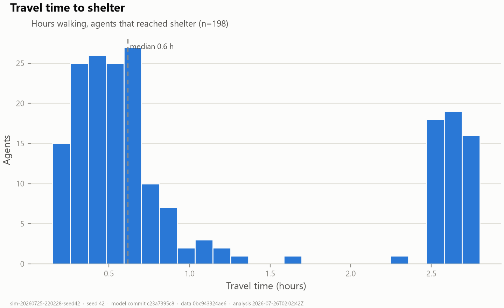
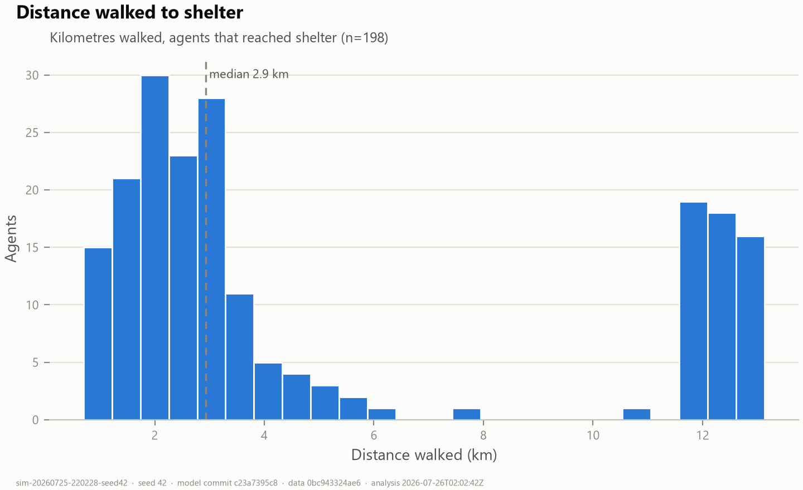
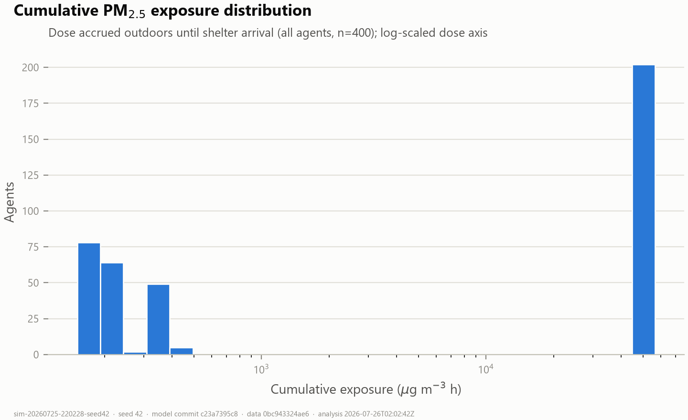
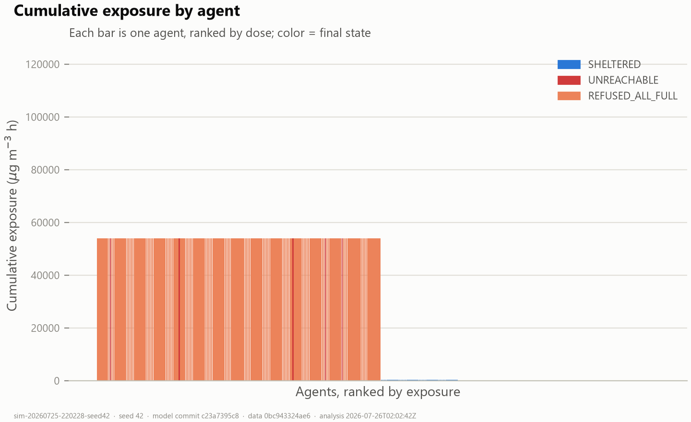
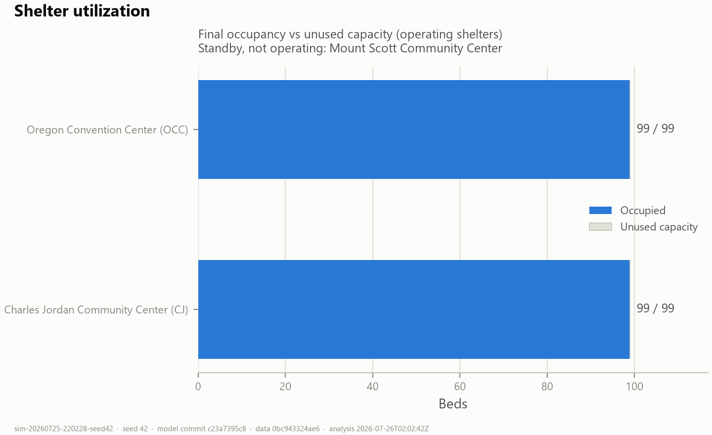

# Run analysis — `sim-20260725-220228-seed42`

## Reproducibility

| Field | Value |
|---|---|
| Simulation ID | `sim-20260725-220228-seed42` |
| Random seed | `42` |
| Model git commit | `c23a7395c83767e01fbe6e5abc8a9c5c6d15f05b` |
| Data version tag | `0bc943324ae6` |
| Run generated (UTC) | 2026-07-25T22:02:29.608231300 |
| Parameters | `{"numAgents": 400, "minutesPerTick": 1.0, "walkingSpeedMps": 1.3, "shelterArrivalDistanceM": 200.0, "simulationHours": 312, "randomSeed": 42}` |
| Analysis script | `scripts/analyze_run.py` v1.1.0 |
| Analysis git commit | `c23a7395c83767e01fbe6e5abc8a9c5c6d15f05b` |
| Analysis generated (UTC) | 2026-07-26T02:02:42Z |

Input datasets (SHA-256):

- `data/Streets.shp` — `f5e5e311b625f129f94fcf6d3150f8feb521ea5a79039ade43514ebfb35810a8`
- `data/airnow/aqs_hourly_pm25_portland_2020-09.csv` — `d908556c347ecdf68342ce859b1c56813cc606f695804c0ba71992604486ca08`
- `data/shelters/shelters_2020-09.csv` — `892b72500eeaa34005c8ae00f9abb5bdba639e463f505b2794e3231e1801b302`
- `data/encampments/irp_campsite_reports_sample.csv` — `3e557de5db4668c5d30fd7a6fc13bcc38b5e37bab4b9becaf9b3dc35366285ca`

## Verification — 38/38 checks passed

agents.csv, shelters.csv and simulation.json are mutually consistent (row counts, outcome census, per-shelter occupancy, exposure/VWE/travel statistics recomputed from raw rows match the manifest).

## Summary statistics

| Metric | Value |
|---|---|
| Total agents | 400 |
| Successful shelter arrivals | 198 (50%) |
| Failed arrivals | 202 {'REFUSED_ALL_FULL': 197, 'UNREACHABLE': 5} |
| Travel time (arrived) | mean 66 min · median 37 min · max 168 min (2.8 h) |
| Travel distance (arrived) | mean 5.2 km · median 2.9 km · max 13.1 km |
| Cumulative PM2.5 exposure (µg·m⁻³·h) | mean 27390 · median 54003 · p90 54003 · max 54003 · Gini 0.49 |
| VWE (µg·m⁻³·h) | mean 27390 · Gini 0.49 — **placeholder: identical to exposure (RRs = 1.0)** |
| Person-hours above Unhealthy (55.5 µg/m³) | 39410 total · mean 98.5 h/agent |
| Mean dose split | 27190 waiting pre-evac + 201 traveling/stranded |
| Capacity refusals | 250 agents refused ≥1× (53 later sheltered) · 416 door refusals total · max 2 per agent |

## Shelter statistics

| Shelter | Operating | Capacity | Final occ. | Unused | Refused | First arrival | Last arrival |
|---|---|---|---|---|---|---|---|
| Charles Jordan Community Center (CJ) | yes | 99 | 99 | 0 | 166 | 2020-09-07T16:13 | 2020-09-07T18:48 |
| Oregon Convention Center (OCC) | yes | 99 | 99 | 0 | 250 | 2020-09-07T16:09 | 2020-09-07T16:39 |
| Mount Scott Community Center (MSCC) | standby | — | 0 | — | 0 | — | — |

## Exposure analysis

**Highest-exposure agents:**

| Agent | State | Shelter | Dose (µg·m⁻³·h) | Travel (min) | h > Unhealthy |
|---|---|---|---|---|---|
| Site 16 | REFUSED_ALL_FULL | — | 54003 | — | 194.0 |
| Site 17 | REFUSED_ALL_FULL | — | 54003 | — | 194.0 |
| Site 19 | REFUSED_ALL_FULL | — | 54003 | — | 194.0 |
| Site 20 | REFUSED_ALL_FULL | — | 54003 | — | 194.0 |
| Site 21 | REFUSED_ALL_FULL | — | 54003 | — | 194.0 |

**Lowest-exposure agents:**

| Agent | State | Shelter | Dose (µg·m⁻³·h) | Travel (min) | h > Unhealthy |
|---|---|---|---|---|---|
| Site 54 | SHELTERED | OCC | 159 | 9.0 | 0.2 |
| Site 28 | SHELTERED | OCC | 162 | 11.0 | 0.2 |
| Site 339 | SHELTERED | OCC | 162 | 11.0 | 0.2 |
| Site 265 | SHELTERED | OCC | 162 | 11.0 | 0.2 |
| Site 303 | SHELTERED | OCC | 162 | 11.0 | 0.2 |

**Travel time vs exposure (arrived agents, n=198):** Pearson r = 0.9997, Spearman rho = 1.0. Structurally near-deterministic: with a county-uniform smoke field and simultaneous evacuation, dose differences among sheltered agents are driven almost entirely by time outdoors (= travel time).

## Routing/data integrity flag

Reference: planned_route_m + snap_gap_m (per-leg, refusal-aware).

All routed agents walked ≈ their planned route (surplus ≤ 200 m). No detour artifact detected (A-17 failing check passed).

## Figures

