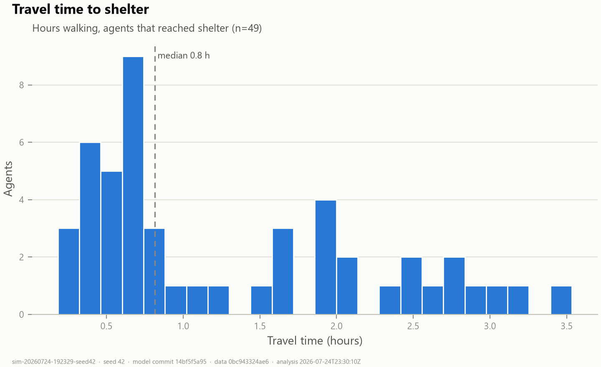
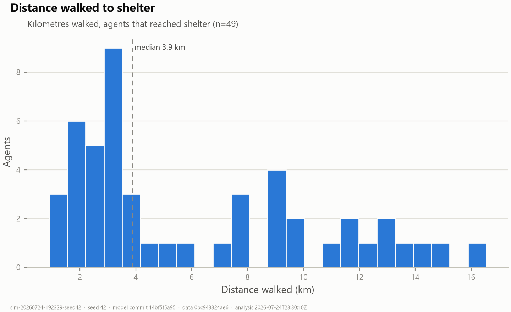
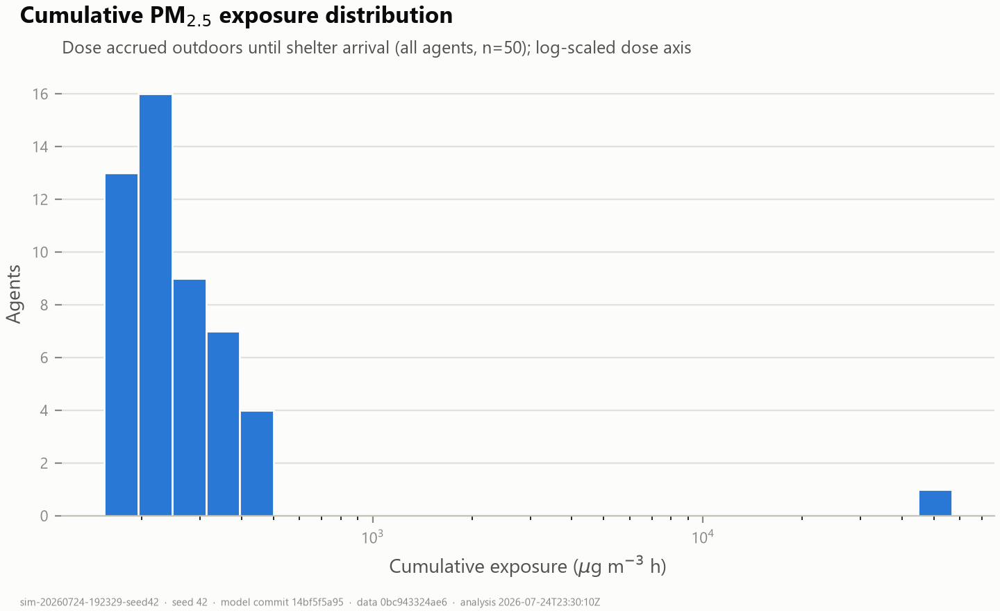
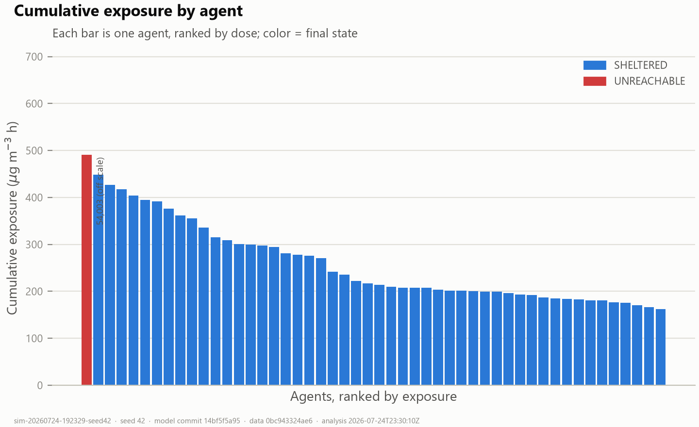
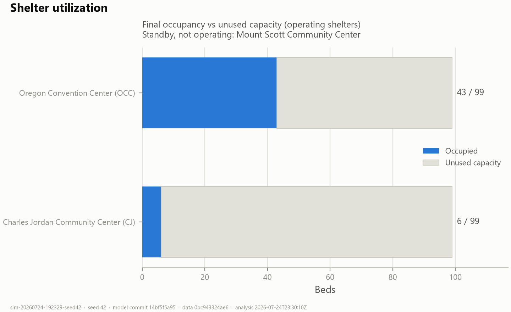

# Current Results Report — Wildfire-Smoke Shelter ABM

**Status of this document:** analysis of the two most recent exported runs of the
research prototype. It explains what the simulation did, which numbers are real,
which are placeholders, what the results mean scientifically, and what they must
**not** be used to conclude. Regenerate any time with
`python scripts/analyze_run.py` (per-run detail lands in
`Geography/output/run_seed<seed>/analysis/`).

## Reproducibility

| Field | Run A (demo) | Run B (replicate) |
|---|---|---|
| Simulation ID | `sim-20260724-192329-seed42` | `sim-20260724-192417-seed1776194289` |
| Random seed | 42 | 1776194289 |
| Agents | 50 | 100 |
| Model git commit | `14bf5f5a95…` + street-network correction (see note) | same |
| Data version tag | `0bc943324ae6` | same |
| Run generated | 2026-07-24T19:23:29 | 2026-07-24T19:24:17 |
| Other parameters | `minutesPerTick=1.0, walkingSpeedMps=1.3, shelterArrivalDistanceM=200, simulationHours=312` | same |
| Analysis | `scripts/analyze_run.py` v1.0.2, 2026-07-24 (UTC), pandas 3.0.5 / matplotlib 3.11.0 | same |

> **Note:** these runs use the street-network validation layer
> (`docs/validation/STREET_NETWORK_VALIDATION.md`). They were executed from the
> corrected working tree immediately before the combined commit, so the
> manifest `git_commit` shows the parent commit; the
> `street_network_validation` block in each manifest identifies the corrected
> build. Pre-fix baselines: `Geography/output/archive-pre-networkfix/`.

Input datasets (SHA-256 checksums identical for both runs, full list in each
run's `simulation.json`): `data/Streets.shp`,
`data/airnow/aqs_hourly_pm25_portland_2020-09.csv`,
`data/shelters/shelters_2020-09.csv`,
`data/encampments/irp_campsite_reports_sample.csv`.

**File verification:** all **37/37 automated cross-checks passed for both runs**
— `agents.csv`, `shelters.csv` and `simulation.json` are mutually consistent
(row counts, outcome census, per-shelter occupancy, exposure/VWE/travel
statistics recomputed from raw rows reproduce the manifest values; identity
columns constant; per-row time/dose arithmetic consistent).

## 1. What the simulation did

Residents of Multnomah County encampments (agents) sheltered in place at real
City-of-Portland campsite-report locations while hourly EPA AQS PM2.5 rose
during the September 2020 smoke event (simulation window Sept 7–19, 312 h,
1 tick = 1 min). When county PM2.5 first reached the EPA "Unhealthy" breakpoint
(55.5 µg/m³ — **tick 960, Sept 7 16:00 local** in both runs), every agent began
walking (1.30 m/s) along shortest street-network paths (real RLIS centerlines,
89,322 nodes / 112,070 edges, Dijkstra) to the network-nearest operating
shelter with capacity: Oregon Convention Center (OCC) or Charles Jordan CC
(CJ), each cap 99; Mount Scott CC standby. Agents accrue PM2.5 exposure every
tick they are outdoors; **arrival at shelter is the study endpoint** and stops
accrual. The run ends at the event horizon and exports the three result files.

Headline outcomes:

| Outcome | Run A (n=50) | Run B (n=100) |
|---|---|---|
| Reached shelter | 49 (98%) | 100 (100%) |
| Unreachable (off-graph start) | 1 | 0 |
| Refused (all full) | 0 | 0 |
| OCC / CJ final occupancy | 43 / 6 | 96 / 4 |
| Travel time (arrived) median · max | 49 min · 3.5 h | 68 min · 3.5 h |
| Distance walked (arrived) median · max | 3.9 km · 16.5 km | 5.3 km · 16.5 km |
| Exposure (µg·m⁻³·h) median · mean · Gini | 216 · 1331 · 0.82 | 239 · 259 · 0.16 |
| Person-hours above Unhealthy | 259 | 137 |
| Last shelter arrival | tick 1172 (Sep 7 19:32) | tick 1171 (Sep 7 19:31) |

## 2. Assumptions currently active

1. **Evacuation trigger:** everyone leaves at the *first* 55.5 µg/m³ crossing —
   a brief Sept-7 spike, **before the real shelters opened (Sept 10–11)**.
2. **Uniform smoke field:** one county-wide hourly PM2.5 value (2 in-county
   monitors); no spatial gradient, no wind/transport.
3. **Walking only**, fixed 1.30 m/s (Bohannon 1997), no rest stops, no freeway
   exclusion, pedestrians may use any street centerline.
4. **Shelter choice:** network-nearest operating shelter with space; perfect
   information; no social behavior.
5. **No indoor exposure model** (deliberate): shelters end exposure by being
   *reached*; indoor filtration is out of scope.
6. **Population:** 50/100 agents sampled uniformly from campsite reports —
   well below the ~2,037 unsheltered (PIT 2019), so capacity never binds.

## 3. Real measurements vs placeholders

**Real (measured/authoritative):**
- Street network — City of Portland RLIS centerlines (real geometry & topology
  attributes; see §6 caveat).
- Hourly PM2.5 — EPA AQS, Multnomah County, Sept 2020 (param 88502; peak
  562.7 µg/m³ on Sept 13).
- Shelter identities/locations — the real Sept-2020 clean-air shelters;
  capacity 99 is newsroom-sourced (unconfirmed by a primary source).
- Encampment locations — real City of Portland IRP campsite reports, but from
  **2025–26** (spatial proxy; no 2020 records exist in the open feed).

**Placeholder / not implemented:**
- `age`, `asthma`, `copd` — **empty columns**, no values invented.
- `age_rr`, `comorbidity_rr` — **1.0**, because the slide-cited RRs
  (×1.45 age, ×1.80 COPD) could not be verified in the cited literature.
  Consequently **VWE ≡ raw exposure in every export** and carries zero
  vulnerability signal.
- Shelter operating *dates* — not gated (shelters accept arrivals from tick 0).

## 4. What the current results mean scientifically

**Meaningful now (with the §5 caveats):**

- **Accessibility census is real signal.** 98–100% of sampled encampment
  locations can reach a Sept-2020 shelter on the real street network; the one
  failure is a start point that snaps to a disconnected graph component. OCC
  absorbs ~90% of arrivals — with only two shelters, north-Portland placement
  (CJ) serves a small catchment.
- **Arrival timing is interpretable:** evacuation at 16:00 → last arrival
  19:32 the same evening (max walk 3.5 h at 1.30 m/s over ≤ 16.5 km) — all
  travel times are now physically plausible and validated against an
  independent shortest-path recomputation (`scripts/test_routing.py`).
- **Exposure inequality (Gini 0.16–0.82)** discriminates outcomes: the
  seed-42 Gini of 0.82 is driven by the single UNREACHABLE agent who stays
  outdoors the whole event (54,003 µg·m⁻³·h vs median 216) — exactly the
  equity failure mode the study is designed to surface. Run B (everyone
  arrives) shows the "successful evacuation" Gini of 0.16.
- **The exposure–travel-time link is structural:** with a uniform field and
  simultaneous evacuation, dose differences among sheltered agents are almost
  perfectly rank-correlated with travel time (Spearman ρ ≈ 1.0). That is a
  *property of the current assumptions*, not a finding.

**Not yet valid for conclusions:**
- **VWE and VWE-Gini** (placeholder RRs — identical to raw exposure).
- **Absolute exposure magnitudes** (Sept-7 evacuation artifact: agents shelter
  *before* the sustained Sept 10–18 episode, so doses are far below what
  matching the real shelter-opening dates would produce).
- **Capacity/refusal dynamics** (population far below the 2×99 bed limit).

## 5. Limitations

1. **Street-graph "wormhole" defect — DISCOVERED AND CORRECTED.** 27 corrupt
   `PDX_F_NODE`/`PDX_T_NODE` attribute IDs created edges spanning kilometres at
   metre cost, corrupting travel time/distance/exposure for ~45% of agents in
   the pre-fix runs. A validation layer in `StreetNetwork` now corrects the
   corrupted node sites at load time (nothing deleted, provenance in every
   manifest) and the corrected graph passes all routing tests (independent
   path recomputation, walking-speed bounds, zero impossible jumps,
   connectivity unchanged). The numbers in this report are post-correction.
   Full evidence and before/after comparison:
   `docs/validation/STREET_NETWORK_VALIDATION.md`. Residual caveats: split
   stub nodes may dangle; encampment-snap first legs up to ~213 m are walked
   straight-line.
2. **Evacuation timing** precedes real shelter openings (AUDIT.md #1 tracked
   refinement: gate on operating dates).
3. **Encampment temporal mismatch** (2025–26 locations as proxy for 2020).
4. **Uniform smoke field** — no intra-county gradient.
5. **Unconfirmed shelter capacity** (newsroom-sourced 99).
6. **Small population** — refusal dynamics untested.
7. **Single-run point estimates** — no seed-sweep variability bands yet.

## 6. Figures (Run A, seed 42)

Regenerable for any run; PNGs stamped with sim ID, seed, commit, data version,
and analysis timestamp in the footer.



*All arrivals within 3.5 h — the pre-fix 9–14 h "cluster" was the routing
artifact (§5.1) and is gone after the street-network correction.*







*The red off-scale bar is the UNREACHABLE agent (54,003 µg·m⁻³·h) — the
equity-failure signal the Gini reflects.*



## 7. How to reproduce

```powershell
# run the model headless (writes Geography/output/run_seed<seed>/)
powershell -File scripts\run-headless.ps1
# verify + analyze + render figures for every exported run
python scripts\analyze_run.py
# independent routing validation (T1-T5)
python scripts\test_routing.py
```

To reproduce a specific run exactly: set `randomSeed` in
`Geography\batch\batch_params.xml` to the manifest's `random_seed`, check out
its `git_commit`, confirm dataset SHA-256s match, then run headless.
