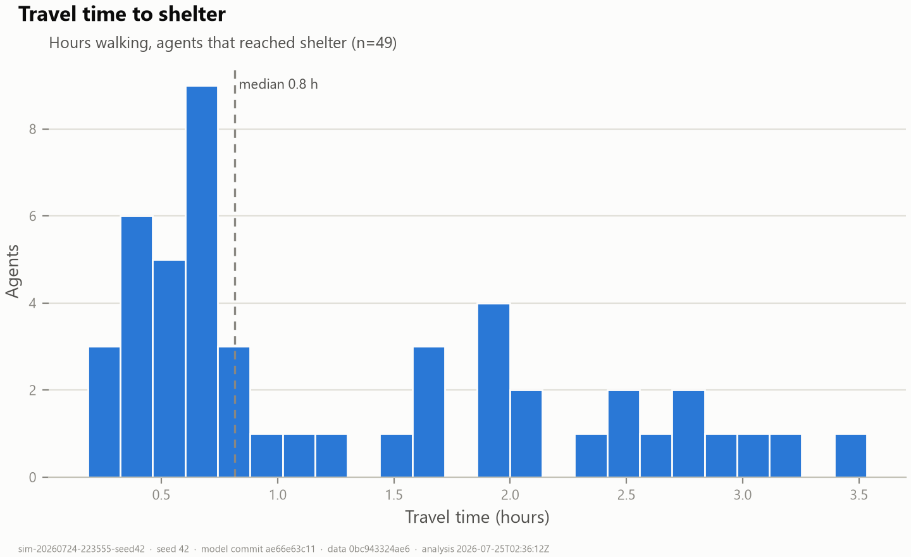
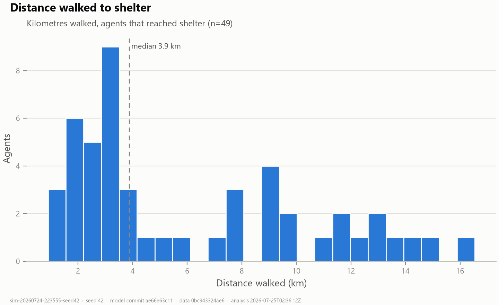
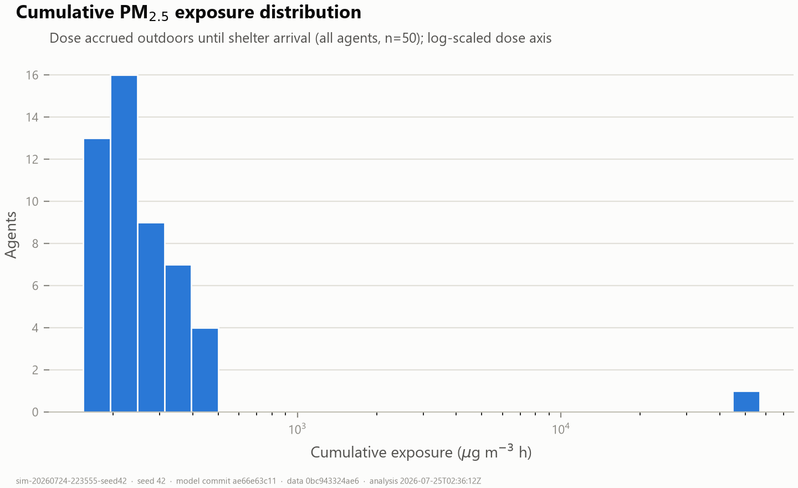
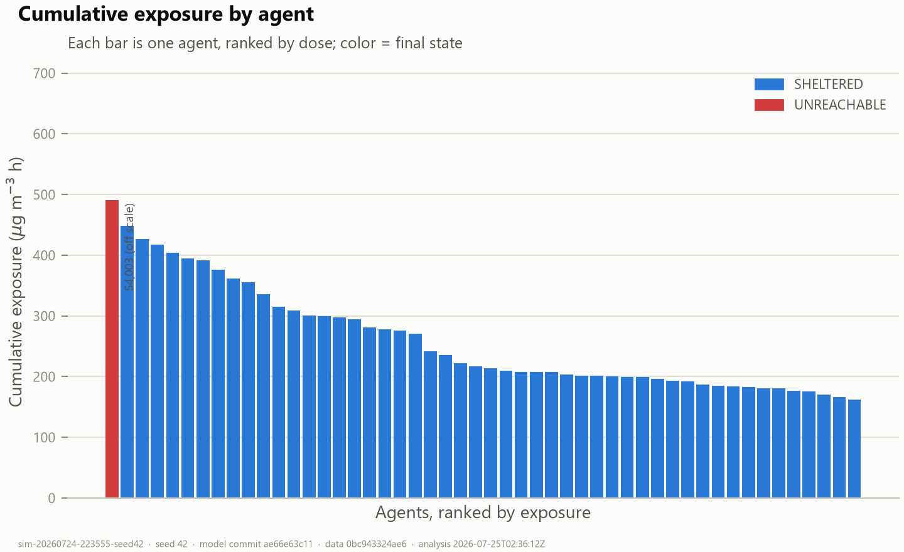
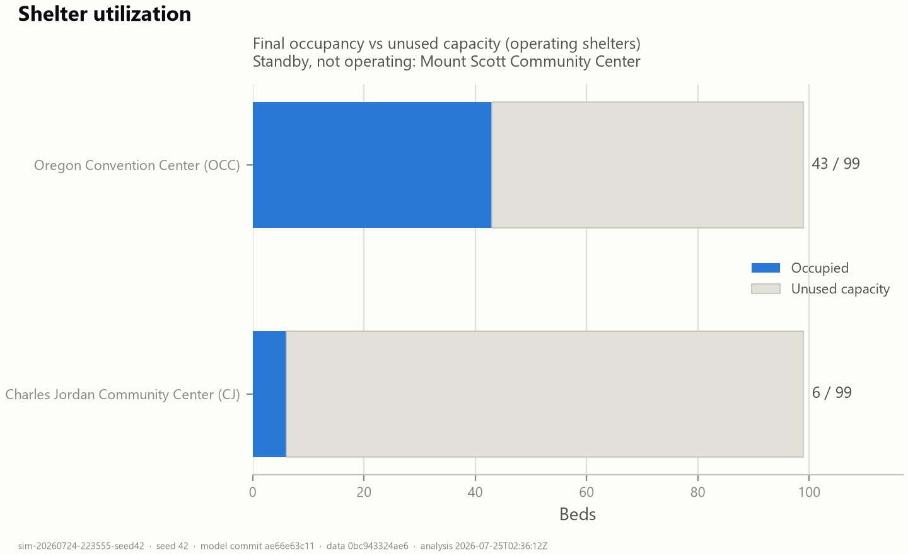

# Run analysis — `sim-20260724-223555-seed42`

## Reproducibility

| Field | Value |
|---|---|
| Simulation ID | `sim-20260724-223555-seed42` |
| Random seed | `42` |
| Model git commit | `ae66e63c11b3462e01e05e0509a6f7443aa54b8c` |
| Data version tag | `0bc943324ae6` |
| Run generated (UTC) | 2026-07-24T22:35:55.594761600 |
| Parameters | `{"numAgents": 50, "minutesPerTick": 1.0, "walkingSpeedMps": 1.3, "shelterArrivalDistanceM": 200.0, "simulationHours": 312, "randomSeed": 42}` |
| Analysis script | `scripts/analyze_run.py` v1.0.2 |
| Analysis git commit | `ae66e63c11b3462e01e05e0509a6f7443aa54b8c` |
| Analysis generated (UTC) | 2026-07-25T02:36:12Z |

Input datasets (SHA-256):

- `data/Streets.shp` — `f5e5e311b625f129f94fcf6d3150f8feb521ea5a79039ade43514ebfb35810a8`
- `data/airnow/aqs_hourly_pm25_portland_2020-09.csv` — `d908556c347ecdf68342ce859b1c56813cc606f695804c0ba71992604486ca08`
- `data/shelters/shelters_2020-09.csv` — `892b72500eeaa34005c8ae00f9abb5bdba639e463f505b2794e3231e1801b302`
- `data/encampments/irp_campsite_reports_sample.csv` — `3e557de5db4668c5d30fd7a6fc13bcc38b5e37bab4b9becaf9b3dc35366285ca`

## Verification — 37/37 checks passed

agents.csv, shelters.csv and simulation.json are mutually consistent (row counts, outcome census, per-shelter occupancy, exposure/VWE/travel statistics recomputed from raw rows match the manifest).

## Summary statistics

| Metric | Value |
|---|---|
| Total agents | 50 |
| Successful shelter arrivals | 49 (98%) |
| Failed arrivals | 1 {'UNREACHABLE': 1} |
| Travel time (arrived) | mean 79 min · median 49 min · max 212 min (3.5 h) |
| Travel distance (arrived) | mean 6.2 km · median 3.9 km · max 16.5 km |
| Cumulative PM2.5 exposure (µg·m⁻³·h) | mean 1331 · median 216 · p90 396 · max 54003 · Gini 0.82 |
| VWE (µg·m⁻³·h) | mean 1331 · Gini 0.82 — **placeholder: identical to exposure (RRs = 1.0)** |
| Person-hours above Unhealthy (55.5 µg/m³) | 259 total · mean 5.2 h/agent |
| Mean dose split | 1224 waiting pre-evac + 107 traveling/stranded |

## Shelter statistics

| Shelter | Operating | Capacity | Final occ. | Unused | Refused | First arrival | Last arrival |
|---|---|---|---|---|---|---|---|
| Charles Jordan Community Center (CJ) | yes | 99 | 6 | 93 | 0 | 2020-09-07T16:21 | 2020-09-07T17:10 |
| Oregon Convention Center (OCC) | yes | 99 | 43 | 56 | 0 | 2020-09-07T16:11 | 2020-09-07T19:32 |
| Mount Scott Community Center (MSCC) | standby | — | 0 | — | 0 | — | — |

## Exposure analysis

**Highest-exposure agents:**

| Agent | State | Shelter | Dose (µg·m⁻³·h) | Travel (min) | h > Unhealthy |
|---|---|---|---|---|---|
| Site 24 | UNREACHABLE | — | 54003 | — | 194.0 |
| Site 13 | SHELTERED | OCC | 449 | 212.0 | 3.5 |
| Site 10 | SHELTERED | OCC | 427 | 191.0 | 3.2 |
| Site 12 | SHELTERED | OCC | 417 | 182.0 | 3.0 |
| Site 9 | SHELTERED | OCC | 404 | 174.0 | 2.9 |

**Lowest-exposure agents:**

| Agent | State | Shelter | Dose (µg·m⁻³·h) | Travel (min) | h > Unhealthy |
|---|---|---|---|---|---|
| Site 28 | SHELTERED | OCC | 162 | 11.0 | 0.2 |
| Site 31 | SHELTERED | OCC | 166 | 14.0 | 0.2 |
| Site 2 | SHELTERED | OCC | 170 | 17.0 | 0.3 |
| Site 48 | SHELTERED | CJ | 176 | 21.0 | 0.4 |
| Site 47 | SHELTERED | OCC | 177 | 22.0 | 0.4 |

**Travel time vs exposure (arrived agents, n=49):** Pearson r = 0.9974, Spearman rho = 1.0. Structurally near-deterministic: with a county-uniform smoke field and simultaneous evacuation, dose differences among sheltered agents are driven almost entirely by time outdoors (= travel time).

## Routing/data integrity flag

All routed agents walked ≈ their shortest-path network distance (surplus ≤ 200 m). No detour artifact detected.

## Figures

