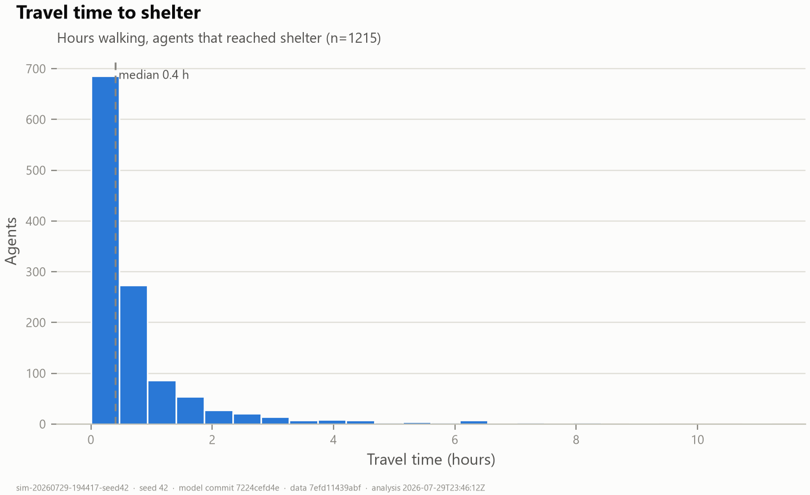
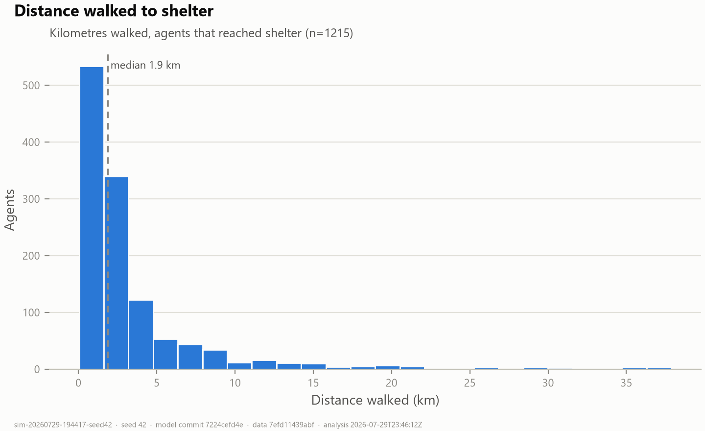
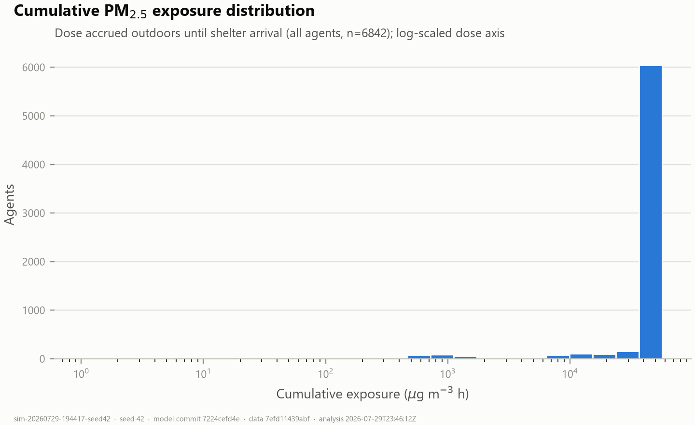
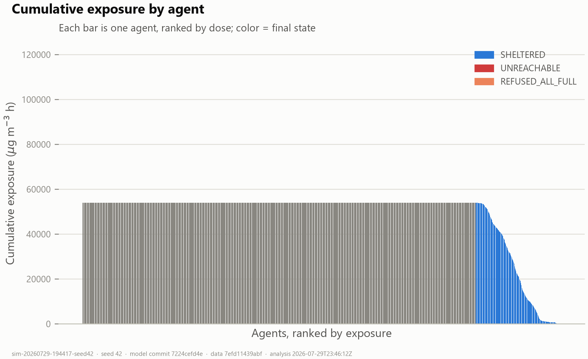
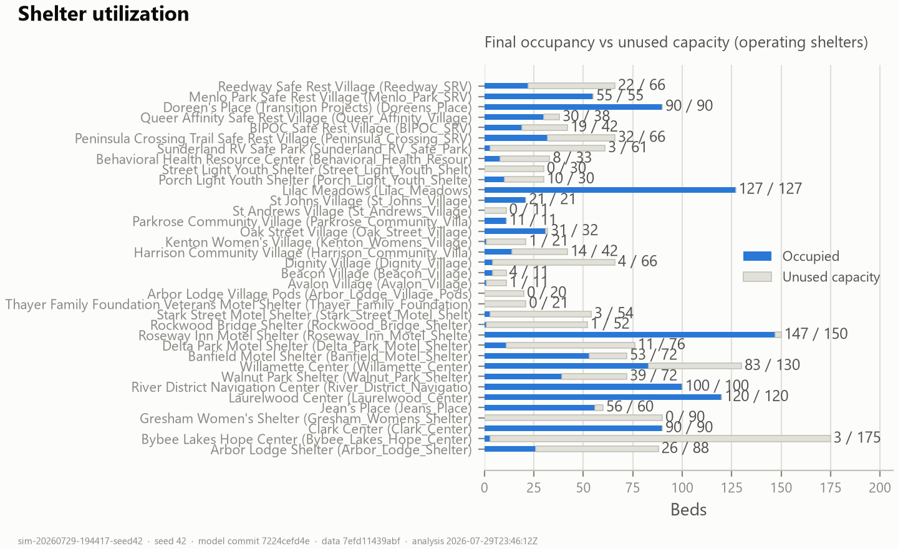

# Run analysis — `sim-20260729-194417-seed42`

## Reproducibility

| Field | Value |
|---|---|
| Simulation ID | `sim-20260729-194417-seed42` |
| Random seed | `42` |
| Model git commit | `7224cefd4e960a2876a6cbc82fb79b41a867856a` |
| Data version tag | `7efd11439abf` |
| Run generated (UTC) | 2026-07-29T19:44:42.822818 |
| Parameters | `{"numAgents": 6842, "minutesPerTick": 1.0, "walkingSpeedMps": 1.3, "shelterArrivalDistanceM": 200.0, "simulationHours": 312, "randomSeed": 42, "evacuationThresholdUgM3": 55.5, "scenarioCode": 0, "enableHeterogeneity": 1, "respectShelterOpeningDates": 1, "triageReserveFraction": 0.0, "enableDecisionLayer": 1, "pAwareInit": 0.356, "pHeavyBelongings": 0.284, "pHasPet": 0.117, "pHasDependents": 0.0044, "groupSpeedDeltaMps": 0.06, "lambdaOutreachPerDay": 0.0, "informationRegime": 1, "enableHazardDeparture": 1, "sigmaTheta": 1.0, "alphaHazard": -8.0, "bRisk": 0.4, "wOfficial": 1.1, "gammaVuln": 0.25, "riskHalfLifeH": 48.0, "barrierBelongings": 0.26, "barrierPet": 0.26, "barrierDependents": 0.26, "petPolicyDefault": 0, "betaTravelTime": 1.0, "betaCapacityPrior": 0.2, "shelterPolicyVariant": 1}` |
| Analysis script | `scripts/analyze_run.py` v1.1.0 |
| Analysis git commit | `7224cefd4e960a2876a6cbc82fb79b41a867856a` |
| Analysis generated (UTC) | 2026-07-29T23:46:12Z |

Input datasets (SHA-256):

- `data/Streets.shp` — `f5e5e311b625f129f94fcf6d3150f8feb521ea5a79039ade43514ebfb35810a8`
- `data/airnow/aqs_hourly_pm25_portland_2020-09.csv` — `d908556c347ecdf68342ce859b1c56813cc606f695804c0ba71992604486ca08`
- `data/shelters/shelters_2026_current_placement_elayer.csv` — `d06eb72384d394b49b5f0b9df632566e04e3bc24e01c96211623974640f98b19`
- `data/encampments/irp_campsite_reports_sample.csv` — `3e557de5db4668c5d30fd7a6fc13bcc38b5e37bab4b9becaf9b3dc35366285ca`

## Verification — 104/104 checks passed

agents.csv, shelters.csv and simulation.json are mutually consistent (row counts, outcome census, per-shelter occupancy, exposure/VWE/travel statistics recomputed from raw rows match the manifest).

## Summary statistics

| Metric | Value |
|---|---|
| Total agents | 6842 |
| Successful shelter arrivals | 1215 (18%) |
| Failed arrivals | 5627 {'UNAWARE': 4414, 'PRE_EVAC': 1208, 'UNREACHABLE': 4, 'REFUSED_ALL_FULL': 1} |
| Travel time (arrived) | mean 48 min · median 24 min · max 673 min (11.2 h) |
| Travel distance (arrived) | mean 3.4 km · median 1.9 km · max 37.9 km |
| Cumulative PM2.5 exposure (µg·m⁻³·h) | mean 48630 · median 54003 · p90 54003 · max 54003 · Gini 0.10 |
| VWE (µg·m⁻³·h) | mean 48630 · Gini 0.10 — **placeholder: identical to exposure (RRs = 1.0)** |
| Person-hours above Unhealthy (55.5 µg/m³) | 1195065 total · mean 174.7 h/agent |
| Mean dose split | 48600 waiting pre-evac + 30 traveling/stranded |
| Capacity refusals | 275 agents refused ≥1× (274 later sheltered) · 836 door refusals total · max 14 per agent |

## Shelter statistics

| Shelter | Operating | Capacity | Final occ. | Unused | Refused | First arrival | Last arrival |
|---|---|---|---|---|---|---|---|
| Arbor Lodge Shelter (Arbor_Lodge_Shelter) | yes | 88 | 26 | 62 | 12 | 2020-09-07T09:27 | 2020-09-18T22:14 |
| Bybee Lakes Hope Center (Bybee_Lakes_Hope_Center) | yes | 175 | 3 | 172 | 2 | 2020-09-07T07:50 | 2020-09-15T22:27 |
| Clark Center (Clark_Center) | yes | 90 | 90 | 0 | 62 | 2020-09-07T00:12 | 2020-09-17T00:16 |
| Gresham Women's Shelter (Gresham_Womens_Shelter) | yes | 90 | 0 | 90 | 1 | — | — |
| Jean's Place (Jeans_Place) | yes | 60 | 56 | 4 | 50 | 2020-09-08T03:09 | 2020-09-19T23:06 |
| Laurelwood Center (Laurelwood_Center) | yes | 120 | 120 | 0 | 2 | 2020-09-07T04:04 | 2020-09-19T20:21 |
| River District Navigation Center (River_District_Navigatio) | yes | 100 | 100 | 0 | 82 | 2020-09-07T04:02 | 2020-09-14T20:16 |
| Walnut Park Shelter (Walnut_Park_Shelter) | yes | 72 | 39 | 33 | 0 | 2020-09-08T04:23 | 2020-09-19T14:29 |
| Willamette Center (Willamette_Center) | yes | 130 | 83 | 47 | 0 | 2020-09-07T01:35 | 2020-09-19T21:08 |
| Banfield Motel Shelter (Banfield_Motel_Shelter) | yes | 72 | 53 | 19 | 29 | 2020-09-07T07:11 | 2020-09-19T10:04 |
| Delta Park Motel Shelter (Delta_Park_Motel_Shelter) | yes | 76 | 11 | 65 | 12 | 2020-09-07T01:03 | 2020-09-17T21:08 |
| Roseway Inn Motel Shelter (Roseway_Inn_Motel_Shelte) | yes | 150 | 147 | 3 | 21 | 2020-09-07T03:00 | 2020-09-19T19:49 |
| Rockwood Bridge Shelter (Rockwood_Bridge_Shelter) | yes | 52 | 1 | 51 | 1 | 2020-09-08T03:46 | 2020-09-08T03:46 |
| Stark Street Motel Shelter (Stark_Street_Motel_Shelt) | yes | 54 | 3 | 51 | 1 | 2020-09-14T10:29 | 2020-09-15T08:28 |
| Thayer Family Foundation Veterans Motel Shelter (Thayer_Family_Foundation) | yes | 21 | 0 | 21 | 12 | — | — |
| Arbor Lodge Village Pods (Arbor_Lodge_Village_Pods) | yes | 20 | 0 | 20 | 12 | — | — |
| Avalon Village (Avalon_Village) | yes | 11 | 1 | 10 | 1 | 2020-09-13T03:28 | 2020-09-13T03:28 |
| Beacon Village (Beacon_Village) | yes | 11 | 4 | 7 | 2 | 2020-09-07T03:32 | 2020-09-15T02:10 |
| Dignity Village (Dignity_Village) | yes | 66 | 4 | 62 | 2 | 2020-09-08T14:44 | 2020-09-16T17:10 |
| Harrison Community Village (Harrison_Community_Villa) | yes | 42 | 14 | 28 | 12 | 2020-09-07T02:19 | 2020-09-17T17:50 |
| Kenton Women's Village (Kenton_Womens_Village) | yes | 21 | 1 | 20 | 12 | 2020-09-12T16:14 | 2020-09-12T16:14 |
| Oak Street Village (Oak_Street_Village) | yes | 32 | 31 | 1 | 12 | 2020-09-07T05:25 | 2020-09-18T11:29 |
| Parkrose Community Village (Parkrose_Community_Villa) | yes | 11 | 11 | 0 | 86 | 2020-09-08T08:16 | 2020-09-13T15:07 |
| St Andrews Village (St_Andrews_Village) | yes | 11 | 0 | 11 | 10 | — | — |
| St Johns Village (St_Johns_Village) | yes | 21 | 21 | 0 | 14 | 2020-09-07T04:27 | 2020-09-18T05:29 |
| Lilac Meadows (Lilac_Meadows) | yes | 127 | 127 | 0 | 50 | 2020-09-07T02:02 | 2020-09-16T10:18 |
| Porch Light Youth Shelter (Porch_Light_Youth_Shelte) | yes | 30 | 10 | 20 | 29 | 2020-09-08T01:34 | 2020-09-19T09:08 |
| Street Light Youth Shelter (Street_Light_Youth_Shelt) | yes | 30 | 0 | 30 | 29 | — | — |
| Behavioral Health Resource Center (Behavioral_Health_Resour) | yes | 33 | 8 | 25 | 31 | 2020-09-18T11:59 | 2020-09-19T16:49 |
| Sunderland RV Safe Park (Sunderland_RV_Safe_Park) | yes | 61 | 3 | 58 | 2 | 2020-09-12T07:32 | 2020-09-15T11:35 |
| Peninsula Crossing Trail Safe Rest Village (Peninsula_Crossing_SRV) | yes | 66 | 32 | 34 | 10 | 2020-09-07T00:15 | 2020-09-19T15:42 |
| BIPOC Safe Rest Village (BIPOC_SRV) | yes | 42 | 19 | 23 | 33 | 2020-09-09T20:12 | 2020-09-19T23:25 |
| Queer Affinity Safe Rest Village (Queer_Affinity_Village) | yes | 38 | 30 | 8 | 28 | 2020-09-07T09:13 | 2020-09-19T18:24 |
| Doreen's Place (Transition Projects) (Doreens_Place) | yes | 90 | 90 | 0 | 74 | 2020-09-07T13:10 | 2020-09-18T04:50 |
| Menlo Park Safe Rest Village (Menlo_Park_SRV) | yes | 55 | 55 | 0 | 96 | 2020-09-07T00:22 | 2020-09-12T09:37 |
| Reedway Safe Rest Village (Reedway_SRV) | yes | 66 | 22 | 44 | 4 | 2020-09-07T15:01 | 2020-09-19T23:27 |

## Exposure analysis

**Highest-exposure agents:**

| Agent | State | Shelter | Dose (µg·m⁻³·h) | Travel (min) | h > Unhealthy |
|---|---|---|---|---|---|
| Site 0 | UNAWARE | — | 54003 | — | 194.0 |
| Site 6841 | UNAWARE | — | 54003 | — | 194.0 |
| Site 6840 | UNAWARE | — | 54003 | — | 194.0 |
| Site 6839 | UNAWARE | — | 54003 | — | 194.0 |
| Site 6838 | UNAWARE | — | 54003 | — | 194.0 |

**Lowest-exposure agents:**

| Agent | State | Shelter | Dose (µg·m⁻³·h) | Travel (min) | h > Unhealthy |
|---|---|---|---|---|---|
| Site 4855 | SHELTERED | Clark_Center | 1 | 11.0 | 0.0 |
| Site 718 | SHELTERED | Clark_Center | 1 | 12.0 | 0.0 |
| Site 2850 | SHELTERED | Peninsula_Crossing_SRV | 1 | 14.0 | 0.0 |
| Site 2638 | SHELTERED | Menlo_Park_SRV | 2 | 21.0 | 0.0 |
| Site 6522 | SHELTERED | Delta_Park_Motel_Shelter | 6 | 3.0 | 0.0 |

**Travel time vs exposure (arrived agents, n=1215):** Pearson r = 0.1957, Spearman rho = 0.1515. Structurally near-deterministic: with a county-uniform smoke field and simultaneous evacuation, dose differences among sheltered agents are driven almost entirely by time outdoors (= travel time).

## Routing/data integrity flag

Reference: planned_route_m + snap_gap_m (per-leg, refusal-aware).

All routed agents walked ≈ their planned route (surplus ≤ 200 m). No detour artifact detected (A-17 failing check passed).

## Figures

